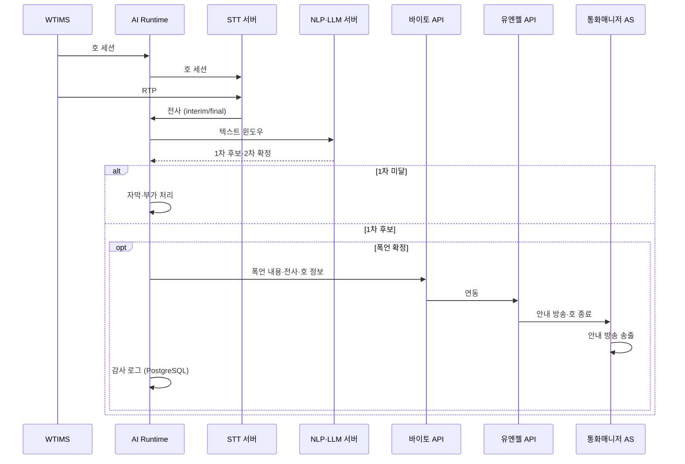
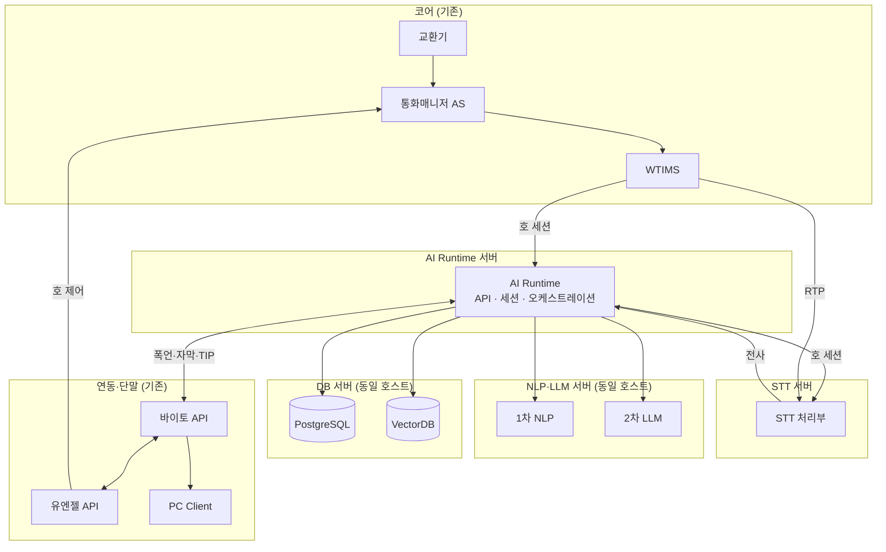

# 통화매니저 실시간 STT 도입을 통한 폭언 감지 기능 개발

## 문서 범위

통화매니저·AI 통화비서에 **실시간 STT**를 도입하고, 전사 텍스트로 **폭언·욕설을 감지**해 가입자를 보호하는 아키텍처를 정의한다.

| 구분 | 내용 |
|------|------|
| **목적** | 실시간 STT 기반 폭언·욕설 감지 → 바이토(수집) → 유엔젤 → 통화매니저 AS(호 종료 안내·호 종료) |
| **신규** | AI Runtime, STT, NLP·LLM(동일 서버), PostgreSQL·VectorDB(동일 서버) |
| **기존 활용** | 교환기, 통화매니저 AS, WTIMS, 유엔젤/바이토 API, PC Client |
| **범위 외** | TTS, NL-IVR, Cloud STT/LLM API, **가동 후 운용비**(전력·상면·유지보수·Cloud 종량제) |
| **CAPEX·용량 근거** | [production-deployment-architecture.md](./production-deployment-architecture.md) (온프레미스·EMS 제외·TTS 제외로 축소) |

동일 STT 인프라로 자막·TIP·스팸·CID 등 부가 기능을 제공할 수 있으나, 본 문서의 **아키텍처 중심**은 폭언·욕설 감지 경로이다.

---

## 1. 제공되는 기능 (사용자 관점)

호 종료 안내 방송은 **통화매니저 AS** 기존 음성으로 재생한다(AI Call Agent TTS 미사용).

| # | 기능 | 가치 | 실현 수단 |
|---|------|------|-----------|
| 1 | **폭언·욕설 실시간 감지 및 호 종료 안내** *(핵심)* | 통화 중 폭언·욕설 감지 후 정책에 따라 안내 방송·호 종료로 가입자 보호 | STT → 1차 NLP → 2차 LLM → 바이토 → 유엔젤 → 통화매니저 AS |
| 2 | **실시간 통화 자막** | interim/final·화자 구분 자막(폭언 감지 입력) | STT 스트리밍, RTP 미러 |
| 3 | **실시간 대화 TIP** | 맥락 맞는 정책·FAQ 힌트 | VectorDB + LLM |
| 4 | **주의·블랙·스팸 사전 알림** | 인입 시 위험 번호 안내 | RDB·스팸 레지스트리 |
| 5 | **자동 연락처 등록** | 통화 기반 연락처 반영 | RDB·[`CID 구현 보고서`](../reports/2026-04/2026-04-21_1340_CID_DUAL_LINE_CONTACTS_STATS_IMPL.md) |
| 6 | **CID 맥락·의도** | 벨 직후 직전 통화 요약·의도 태그 | caller-context API, 통화 후 LLM |

### 1.1 폭언·욕설 감지 흐름



| 단계 | 주체 | 처리 |
|------|------|------|
| 수집 | WTIMS → AI Runtime → STT(세션), WTIMS → STT(RTP) | 호 세션은 Runtime 경유, RTP는 STT 직연, 전사는 Runtime 수신 |
| 1차 | 경량 NLP | 금칙어·패턴·경량 분류, 저지연 후보 |
| 2차 | LLM | 문맥 기반 확정, 오탐 완화 |
| 조치 | 바이토 → 유엔젤 → 통화매니저 AS | 폭언 수집, 호 종료 안내·호 종료 |
| 사후 | AI Runtime, NLP·LLM, PostgreSQL | 감사 로그, 통화 종료 후 요약·최종 판단 |

---

## 2. 아키텍처

### 2.1 논리 계층

```
┌──────────────────────────────────────────────────────────────┐
│  단말·API           바이토 API ── PC Client                  │
│                     유엔젤 API                               │
├──────────────────────────────────────────────────────────────┤
│  AI (신규)          AI Runtime ─ STT 서버                    │
│                     NLP·LLM (동일 서버) · PG·Vector (동일 서버)│
├──────────────────────────────────────────────────────────────┤
│  코어 (기존)        교환기 ─ 통화매니저 AS ─ WTIMS           │
└──────────────────────────────────────────────────────────────┘
```

| 계층 | 구성 | 역할 |
|------|------|------|
| **코어** | 교환기, 통화매니저 AS, WTIMS | 호 설정, RTP 미러 원천, **호 종료 안내 방송** |
| **AI** | AI Runtime, STT 서버, NLP·LLM 서버, DB 서버 | 세션·전사·폭언 감지, 이력·TIP·스팸 |
| **연동·단말** | 유엔젤 API, 바이토 API, PC Client | 수집·호 제어 지시, 자막·CID·경고 UI |

### 2.2 물리 구성

신규 AI 측은 **물리 서버 4종**으로 나눈다. **호 세션**과 **RTP** 경로는 분리한다.

| 구분 | 경로 | 설명 |
|------|------|------|
| **호 세션** | WTIMS → **AI Runtime** → **STT 서버** | 호 ID·발신번호·화자 매핑 등 세션·제어 정보 |
| **RTP** | WTIMS → **STT 서버** | 음성 스트림 직연(AI Runtime 경유 없음) |
| **전사** | STT 서버 → **AI Runtime** | interim/final 텍스트·메타 |



### 2.3 데이터 경로

| ID | 경로 | 트리거 |
|----|------|--------|
| P-0 | WTIMS → AI Runtime → STT (호 세션), WTIMS → STT (RTP) | 통화 시작 |
| P-1 | STT → AI Runtime → NLP·LLM → 바이토 → 유엔젤 → 통화매니저 AS | 폭언 2차 확정 |
| P-2 | STT → AI Runtime → 바이토 → PC Client | 상시(자막) |
| P-3 | AI Runtime → VectorDB → NLP·LLM → 바이토 → PC | TIP 요청 |
| P-4 | AI Runtime ↔ PostgreSQL (DB 서버) | 이력·감사·스팸·연락처 |
| P-5 | 인입 시 PostgreSQL 조회 → AI Runtime → 바이토 → PC | 스팸·주의 번호 |

### 2.4 설계 원칙

1. **폭언 감지 우선** — STT·1차 NLP·2차 LLM·외부 연동(P-1)을 최우선 경로로 설계한다.
2. **시그널·미디어 분리** — **호 세션**은 WTIMS → AI Runtime → STT, **RTP**는 WTIMS → STT 직연.
3. **역할별 서버 배치** — AI Runtime(세션·API), STT(음성·전사), **NLP·LLM 동일 서버**, **PostgreSQL·VectorDB 동일 서버**.
4. **온프레미스 전용** — STT·LLM 모두 자체 GPU 서버에 구축(Cloud API 미사용).
5. **코어 비침해** — 교환기·통화매니저 AS·WTIMS 구조는 유지하고, AI는 세션·RTP 미러·API 연동으로만 접근한다.

---

## 3. AI Call Agent — 노드별 기능

신규·추가되는 AI 측 구성만 기술한다. 코어·API·단말은 기존 자산이다.

| 서버 종류 | 구성 대수 | 이중화 | 기능 | 연관 §1 |
|-----------|-----------|--------|------|---------|
| **AI Runtime** *(API·세션 통합)* | **2** | All-Active | WTIMS 호 세션, STT 세션 연계, 전사·폭언 오케스트레이션, 바이토/유엔젤 | #1~#6 |
| **STT** | **2** | All-Active | WTIMS RTP 직연·호 세션, interim/final 전사 | #1, #2 |
| **NLP·LLM** *(동일 호스트)* | **2** | All-Active | 1차 NLP·2차 LLM(확정·요약·TIP·스팸·CID) | #1, #3, #4, #6 |
| **DB** *(PostgreSQL·VectorDB 동거)* | **2** | Primary + Standby | 이력·폭언 감사·스팸·연락처 / 지식·TIP 벡터 검색 | #1, #3, #4~#6 |

**합계: 신규 물리 서버 8대** (교환기·통화매니저 AS·WTIMS·EMS·TTS 제외). 용량 목표는 참조 문서와 동일하게 **동시 통화 약 500호·시간당 15,000명** 부하를 전제한다(병목: AI Runtime 동시 세션).

### 3.1 도입하지 않는 노드

| 항목 | 사유 |
|------|------|
| TTS | 호 종료 안내는 통화매니저 AS; NL-IVR 제외 |
| AIR GW | WTIMS → AI Runtime 직연(본 설계); 별도 GW 미도입 |
| Cloud STT/LLM | 온프레미스 자체 구축만 |

---

## 4. CAPEX (서버·HW, 온프레미스)

**서버·HW 구매비(CAPEX)만** ROM으로 산정한다. **초기 SW 개발비**는 **§5**를 본다.

산정 근거: [production-deployment-architecture.md](./production-deployment-architecture.md) **§6.3(스펙)·§11.2(역할별 단가)**. 상용 16노드 구성에서 **TTS·AIR GW·API/Realtime(별도)·EMS** 를 제외하고, 본 문서의 **4종·8대** 배치(NLP·LLM 동거, PostgreSQL·Qdrant 동거, API는 AI Runtime에 통합)로 재매핑했다.

### 4.1 서버 종류별 구성 대수

| 서버 종류 | 구성 대수 | 이중화 | 권장 스펙(노드당, 요약) | 노드당 ROM | 합계 ROM |
|-----------|-----------|--------|-------------------------|------------|----------|
| **AI Runtime** *(API·세션 통합)* | **2** | All-Active | 16 vCPU, 64 GB RAM, HDD 1 TB, 1 Gbps | 약 1,042만 원 | **약 2,084만 원** |
| **STT** | **2** | All-Active | 32 vCPU, 128 GB RAM, **L40S×1**, HDD 2 TB, 10 Gbps | 약 2,995만 원 | **약 5,990만 원** |
| **NLP·LLM** *(동일 호스트)* | **2** | All-Active | 32 vCPU, 256 GB RAM, **L40S×2**, HDD 2 TB, 1 Gbps | 약 5,378만 원 | **약 1억 756만 원** |
| **DB** *(PostgreSQL·Qdrant 동거)* | **2** | Primary + Standby | 24 vCPU, 128 GB RAM, HDD 4 TB, 1 Gbps | 약 1,950만 원 | **약 3,900만 원** |
| **합계** | **8대** | — | — | — | **약 2억 2,730만 원** |

> **DB 노드당 ROM**: 참조 문서 PostgreSQL HA(약 1,662만)와 Qdrant(약 1,090만)를 **동일 호스트**로 합산·소폭 절감한 ROM(스펙은 PostgreSQL HA 기준, VectorDB 워크로드 동거).

### 4.2 구매 범위(ROM)

| 항목 | 금액 |
|------|------|
| **CAPEX 합계(표 기준)** | **약 2.27억 원** |
| **권장 구매 범위** | **약 1.8억 ~ 2.7억 원** (부품·리셀러 조건 ±20%, 참조 문서 §11.2와 동일) |

### 4.3 참조 문서 대비 제외·통합

| 참조 문서(16노드) | 본 문서(8대) |
|-------------------|--------------|
| TTS 2대 | **제외** (통화매니저 AS 안내) |
| AIR GW 1+1 | **제외** (WTIMS → AI Runtime 직연) |
| API/Realtime 1+1 | **AI Runtime에 통합** (2대 All-Active) |
| STT 2, LLM 2, AI Runtime 2, PG 2, Qdrant 2 | STT 2 · **NLP·LLM 2(동거)** · Runtime 2 · **DB 2(PG·Vector 동거)** |

---

## 5. OPEX — 초기 SW 개발비 (운용비 제외)

**본 절의 OPEX**는 통상 의미의 **월간 운용비가 아니라**, [prd.md](../product/prd.md) **§개발 공수(MM)** 에 대응하는 **초기 소프트웨어 개발비 ROM**이다. **전력·상면·유지보수·Cloud API 종량제** 등 **가동 후 운용비는 포함하지 않는다.**

**단가(ROM):** [production-deployment-architecture.md](./production-deployment-architecture.md) **§11.4** — **약 1,300만 원/MM** (PRD KT AICC 견적 환산 단가와 동일).

**기존 코어 연동:** WTIMS·통화매니저 API(유엔젤/바이토) 등 **기존 노드 제품 개발**은 PRD **72 MM 합계와 이중 계상하지 않으며**, 상용 문서 **§11.3** 범주(**약 0.7억 원** + α)로 **별도** 산정한다.

### 5.1 서버별 개발 공수 (MM)

PRD **v3.6 서버 역할 표(합계 72.0 MM)** 를 본 문서 **4종 서버·기능(§1)** 에 맞게 재배분했다. 제외·축소: **TTS**, **AIR GW**, **Pipecat 중심 NL-IVR**, **별도 API/Realtime 노드**(Runtime에 통합).

| 본 문서 서버 | PRD 근거 (역할) | PRD MM | 본 문서 조정 | **MM** | 연관 기능 (§1) |
|--------------|-----------------|--------|--------------|--------|----------------|
| **AI Runtime** *(API·세션 통합)* | API/Realtime **5.0** + AI Runtime **22.0** | 27.0 | TTS·GW·음성 NL-IVR·Pipecat 풀스택 경로 축소 | **19.0** | #1~#6 (세션·자막·폭언 연동·TIP·스팸·CID API) |
| **STT** | STT Server | 9.0 | — (온프레미스 ASR·RTP mirror·gRPC, 품질 검증 포함) | **9.0** | #1, #2 |
| **NLP·LLM** *(동일 호스트)* | LLM Server | 11.0 | **1차 NLP**(폭언·욕설 규칙/경량 분류) 가산 | **12.0** | #1(1·2차 감지), #3, #4, #6 |
| **DB** *(PostgreSQL·Qdrant 동거)* | PostgreSQL HA **2.5** + Qdrant **2.5** | 5.0 | 동일 호스트 배포만 변경, 스키마·벡터 범위 동일 | **5.0** | #1(감사), #3~#6 |
| **공통·통합·검증** | 공통·통합·검증 | 12.0 | TTS·NL-IVR E2E 축소, **폭언·STT·바이토/유엔젤** 연동·부하 검증 유지 | **10.0** | 전 기능 |
| **합계 (AI Call Agent SW)** | | **72.0** | | **55.0** | |

### 5.2 초기 개발비 ROM

| 항목 | MM | 단가 | 금액 (ROM) |
|------|-----|------|------------|
| AI Call Agent SW 개발 | **55.0** | 약 1,300만 원/MM | **약 7.15억 원** |
| **기존 노드 연동 개발** *(별도, §11.3)* | — | — | **약 0.7억 원** |
| **SW 개발 합계** | | | **약 7.85억 원** |

> **참고:** 레포에 **이미 구현된 범위**가 크면 [prd.md](../product/prd.md) 가이드대로 MM·금액을 **잔여 구현 비율**로 재계산한다.

### 5.3 PRD 대비 MM 제외·통합

| PRD 서버(역할) | PRD MM | 본 문서 |
|----------------|--------|---------|
| TTS Server | 6.0 | **제외** (§3.1) |
| AIR 연동 접점 GW | 2.0 | **제외** — WTIMS → AI Runtime 직연 |
| API/Realtime | 5.0 | **AI Runtime에 통합** (19.0 MM 안에 포함) |
| STT / LLM / PostgreSQL / Qdrant / 공통 | 9.0 / 11.0 / 2.5 / 2.5 / 12.0 | 위 표 **STT·NLP·LLM·DB·공통** 으로 재매핑 |

### 5.4 CAPEX + 초기 개발비 요약

| 구분 | ROM |
|------|-----|
| **CAPEX** (§4, 서버·HW 8대) | 약 **2.27억 원** (권장 범위 **1.8억 ~ 2.7억 원**) |
| **초기 SW 개발** (§5, 55 MM + 연동 0.7억) | 약 **7.85억 원** |
| **합계 (CAPEX + 초기 개발)** | 약 **10.1억 원** (CAPEX ±20%·잔여 MM 비율에 따라 변동) |

---

## 부록

### A. 참고 문서

[production-deployment-architecture.md](./production-deployment-architecture.md) · [prd.md](../product/prd.md) (서버별 MM **v3.6**, 합계 72.0) · [prd-detailed-phase1-4.md](../product/prd-detailed-phase1-4.md) · [CALL_HISTORY_AND_CONTENT_DESIGN.md](../design/CALL_HISTORY_AND_CONTENT_DESIGN.md)

### B. 부가 기능 요약

**스팸 공유** — STT·LLM 분류 → 공용 DB upsert → 타 가입자 착신 시 조회 → PC 표시.

**VectorDB** — 메뉴얼·FAQ 청크 임베딩, TIP용 RAG, 운영자 HITL(선택).

**SIP PBX** — Webhook, CDR, Prometheus 등 기존 기능은 AI와 병행.

### C. PRD 대비 범위 외

| 항목 | 비고 |
|------|------|
| NL-IVR·Dynamic ARS (AI TTS) | 텍스트·폭언 감지 중심 |
| Active RAG 통화 주도 | TIP 보조만 |
| 멀티 에이전트 (Phase 4) | 별도 검토 |
| 오디오 직접 감정 분석 | STT+LLM 중심, 옵션 |
