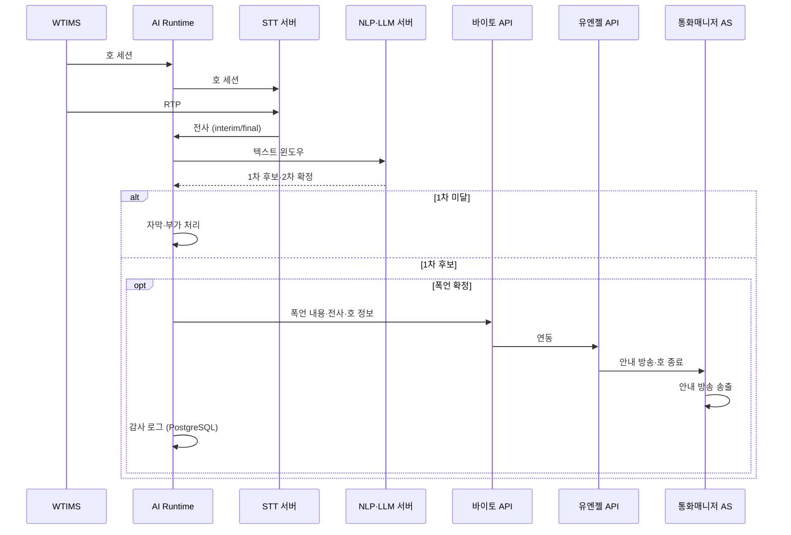
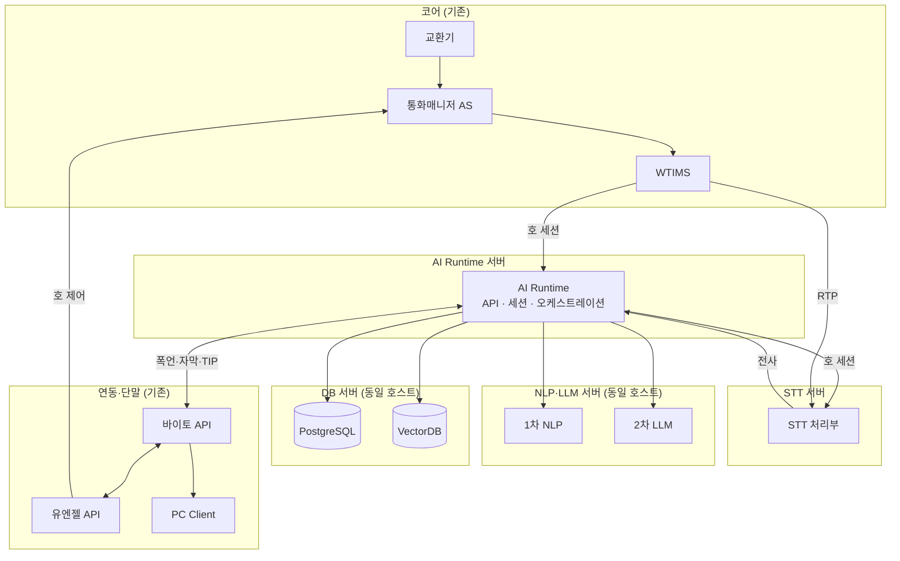

# 통화매니저 실시간 STT 도입을 통한 폭언 감지 기능 개발

## 문서 범위

통화매니저·AI 통화비서에 **실시간 STT**를 도입하고, 전사 텍스트로 **폭언·욕설을 감지**해 가입자를 보호하는 아키텍처를 정의한다.

| 구분 | 내용 |
|------|------|
| **목적** | 실시간 STT 기반 폭언·욕설 감지 → 바이토(수집) → 유엔젤 → 통화매니저 AS(호 종료 안내·호 종료) |
| **신규** | AI Runtime, STT, NLP·LLM(동일 서버), PostgreSQL·VectorDB(동일 서버) |
| **기존 활용** | 교환기, 통화매니저 AS, WTIMS, 유엔젤/바이토 API, PC Client |
| **범위 외** | AI Call Agent TTS, NL-IVR, 초기 개발비·운용비(OPEX) |

동일 STT 인프라로 자막·TIP·스팸·CID 등 부가 기능을 제공할 수 있으나, 본 문서의 **아키텍처 중심**은 폭언·욕설 감지 경로이다.

---

## 1. 제공되는 기능 (사용자 관점)

호 종료 안내 방송은 **통화매니저 AS** 기존 음성으로 재생한다(AI Call Agent TTS 미사용).

| # | 기능 | 가치 | 실현 수단 |
|---|------|------|-----------|
| 1 | **폭언·욕설 실시간 감지 및 호 종료 안내** *(핵심)* | 통화 중 폭언·욕설 감지 후 정책에 따라 안내 방송·호 종료로 가입자 보호 | STT → 1차 NLP → 2차 LLM → 바이토 → 유엔젤 → 통화매니저 AS |
| 2 | **실시간 통화 자막** | interim/final·화자 구분 자막(폭언 감지 입력) | STT 스트리밍, RTP 미러 |
| 3 | **실시간 대화 TIP** | 맥락 맞는 정책·FAQ 힌트 | VectorDB + LLM |
| 4 | **주의·블랙·스팸 사전 알림** | 인입 시 위험 번호 안내 | RDB·스팸 레지스트리 |
| 5 | **자동 연락처 등록** | 통화 기반 연락처 반영 | RDB·[`CID 구현 보고서`](../reports/2026-04/2026-04-21_1340_CID_DUAL_LINE_CONTACTS_STATS_IMPL.md) |
| 6 | **CID 맥락·의도** | 벨 직후 직전 통화 요약·의도 태그 | caller-context API, 통화 후 LLM |

### 1.1 폭언·욕설 감지 흐름



| 단계 | 주체 | 처리 |
|------|------|------|
| 수집 | WTIMS → AI Runtime → STT(세션), WTIMS → STT(RTP) | 호 세션은 Runtime 경유, RTP는 STT 직연, 전사는 Runtime 수신 |
| 1차 | 경량 NLP | 금칙어·패턴·경량 분류, 저지연 후보 |
| 2차 | LLM | 문맥 기반 확정, 오탐 완화 |
| 조치 | 바이토 → 유엔젤 → 통화매니저 AS | 폭언 수집, 호 종료 안내·호 종료 |
| 사후 | AI Runtime, NLP·LLM, PostgreSQL | 감사 로그, 통화 종료 후 요약·최종 판단 |

---

## 2. 아키텍처

### 2.1 논리 계층

```
┌──────────────────────────────────────────────────────────────┐
│  단말·API           바이토 API ── PC Client                  │
│                     유엔젤 API                               │
├──────────────────────────────────────────────────────────────┤
│  AI (신규)          AI Runtime ─ STT 서버                    │
│                     NLP·LLM (동일 서버) · PG·Vector (동일 서버)│
├──────────────────────────────────────────────────────────────┤
│  코어 (기존)        교환기 ─ 통화매니저 AS ─ WTIMS           │
└──────────────────────────────────────────────────────────────┘
```

| 계층 | 구성 | 역할 |
|------|------|------|
| **코어** | 교환기, 통화매니저 AS, WTIMS | 호 설정, RTP 미러 원천, **호 종료 안내 방송** |
| **AI** | AI Runtime, STT 서버, NLP·LLM 서버, DB 서버 | 세션·전사·폭언 감지, 이력·TIP·스팸 |
| **연동·단말** | 유엔젤 API, 바이토 API, PC Client | 수집·호 제어 지시, 자막·CID·경고 UI |

### 2.2 물리 구성

신규 AI 측은 **물리 서버 4종**으로 나눈다. **호 세션**과 **RTP** 경로는 분리한다.

| 구분 | 경로 | 설명 |
|------|------|------|
| **호 세션** | WTIMS → **AI Runtime** → **STT 서버** | 호 ID·발신번호·화자 매핑 등 세션·제어 정보 |
| **RTP** | WTIMS → **STT 서버** | 음성 스트림 직연(AI Runtime 경유 없음) |
| **전사** | STT 서버 → **AI Runtime** | interim/final 텍스트·메타 |



### 2.3 데이터 경로

| ID | 경로 | 트리거 |
|----|------|--------|
| P-0 | WTIMS → AI Runtime → STT (호 세션), WTIMS → STT (RTP) | 통화 시작 |
| P-1 | STT → AI Runtime → NLP·LLM → 바이토 → 유엔젤 → 통화매니저 AS | 폭언 2차 확정 |
| P-2 | STT → AI Runtime → 바이토 → PC Client | 상시(자막) |
| P-3 | AI Runtime → VectorDB → NLP·LLM → 바이토 → PC | TIP 요청 |
| P-4 | AI Runtime ↔ PostgreSQL (DB 서버) | 이력·감사·스팸·연락처 |
| P-5 | 인입 시 PostgreSQL 조회 → AI Runtime → 바이토 → PC | 스팸·주의 번호 |

### 2.4 설계 원칙

1. **폭언 감지 우선** — STT·1차 NLP·2차 LLM·외부 연동(P-1)을 최우선 경로로 설계한다.
2. **시그널·미디어 분리** — **호 세션**은 WTIMS → AI Runtime → STT, **RTP**는 WTIMS → STT 직연.
3. **역할별 서버 배치** — AI Runtime(세션·API), STT(음성·전사), **NLP·LLM 동일 서버**, **PostgreSQL·VectorDB 동일 서버**.
4. **STT 선택 가능** — 자체 GPU STT 또는 Cloud STT(옵션 A/B, §4).
5. **코어 비침해** — 교환기·통화매니저 AS·WTIMS 구조는 유지하고, AI는 세션·RTP 미러·API 연동으로만 접근한다.

---

## 3. AI Call Agent — 노드별 기능

신규·추가되는 AI 측 구성만 기술한다. 코어·API·단말은 기존 자산이다.

| 노드 | 배치 | 기능 | 연관 §1 |
|------|------|------|---------|
| **AI Runtime 서버** | 신규 1대(± HA) | WTIMS 호 세션 수신, STT 세션 연계, 전사 수신·오케스트레이션, 바이토/유엔젤 연동 | #1~#6 |
| **STT 서버** | 신규 1대(GPU) | WTIMS **RTP 직연**, Runtime **호 세션** 수신, interim/final 전사 | #1, #2 |
| **NLP·LLM** | **동일 서버** 1대 | 1차 NLP(후보)·2차 LLM(확정·요약·TIP·스팸·CID) | #1, #3, #4, #6 |
| **PostgreSQL·VectorDB** | **동일 서버** 1대 | 이력·폭언 감사·스팸·연락처 / 지식 임베딩·TIP 검색 | #1, #3, #4~#6 |

### 3.1 배포 옵션

| 옵션 | 구성 | 특성 |
|------|------|------|
| **A** | Runtime 1 + STT(GPU) 1 + NLP·LLM 1 + DB 1 | 망 내 STT·LLM, CAPEX ↑ |
| **B** | Runtime 1 + DB 1 (STT·LLM Cloud API) | STT·LLM **OPEX 별도**, CAPEX ↓ |

### 3.2 도입하지 않는 노드

| 항목 | 사유 |
|------|------|
| AIR GW | API·Runtime 통합으로 불필요 |
| AI Call Agent TTS | 호 안내는 통화매니저 AS; NL-IVR 제외 |

---

## 4. CAPEX (서버·HW)

서버·HW 구매비만 ROM으로 산정한다. 개발비·운용비·Cloud API 종량제는 포함하지 않는다.

| 항목 | 옵션 A | 옵션 B |
|------|--------|--------|
| AI Runtime 서버 | CPU 8~16C, RAM 32~64GB | 동일 |
| STT 서버 (GPU) | 1대 (A10/L4급) | Cloud STT 시 **0대** |
| NLP·LLM 서버 | CPU/GPU 1대 (NLP·LLM 동거) | LLM Cloud 시 CPU 위주 |
| DB 서버 (PostgreSQL·VectorDB 동거) | CPU 8C, RAM 32~64GB, NVMe SSD | 동일 |
| **합계 (ROM)** | **약 1.1억 ~ 1.7억 원** | **약 0.35억 ~ 0.55억 원** |

---

## 부록

### A. 참고 문서

[prd.md](../product/prd.md) · [prd-detailed-phase1-4.md](../product/prd-detailed-phase1-4.md) · [CALL_HISTORY_AND_CONTENT_DESIGN.md](../design/CALL_HISTORY_AND_CONTENT_DESIGN.md) · [CDR_ENHANCEMENT_DESIGN.md](../design/CDR_ENHANCEMENT_DESIGN.md)

### B. 부가 기능 요약

**스팸 공유** — STT·LLM 분류 → 공용 DB upsert → 타 가입자 착신 시 조회 → PC 표시.

**VectorDB** — 메뉴얼·FAQ 청크 임베딩, TIP용 RAG, 운영자 HITL(선택).

**SIP PBX** — Webhook, CDR, Prometheus 등 기존 기능은 AI와 병행.

### C. PRD 대비 범위 외

| 항목 | 비고 |
|------|------|
| NL-IVR·Dynamic ARS (AI TTS) | 텍스트·폭언 감지 중심 |
| Active RAG 통화 주도 | TIP 보조만 |
| 멀티 에이전트 (Phase 4) | 별도 검토 |
| 오디오 직접 감정 분석 | STT+LLM 중심, 옵션 |
