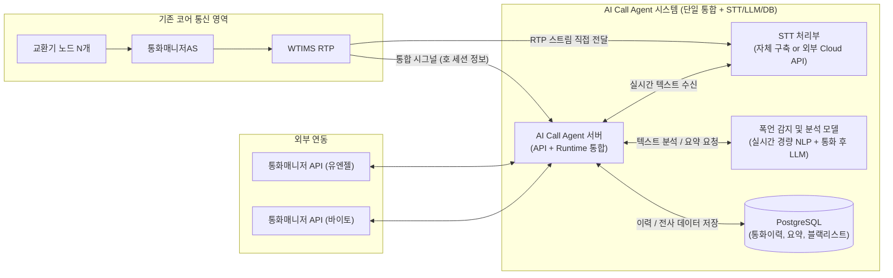

# 통화매니저 AI 전화 고도화 Architecture

## 개요
본 문서는 기존 통신 노드(교환기, 통화매니저AS, WTIMS)를 활용하되, **실시간 STT 및 폭언/욕설 감지를 포함한 AI 통화 고도화**라는 핵심 목적에 맞추어 최소한의 리소스로 최적화된 아키텍처를 설계합니다.

### 주요 설계 원칙
1. **목적 특화**: 실시간 STT 변환과 경량 NLP(실시간 폭언 감지), 그리고 통화 종료 후 LLM(최종 판단 및 요약)을 주력으로 수행합니다.
2. **단일 서버 통합**: 복잡한 라우팅(GW) 및 음성 합성(TTS), 벡터 검색(VectorDB) 구성 요소를 제외하고, API/Realtime과 AI Runtime을 단일 서버로 통합합니다.
3. **데이터베이스 활용**: 영구 저장이 필요한 통화 이력, 전사(Transcript), 요약, 악성 고객 정보는 RDB(PostgreSQL)에 보관합니다.
4. **STT 벤더 유연성**: 자체 구축 STT 외에도 Google, AWS, Azure, Naver CLOVA 등 외부 클라우드 STT 솔루션을 선택지로 열어두어 초기 도입 비용 및 운영 비용을 유연하게 산정합니다.
5. **기존 연동 유지**: 코어망 및 외부 API(유엔젤/바이토)와의 연동(0.7억 예상)은 기존대로 유지합니다.

---

## 제공되는 기능 (사용자 관점)

기존 상용 환경에서 이미 개발된 기능 중 **TTS(음성 합성)와 VectorDB(지식 검색/RAG)를 제외**하고, STT와 LLM, RDB를 조합하여 제공할 수 있는 사용자(상담원 및 관리자) 관점의 기능은 다음과 같습니다.

### 1. 실시간 통화 텍스트 변환 및 화면 표시 (STT)
- 고객과 상담원의 음성을 실시간으로 분리(Diarization)하여 메신저 채팅과 같은 텍스트 형태로 화면에 제공합니다.
- 상담원이 통화 중 이전 대화 내용을 즉시 확인하여 정확한 응대가 가능합니다.

### 2. 실시간 폭언 및 악성 민원 감지 (경량 NLP)
- 통화 중 고객의 폭언, 욕설, 공격적인 언어 및 분노 상태를 경량 NLP 모델이 실시간으로 스캔합니다.
- 임계치 이상의 폭언이 감지되면 즉시 관리자 또는 모니터링 시스템에 알림을 전송하여 선제적인 상담원 보호 조치를 지원합니다.

### 3. 통화 종료 후 심층 분석 및 요약 (LLM)
- **통화 내용 자동 요약**: 통화가 종료되면 전체 대화 문맥(Transcript)을 LLM이 분석하여 1~3줄의 핵심 내용으로 자동 요약합니다.
- **최종 폭언 강도 및 의도 판별**: 실시간 감지 외에도, 전체 문맥을 고려하여 숨겨진 악의적 의도나 성희롱, 협박 여부를 정확하게 분류하고 위험도를 평가합니다.
- **자동 키워드(태그) 추출**: 문의 유형이나 주요 키워드(엔티티)를 자동으로 추출하여 상담원의 통화 후 메모 작성 업무를 최소화합니다.

### 4. 통화 이력 및 전사 기록 관리 (DB)
- 모든 통화에 대해 음성 파일(기존 WTIMS 연계)과 함께 텍스트화된 전체 대화 기록을 데이터베이스(PostgreSQL)에 영구 보관합니다.
- 언제든 과거 통화 이력을 텍스트로 검색하고 읽어볼 수 있어 청취 시간을 획기적으로 줄여줍니다.

### 5. 블랙리스트 및 주의 고객 관리 (DB & LLM)
- LLM 분석 결과 악성 민원으로 판별된 고객의 번호를 DB에 축적하여, 해당 번호로 재인입 시 상담원 화면에 사전 '주의 고객' 알림을 띄울 수 있습니다.

---

## 1. 아키텍처 다이어그램 (고도화/최적화 버전)

---

## 2. 핵심 데이터 플로우

1. **호 인입 및 RTP 분기**: 사용자의 통화(INVITE)가 교환기를 거쳐 통화매니저AS와 WTIMS로 연결됩니다. WTIMS는 통화의 음성(RTP) 스트림을 복제하여 **STT 처리부**로 전송합니다.
2. **시그널 및 런타임 제어**: WTIMS는 통화 세션 정보를 단일화된 **AI Call Agent 서버**로 릴레이합니다.
3. **실시간 STT 및 경량 NLP**:
   - STT 모듈이 음성을 실시간 텍스트로 변환하여 AI Call Agent로 전달합니다. (유저 PC Client에 텍스트 노출 연계 가능)
   - AI Call Agent는 경량화된 NLP 언어 모델을 호출하여 실시간으로 폭언/욕설/분노 키워드를 감지합니다.
4. **통화 종료 후 LLM 판단 및 요약**:
   - 통화가 종료되면 전체 텍스트 전사(Transcript) 데이터를 LLM에 전달합니다.
   - LLM은 전체 문맥을 분석하여 최종적인 폭언 여부/강도, 통화 요약, 키워드(태그)를 추출합니다.
5. **데이터 영구 저장**:
   - 추출된 결과 및 텍스트 전문을 PostgreSQL DB에 기록하여 통화 이력 및 블랙리스트 관리 등에 활용합니다.

---

## 3. 구성 요소 상세 (제외 및 통합 내역)

### 3.1 유지 및 통합되는 구성 요소
- **기존 코어 (교환기, 통화매니저AS, WTIMS)**: 구조 변경 없이 그대로 활용.
- **AI Call Agent 서버**: 기존에 분리되었던 `API/Realtime` 서버와 `AI Runtime` 서버, 그리고 연동 `GW`를 하나의 애플리케이션/서버 노드로 통합하여 운용 (메모리 및 네트워크 I/O 오버헤드 감소).
- **PostgreSQL (RDB)**: 영구적인 통화 기록, LLM 요약, 식별된 태그(키워드) 등을 보관하기 위해 유지.
- **분석 모델 서버 (NLP + LLM)**: 
  - **경량 NLP 모델**: 단어/구문 기반의 빠르고 가벼운 모델로 실시간 필터링.
  - **LLM**: sLLM (예: Llama 3 8B, Qwen 등) 또는 Cloud LLM API를 사용하여 문맥 기반 요약 및 최종 판별.

### 3.2 선택형 구성 요소 (STT)
실시간 STT는 운영 예산과 보안 요구사항에 따라 벤더 선택이 가능합니다.
- **옵션 A (자체 구축)**: 오픈소스(Faster-Whisper 등) 기반 GPU 서버 구축. 초기 CAPEX가 높으나 유지비용이 저렴함.
- **옵션 B (Cloud STT)**: Google Cloud Speech-to-Text, AWS Transcribe, Azure Speech, Naver CLOVA 등. 초기 도입비용(CAPEX)을 낮추고 종량제(OPEX)로 전환.

### 3.3 완전히 제거된 구성 요소
- ❌ **AIR GW**: API/Runtime 통합으로 내부 라우팅이 불필요해져 제거.
- ❌ **Qdrant (VectorDB) 및 RAG 기능**: 문서를 검색해서 AI가 음성으로 자동 답변(상담 대체)하는 지식망 기능은 배제.
- ❌ **TTS Server**: AI가 음성을 합성하여 대답하거나 안내 방송을 하는 목적이 없으므로 제거.

---

## 4. 최소 구성 예상 비용 산출 (ROM)

고도화된 최적화 아키텍처를 기반으로 한 도입 비용 요약입니다. RAG용 VectorDB와 TTS, 분산 런타임이 빠짐에 따라 하드웨어 및 소프트웨어 개발비가 크게 축소됩니다.

| 항목 | 구분 | 예상 비용 (ROM) | 비고 |
|------|------|-----------------|------|
| **기존 연동 개발비** | 기존 자산 연동 | **0.7억 원** | WTIMS, 통화매니저 API(유엔젤/바이토) 연동은 기존 산출과 동일 |
| **소프트웨어 개발비** | AI Call Agent 개발 | **약 3.5억 ~ 4.5억 원** | 단일 통합 서버 개발, 경량 NLP 및 LLM 요약 연동, DB 적재 (RAG, TTS 제외로 대폭 감소) |
| **인프라/HW (옵션 A)** | STT/LLM 자체 구축 시 | **약 1.0억 ~ 1.5억 원** | 통합 서버(CPU/RAM) + RDB 서버 + STT/sLLM 구동용 GPU 서버(예: 1~2대) |
| **인프라/HW (옵션 B)** | Cloud STT/LLM 사용 시| **약 0.3억 ~ 0.5억 원** | 통합 서버 및 RDB(CPU/RAM)만 온프레미스 구축. STT/LLM은 월 과금(OPEX) |

### 총 도입 비용 비교
- **STT/LLM 자체 구축 시 (CAPEX 집중)**: 약 **5.2억 ~ 6.7억 원**
- **Cloud STT/LLM 사용 시 (초기 투자 최소화)**: 약 **4.5억 ~ 5.7억 원** (클라우드 API 사용량에 따른 월별 OPEX 별도 산정 필요)

> **비고**: Cloud API (Google, Naver 등) 사용 시 분당/초당 과금 정책에 따라 월 1만 시간 통화 시 수백만 원 대의 월 고정비가 발생할 수 있으므로, 연간 유지보수 비용 산정 시 트래픽 볼륨에 따른 OPEX 비교가 필수적입니다.
