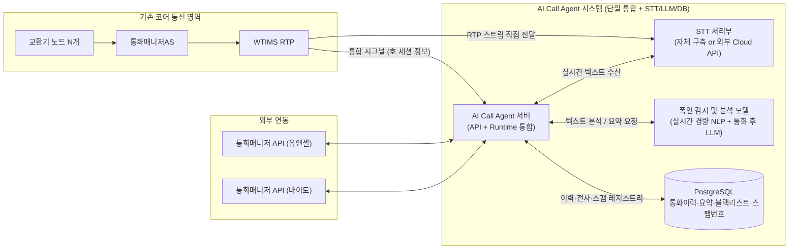

# 통화매니저 AI 전화 고도화 Architecture

## 개요
본 문서는 기존 통신 노드(교환기, 통화매니저AS, WTIMS)를 활용하되, **실시간 STT·폭언/욕설 감지·스팸 전화 공유(가입자 간 번호 평판)** 를 포함한 AI 통화 고도화를 목표로, 최소한의 리소스로 최적화된 아키텍처를 설계합니다.

### 주요 설계 원칙
1. **목적 특화**: 실시간 STT 변환과 경량 NLP(실시간 폭언 감지), 통화 종료 후 LLM(최종 판단·요약·**스팸 분류**), 그리고 **가입자 간 공유 스팸 번호 DB**를 주력으로 수행합니다.
2. **단일 서버 통합**: 복잡한 라우팅(GW) 및 음성 합성(TTS), 벡터 검색(VectorDB) 구성 요소를 제외하고, API/Realtime과 AI Runtime을 단일 서버로 통합합니다.
3. **데이터베이스 활용**: 영구 저장이 필요한 통화 이력, 전사(Transcript), 요약, 악성 고객 정보, **스팸으로 판정된 발신 번호(공용 평판)** 는 RDB(PostgreSQL)에 보관합니다. VectorDB는 사용하지 않습니다.
4. **STT 벤더 유연성**: 자체 구축 STT 외에도 Google, AWS, Azure, Naver CLOVA 등 외부 클라우드 STT 솔루션을 선택지로 열어두어 초기 도입 비용 및 운영 비용을 유연하게 산정합니다.
5. **기존 연동 유지**: 코어망 및 외부 API(유엔젤/바이토)와의 연동(0.7억 예상)은 기존대로 유지합니다.

**문서·요구 근거**: 제품 범위·Phase 정의는 [prd.md](../product/prd.md), 세부 FR·User Story는 [prd-detailed-phase1-4.md](../product/prd-detailed-phase1-4.md)를 본다. CDR·녹음·전사 흐름은 [CALL_HISTORY_AND_CONTENT_DESIGN.md](../design/CALL_HISTORY_AND_CONTENT_DESIGN.md), [CDR_ENHANCEMENT_DESIGN.md](../design/CDR_ENHANCEMENT_DESIGN.md), [RECORDING_FLOW_CHECK.md](../design/RECORDING_FLOW_CHECK.md) 등 설계 문서와 정합한다.

---

## 제공되는 기능 (사용자 관점)

아래는 **TTS(음성 합성)와 VectorDB(의미 검색·RAG)를 쓰지 않는 Minimal 전제**에서, **STT + LLM + (선택) RDB**로 사용자(상담원·관리자·운영)에게 줄 수 있는 기능을 정리한 것이다.  
PRD 상 Phase 1~3 일부(F1.1.x, F2.1.1·일부 F2.1.2, F3.1.x, F3.2.1의 **텍스트 어시스트** 변형)와 SIP PBX 코어 이벤트·관측 요구와 맞춘다.

### 핵심 (통화 중·직후)

| # | 기능 | 사용자 입장에서의 가치 | 주요 수단 (Minimal) |
|---|------|------------------------|---------------------|
| 1 | **실시간 통화 자막(STT)** | 통화 중 화면에 글자로 대화가 올라와 청취 부담이 줄고, 놓친 말을 바로 확인할 수 있다. | 실시간 STT(스트리밍)·RTP 미러 등 |
| 2 | **부분(interim) / 최종(final) 전사** | 말하는 도중 미리보기와, 문장 단위 확정 텍스트를 구분해 볼 수 있다. | STT 스트림 + UI 표시 |
| 3 | **화자 구분(Diarization)** | 고객/상담원 발화가 구분되어 읽기 쉽다. | STT·메타데이터·PRD F1.1.1-04 |
| 4 | **실시간 욕설·폭언·위험 신호** | 욕설·공격적 표현 등이 잡히면 즉시 알 수 있어 상담원 보호·감독에 유리하다. | 사전·규칙·경량 분류기 + (선택) LLM 스팟 체크 |
| 5 | **의도(Intent) 라벨(상담원 보조)** | “환불·배송·상담원 연결” 등 발화 의도가 태그로 보이면 다음 조치를 빨리 정할 수 있다. | LLM JSON 분류(PR드 F2.1.1) — **고객에게 TTS로 말하지 않고** 화면·DB에만 표시 |
| 6 | **신뢰도·이상 징후 표시(Confidence)** | AI 판단이 애매할 때 감독자에게 알리거나, 상담원이 재확인하도록 유도할 수 있다. | LLM confidence·PRD F3.1.1 |
| 7 | **통화 후 요약·위험도·태그** | 통화 직후 한 줄 요약, 폭언/민원 위험 등급, 키워드가 자동으로 남아 후처리 시간이 줄어든다. | 통화 종료 후 LLM 1회(또는 소수) 호출 |
| 8 | **통화 후 검토·라벨링 지원** | 감독자가 요약·태그를 보고 빠르게 OK/수정 라벨을 달 수 있다. | PRD F3.1.3 + DB 컬럼·간단 UI |
| 9 | **쉐도잉(텍스트 가이드)** | 신입 상담원 화면에 “이렇게 답해보세요” 문구가 뜨면 교육 부담이 줄어든다. | PRD F3.2.1 — **TTS 없이 텍스트만** 제시하는 형태로 범위 한정 |
| 10 | **주의 고객·블랙리스트 사전 알림** | 문제 통화 번호가 다시 오면 상담원에게 미리 경고한다. | DB 플래그 + 인입 시 조회 |
| 11 | **통화 이력·전사 검색** | 과거 통화를 텍스트로 찾아보고, 녹음 파일과 짝지어 볼 수 있다. | RDB + 녹음 경로 메타(아래 12와 연계) |
| 12 | **녹음 파일과 전사 연계** | “어디까지 말했는지” 녹음으로 확인하면서, 같은 통화의 텍스트를 따라간다. | WTIMS/녹음 설계·CDR `recording_path` 등 |
| 13 | **후처리 STT(고정밀 전사)** | 실시간 STT와 별도로, 통화 종료 후 한 번 더 정밀 전사해 품질·감사용으로 쓸 수 있다. | 설정상 후처리 STT(예: `post_processing_stt`) — **VectorDB 불필요** |
| 14 | **CDR(통화 상세 기록)** | 통화 한 건당 시작·응답·종료·녹음 여부 등이 한 줄(JSONL 등)로 남아 분석·감사에 쓴다. | SIP PBX 코어·CDR 설계([CDR_ENHANCEMENT_DESIGN.md](../design/CDR_ENHANCEMENT_DESIGN.md)) |
| 15 | **이벤트·Webhook 알림** | 폭언 감지·통화 종료 등을 보안/CRM/사내 대시보드로 넘길 수 있다. | `events`·Webhook 설정(PR드 SIP 코어·Cross-cutting) |
| 16 | **관측(헬스·메트릭)** | 장애 여부·부하를 관제에서 본다. | `/health`, Prometheus 등(PR드 NFR) |
| 17 | **스팸 전화 판단·공용 번호 DB** | 한 가입자 통화에서 스팸으로 판정된 번호가 **운영 공용 DB**에 쌓이고, **다른 가입자**에게 같은 번호로 전화가 올 때 착신 측에 “스팸 위험” 안내를 띄워 피해를 줄인다. | STT 전사(실시간·종료 후) + 규칙/LLM 판정 → PostgreSQL **스팸 레지스트리** → **INVITE/인입 시점** 통화매니저 API·클라이언트에 메타 전달 |

#### 스팸 공유 플로우 (요약)

1. **수집**: 통화 중·종료 후 STT 텍스트를 입력으로 스팸 분류(경량 규칙 + 필요 시 LLM). 보이스피싱·대출·원치 않는 광고 등 패턴은 운영 정책·프롬프트로 정의한다.
2. **등록**: 판정 결과·신뢰도·근거(전사 일부·해시)를 만족할 때만 공용 DB에 **발신 번호(E.164 등)** 를 upsert(건수·최종 판정 시각 갱신). 오탐 완화를 위해 임계치·운영자 승인 큐를 둘 수 있다.
3. **조회**: 임의 가입자의 착신 **INVITE(또는 코어가 알려주는 발신 CLI)** 시, AI Call Agent(또는 통화매니저 API 백엔드)가 공용 DB를 조회한다.
4. **표시**: 유저 PC Client(바이토 경유) 등에 **“스팸 위험 가능 번호”** 배지·팝업·통화 상세 패널에 표시한다. **TTS 없이** 텍스트·UI만으로 충분하다.
5. **거버넌스**: 개인정보·통신비밀보호, 오탐 시 이의제기·차단 해제 절차, 보관 기간은 별도 운영 규정으로 둔다.

### 확장(선택) — VectorDB 없이 가능한 범위

| 기능 | 설명 | 제한 |
|------|------|------|
| **지식 추출 결과만 DB/파일 보관** | 통화 전사에서 Q&A 후보를 LLM으로 뽑아 **PostgreSQL 행 또는 JSONL**로만 저장한다. | **의미 검색·자동 RAG 응답은 불가**(VectorDB 없음). 검색은 SQL·키워드·기간 필터 수준. |
| **Tool Calling(텍스트·API만)** | LLM이 “주문 조회 API 호출” 등 **HTTP API**를 호출해 화면에 결과를 뿌리는 수준은 Minimal과 호환 가능하다. | 고객에게 **음성(TTS)으로 읽어주는 NL-IVR**는 TTS 전제이므로 본 Minimal **본편에서 제외**. |
| **운영자 개입(HITL) 알림** | “AI/분석 신뢰도 낮음” 등을 운영자 큐로 보낸다. | RAG 없이도 **텍스트·점수 기반** 큐는 가능. Pipecat·대시보드 연계는 별도 구현 범위. |

### SIP PBX 코어에서 함께 쓰는 기능 (AI와 무관·동시 제공)

| 기능 | 사용자·운영 가치 |
|------|------------------|
| **통화 시작/종료 이벤트·Webhook** | 외부 시스템과 연동해 알림·연계 업무를 자동화한다. |
| **CDR·로그** | 분쟁·품질 분석 시 근거 자료로 쓴다. |
| **Prometheus·헬스체크** | 가동률·용량 관리에 쓴다. |

### 이 Minimal 설계에서 **넣지 않거나** PRD와 달리 **축소**하는 것

| 구분 | 이유 |
|------|------|
| **RAG·Active RAG·Vector 검색** | VectorDB 전제(PR드 Phase 1 Epic 1.2~1.3). |
| **AI가 음성으로 응답하는 NL-IVR·Dynamic ARS** | TTS·망 내 음성 재생 시나리오가 중심(PR드 Phase 2 일부). |
| **멀티 에이전트·자율 도구 연쇄(Phase 4)** | 운영·안전 범위가 커 Minimal 본편과 분리. |
| **감정 분석 등 “오디오 직접 모델”** | `config.ai`의 emotion 등은 **Reflecting·별도 GPU 파이프** 전제인 경우가 많아, **“실시간 STT 텍스트 + LLM” 중심**으로 통일할지 별도 옵션으로 둔다. |

---

## 1. 아키텍처 다이어그램 (고도화/최적화 버전)

---

## 2. 핵심 데이터 플로우

1. **호 인입 및 RTP 분기**: 사용자의 통화(INVITE)가 교환기를 거쳐 통화매니저AS와 WTIMS로 연결됩니다. WTIMS는 통화의 음성(RTP) 스트림을 복제하여 **STT 처리부**로 전송합니다.
2. **시그널 및 런타임 제어**: WTIMS는 통화 세션 정보를 단일화된 **AI Call Agent 서버**로 릴레이합니다.
3. **실시간 STT 및 경량 NLP**:
   - STT 모듈이 음성을 실시간 텍스트로 변환하여 AI Call Agent로 전달합니다. (유저 PC Client에 텍스트 노출 연계 가능)
   - AI Call Agent는 경량화된 NLP 언어 모델을 호출하여 실시간으로 폭언/욕설/분노 키워드를 감지합니다.
4. **통화 종료 후 LLM 판단 및 요약**:
   - 통화가 종료되면 전체 텍스트 전사(Transcript) 데이터를 LLM에 전달합니다.
   - LLM은 전체 문맥을 분석하여 최종적인 폭언 여부/강도, 통화 요약, 키워드(태그)를 추출합니다.
5. **데이터 영구 저장**:
   - 추출된 결과 및 텍스트 전문을 PostgreSQL DB에 기록하여 통화 이력 및 블랙리스트 관리 등에 활용합니다.
6. **스팸 번호 공용 등록·착신 알림**:
   - 통화(또는 일정 길이 이상의 인입)에서 STT·LLM으로 스팸으로 판정되면 **공용 스팸 레지스트리** 테이블에 발신 번호를 반영합니다.
   - **다른 가입자** 착신 시 코어가 넘겨준 발신 번호로 API_AIR가 DB를 조회하고, 통화매니저 API(바이토·유엔젤)를 통해 **유저 PC Client**에 “스팸 위험” 정보를 내려줍니다(벨 울림 전·통화 화면 진입 직후 등 시점은 연동 규약으로 정함).

## 3. 구성 요소 상세 (제외 및 통합 내역)

### 3.1 유지 및 통합되는 구성 요소
- **기존 코어 (교환기, 통화매니저AS, WTIMS)**: 구조 변경 없이 그대로 활용.
- **AI Call Agent 서버**: 기존에 분리되었던 `API/Realtime` 서버와 `AI Runtime` 서버, 그리고 연동 `GW`를 하나의 애플리케이션/서버 노드로 통합하여 운용 (메모리 및 네트워크 I/O 오버헤드 감소).
- **PostgreSQL (RDB)**: 영구적인 통화 기록, LLM 요약, 식별된 태그(키워드), **스팸 발신 번호 공용 레지스트리**(신고 건수·신뢰도·최종 판정 시각 등)를 보관하기 위해 유지.
- **분석 모델 서버 (NLP + LLM)**: 
  - **경량 NLP 모델**: 단어/구문 기반의 빠르고 가벼운 모델로 실시간 필터링.
  - **LLM**: sLLM (예: Llama 3 8B, Qwen 등) 또는 Cloud LLM API를 사용하여 문맥 기반 요약 및 최종 판별.

### 3.2 선택형 구성 요소 (STT)
실시간 STT는 운영 예산과 보안 요구사항에 따라 벤더 선택이 가능합니다.
- **옵션 A (자체 구축)**: 오픈소스(Faster-Whisper 등) 기반 GPU 서버 구축. 초기 CAPEX가 높으나 유지비용이 저렴함.
- **옵션 B (Cloud STT)**: Google Cloud Speech-to-Text, AWS Transcribe, Azure Speech, Naver CLOVA 등. 초기 도입비용(CAPEX)을 낮추고 종량제(OPEX)로 전환.

### 3.3 완전히 제거된 구성 요소
- ❌ **AIR GW**: API/Runtime 통합으로 내부 라우팅이 불필요해져 제거.
- ❌ **Qdrant (VectorDB) 및 RAG 기능**: 문서를 검색해서 AI가 음성으로 자동 답변(상담 대체)하는 지식망 기능은 배제.
- ❌ **TTS Server**: AI가 음성을 합성하여 대답하거나 안내 방송을 하는 목적이 없으므로 제거.

---

## 4. 최소 구성 예상 비용 산출 (ROM)

고도화된 최적화 아키텍처를 기반으로 한 도입 비용 요약입니다. RAG용 VectorDB와 TTS, 분산 런타임이 빠짐에 따라 하드웨어 및 소프트웨어 개발비가 크게 축소됩니다.

| 항목 | 구분 | 예상 비용 (ROM) | 비고 |
|------|------|-----------------|------|
| **기존 연동 개발비** | 기존 자산 연동 | **0.7억 원** | WTIMS, 통화매니저 API(유엔젤/바이토) 연동은 기존 산출과 동일 |
| **소프트웨어 개발비** | AI Call Agent 개발 | **약 3.5억 ~ 4.5억 원** | 단일 통합 서버 개발, 경량 NLP 및 LLM 요약 연동, DB 적재 (RAG, TTS 제외로 대폭 감소) |
| **인프라/HW (옵션 A)** | STT/LLM 자체 구축 시 | **약 1.0억 ~ 1.5억 원** | 통합 서버(CPU/RAM) + RDB 서버 + STT/sLLM 구동용 GPU 서버(예: 1~2대) |
| **인프라/HW (옵션 B)** | Cloud STT/LLM 사용 시| **약 0.3억 ~ 0.5억 원** | 통합 서버 및 RDB(CPU/RAM)만 온프레미스 구축. STT/LLM은 월 과금(OPEX) |

### 총 도입 비용 비교
- **STT/LLM 자체 구축 시 (CAPEX 집중)**: 약 **5.2억 ~ 6.7억 원**
- **Cloud STT/LLM 사용 시 (초기 투자 최소화)**: 약 **4.5억 ~ 5.7억 원** (클라우드 API 사용량에 따른 월별 OPEX 별도 산정 필요)

> **비고**: Cloud API (Google, Naver 등) 사용 시 분당/초당 과금 정책에 따라 월 1만 시간 통화 시 수백만 원 대의 월 고정비가 발생할 수 있으므로, 연간 유지보수 비용 산정 시 트래픽 볼륨에 따른 OPEX 비교가 필수적입니다.
