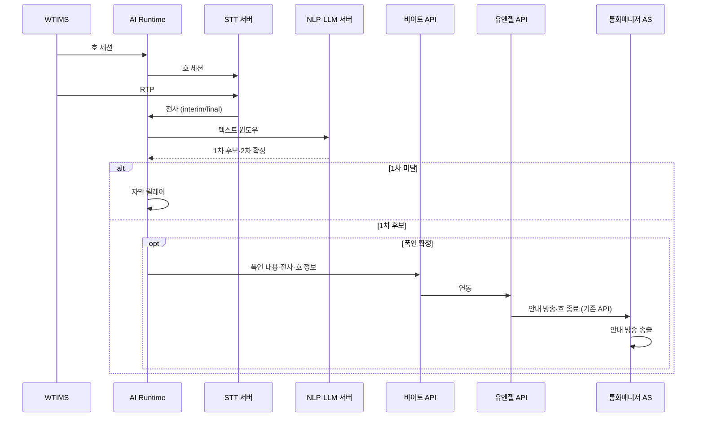
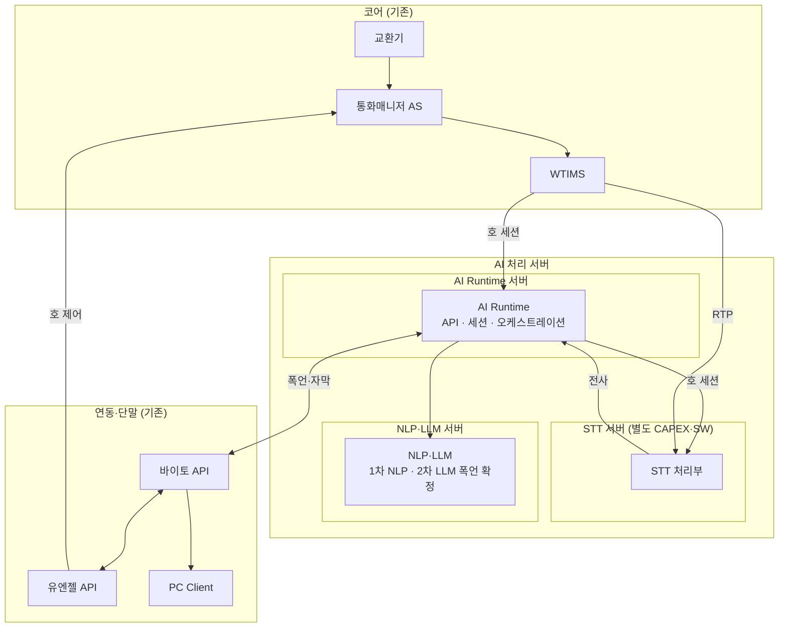

# 통화매니저 최소 구성 — 실시간 STT·폭언 감지·자막

## 문서 범위

[minimal-stt-profanity-architecture.md](./minimal-stt-profanity-architecture.md)를 **최소비용·최소구성·최소기능** 관점으로 축소한 기획안이다. **폭언·욕설 실시간 감지·호 종료 안내**와 **실시간 통화 자막** 두 기능만 제공한다.

| 구분 | 내용 |
|------|------|
| **목적** | 실시간 STT → 폭언·욕설 감지 → 바이토(수집) → 유엔젤(기존 호제어) → 통화매니저 AS(기존 안내·종료) |
| **신규 (본편 CAPEX·SW)** | **AI Runtime**, **NLP·LLM**(동일 서버) |
| **신규 (별도 산출)** | **STT** — 아키텍처·CAPEX는 본 문서에 기재하되 **도입 비용 합계에는 포함하지 않음**(별도 과제·예산) |
| **제외** | **DB 서버**(PostgreSQL·VectorDB), TTS, NL-IVR, TIP·스팸·CID·RAG, Cloud API, **가동 후 운용비** |
| **기존 활용** | 교환기, 통화매니저 AS, WTIMS, 유엔젤/바이토 API, PC Client(자막·기존 폭언 알림) |
| **성능·용량** | Busy Hour **시간당 15,000명·약 4.17 CPS·동시 500호** (§3.2, [production-deployment-architecture.md](./production-deployment-architecture.md) §4·§5) |
| **CAPEX·서버 근거** | 상용 문서 §6.3·§11.2 (온프레미스·EMS·TTS·DB 제외) |

확장안(부가 기능·DB·전체 MM)은 [minimal-stt-profanity-architecture.md](./minimal-stt-profanity-architecture.md)를 본다.

---

## 도입 비용 요약 (CAPEX + 초기 SW)

**STT 서버 CAPEX·STT SW 개발비(MM)** 는 **별도 산출**이며, 아래 **합계에는 넣지 않는다**.

| 구분 | ROM | 상세 |
|------|-----|------|
| **CAPEX** (본편 HW **6대**) | **약 1.45억 원** | AI Runtime 3 + NLP·LLM 3 (운영 각 2 + **TB 1**, §4.1) |
| **초기 SW 개발** (본편) | **약 2.78억 원** | AI Call Agent **1.30억** (§5.2) + 기존 노드 **1.48억** (§5.3) |
| **합계** | **약 4.23억 원** | CAPEX + 초기 SW |

---

## 1. 제공되는 기능 (사용자 관점)

호 종료 안내 방송·호 종료는 **통화매니저 AS·유엔젤 API 기존 기능**을 사용한다(AI Call Agent TTS·신규 망제어 개발 없음).

| # | 기능 | 가치 | 실현 수단 |
|---|------|------|-----------|
| 1 | **폭언·욕설 실시간 감지 및 호 종료 안내** *(핵심)* | 통화 중 폭언·욕설 감지 후 정책에 따라 **기존** 안내 방송·호 종료 | STT → 1차 NLP → 2차 LLM → 바이토 → 유엔젤(기존) → 통화매니저 AS |
| 2 | **실시간 통화 자막** | interim/final·화자 구분 자막(폭언 감지 입력) | STT 스트리밍, RTP 미러 → 바이토 → PC Client |

### 1.1 폭언·욕설 감지 흐름



| 단계 | 주체 | 처리 |
|------|------|------|
| 수집 | WTIMS → AI Runtime → STT(세션), WTIMS → STT(RTP) | 호 세션은 Runtime 경유, RTP는 STT 직연 |
| 1차 | 경량 NLP | 금칙어·패턴·경량 분류 |
| 2차 | LLM | 통화 전사 기반 폭언·욕설 **확정·오탐 완화** |
| 조치 | 바이토 → 유엔젤 → 통화매니저 AS | 폭언 수집, **기존** 호 종료 안내·호 종료 |
| 자막 | STT → AI Runtime → 바이토 → PC Client | 상시(기능 #2) |

> **DB 미사용:** 감사·이력·지식 저장은 본 최소 구성 범위 밖이다. 필요 시 추후 DB 도입 또는 외부 수집(바이토)만으로 운영한다.

---

## 2. 아키텍처

### 2.1 논리 계층

```
┌──────────────────────────────────────────────────────────────┐
│  단말·API           바이토 API ── PC Client (자막)           │
│                     유엔젤 API (기존 호제어)                 │
├──────────────────────────────────────────────────────────────┤
│  AI (신규)          AI Runtime ─ STT 서버 (별도 예산)        │
│                     NLP·LLM (동일 서버)                      │
├──────────────────────────────────────────────────────────────┤
│  코어 (기존)        교환기 ─ 통화매니저 AS ─ WTIMS           │
└──────────────────────────────────────────────────────────────┘
```

| 계층 | 구성 | 역할 |
|------|------|------|
| **코어** | 교환기, 통화매니저 AS, WTIMS | 호 설정, RTP 미러, **기존** 호 종료 안내 |
| **AI** | AI Runtime, STT, NLP·LLM | 세션·전사·폭언 감지·자막 릴레이 |
| **연동·단말** | 유엔젤 API, 바이토 API, PC Client | **기존** 호 제어, 자막·폭언 알림(기구현) |

### 2.2 물리 구성

신규 AI 측은 **AI 처리 서버** 영역 안에 **3종 서버**(AI Runtime · STT · NLP·LLM)로 구성한다. 물리적으로 **3종·9대**(종류당 **운영 2대 All-Active + TB 1대**). **본편 CAPEX·SW 합계**는 STT를 제외한 **Runtime + NLP·LLM, 6대**(운영 4 + TB 2) 기준이다.

| 구분 | 경로 | 설명 |
|------|------|------|
| **호 세션** | WTIMS → **AI Runtime** → **STT 서버** | 호 ID·발신번호·화자 매핑 |
| **RTP** | WTIMS → **STT 서버** | 음성 스트림 직연 |
| **전사** | STT 서버 → **AI Runtime** | interim/final → 자막·폭언 파이프라인 |
| **폭언 판정** | AI Runtime → **NLP·LLM 서버** | 1차 NLP·2차 LLM **동일 호스트** 일체 |



### 2.3 데이터 경로

| ID | 경로 | 트리거 |
|----|------|--------|
| P-0 | WTIMS → AI Runtime → STT (호 세션), WTIMS → STT (RTP) | 통화 시작 |
| P-1 | STT → AI Runtime → NLP·LLM → 바이토 → 유엔젤 → 통화매니저 AS | 폭언 2차 확정 |
| P-2 | STT → AI Runtime → 바이토 → PC Client | 상시(자막) |

### 2.4 설계 원칙

1. **최소 기능** — §1 두 기능만 구현·운영 범위로 고정한다.
2. **시그널·미디어 분리** — 호 세션은 WTIMS → AI Runtime → STT, RTP는 WTIMS → STT 직연.
3. **DB 없음** — RDB·VectorDB 신규 구축 없이 Runtime·연동만으로 가동한다.
4. **STT 별도 예산** — STT HW·SW는 **별도 과제**로 관리하되, 연동·용량은 본 문서와 정합한다.
5. **기존 호제어 재사용** — 안내 방송·호 종료·폭언 담당자 알림은 **기구현** 전제.
6. **온프레미스** — NLP·LLM은 자체 GPU 서버(L40S×1/노드). STT도 온프레미스 전제(별도 산출).

---

## 3. AI Call Agent — 노드별 기능

| 서버 종류 | 구성 대수 | 이중화 | 기능 | 연관 §1 | 본편 CAPEX |
|-----------|-----------|--------|------|---------|------------|
| **AI Runtime** *(API·세션 통합)* | **3** *(2+TB1)* | 운영 All-Active 2 + **TB 1** | WTIMS 호·STT 세션, 전사 릴레이, 폭언·자막 오케스트레이션, 바이토/유엔젤 클라이언트 | #1, #2 | **포함** |
| **STT** | **3** *(2+TB1)* | 운영 All-Active 2 + **TB 1** | RTP 직연·전사(자막·폭언 입력) | #1, #2 | **별도** §4.1 |
| **NLP·LLM** *(동일 호스트)* | **3** *(2+TB1)* | 운영 All-Active 2 + **TB 1** | 1차 NLP·2차 LLM(**폭언·욕설 확정만**) | #1 | **포함** |

**물리 합계: 9대** (본편 **6대** + STT **3대** 별도). **§3.2 용량**은 **운영 2대/종** 기준( TB 제외).

### 3.2 성능·용량 기준 (가상 시나리오)

[production-deployment-architecture.md](./production-deployment-architecture.md) **§4·§5·§6.1** 을 **3종·운영 6대(DB·TB 제외)** 기준으로 요약한다. STT·Runtime 벤치는 확장안과 동일하고, **LLM 부하는 폭언 2차 확정 위주**로 확장안보다 작을 수 있다(스테이징에서 재확인).

#### 처리 용량 목표

| 항목 | 값 |
|------|-----|
| **시간당 수용 가입자** | **15,000명** |
| **지속 CPS** | 약 **4.17** |
| **실효 동시 통화 상한** | **500호** (AI 응대 약 **100호**, 20%) |
| **실효 병목** | **AI Runtime 동시 세션 500** |

#### 기준 시나리오 (Busy Hour)

| 가정 | 내용 |
|------|------|
| STT | 모든 대상 통화 **RTP 미러 연속 인식**(자막·폭언) |
| 호당 STT 스트림 | 유저간 **2**/호 · AI **1**/호 → 평균 **1.8**/호 |
| LLM | **폭언 2차 확정** 경로 위주(유저간 종료 요약·TIP·CID **없음**) |
| Runtime | **1 세션/호** |

**500호 부하 시:** STT **약 900** 동시 스트림, Runtime **500** 세션(실효 상한). LLM은 폭언 트래픽만 반영 시 확장안 대비 **여유 증가** 가능.

#### 노드별 성능·수용량 매트릭스

| 시스템 노드 | 클러스터 벤치마크 | 최대 수용 동시호 (단독) | 구성 대수 |
|-------------|-------------------|-------------------------|-----------|
| **AI Runtime** | 동시 세션 **500** | **500호** | 2 All-Active |
| **STT** *(별도)* | 동시 스트림 **1,250** | **694호** *(1.8 스트림/호)* | 2 All-Active |
| **NLP·LLM** | 추론 QPS **25** (운영 **20**) | **652호** *(확장안 동일 벤치)* | 2 All-Active |

---

## 4. CAPEX (서버·HW, 온프레미스)

산정 근거: [production-deployment-architecture.md](./production-deployment-architecture.md) **§11.2**.

**TB(Test Bed) 구성:** 서버 **종류당 1대**를 **TB 전용**으로 추가한다(운영 All-Active 2대와 **동일 스펙**). 연동·부하·릴리즈 검증용이며, **§3.2 용량 산정의 운영 상한(500호 등)에는 TB 대수를 넣지 않는다.**

### 4.1 서버 종류별 구성 대수·CAPEX

| 서버 종류 | 운영 | TB | **합계** | 이중화·비고 | 권장 스펙(노드당, 요약) | 노드당 ROM | 합계 ROM |
|-----------|------|-----|----------|-------------|-------------------------|------------|----------|
| **AI Runtime** *(API·세션 통합)* | 2 | 1 | **3** | 운영 All-Active + TB 1 | 16 vCPU, 64 GB RAM, HDD 1 TB, 1 Gbps | 약 1,042만 원 | **약 3,126만 원** |
| **NLP·LLM** *(동일 호스트)* | 2 | 1 | **3** | 운영 All-Active + TB 1 | 32 vCPU, 256 GB RAM, **L40S×1**, HDD 2 TB, 1 Gbps | 약 3,804만 원 | **약 1.14억 원** |
| **STT** *(별도 산출)* | 2 | 1 | **3** | 운영 All-Active + TB 1 · **도입 비용 합계 제외** | 32 vCPU, 128 GB RAM, **L40S×1**, HDD 2 TB, 10 Gbps | 약 2,995만 원 | **약 0.90억 원** *(합계 미포함)* |
| **본편 합계** | 4 | 2 | **6대** | Runtime·NLP·LLM만 | — | — | **약 1.45억 원** |

> **STT** 는 **별도 과제·예산**으로 발주한다(위 표 **합계 ROM** 참고, **「도입 비용 요약」·본편 합계 행에는 미반영**). 본 문서 **§2·§3** 연동·용량은 STT 구축 시 **필수 전제**이다. STT **SW 개발 MM** 은 §5.1에서 **항목만 표기**하고 금액 합계에는 넣지 않는다.

---

## 5. OPEX — 초기 SW 개발비 (운용비 제외)

**월간 운용비가 아닌** 초기 **소프트웨어 개발비 ROM**이다. **단가:** [production-deployment-architecture.md](./production-deployment-architecture.md) **§11.4** — **약 1,300만 원/MM**.

| 구분 | MM | 비고 |
|------|-----|------|
| **AI Call Agent (본편)** | **10.0** | Runtime **6** + NLP·LLM **4** (§5.1) |
| **STT** | *(별도)* | §5.1 표기만, **MM·금액 합계 제외** |
| **기존 노드 연동** | **§5.3** | AI MM과 이중 계상 없음 |

**검증(E2E·부하·시뮬레이터) 전용 MM 행은 두지 않는다.** 각 서버 개발 범위에 **연동·단위·부하 검증**을 포함한다.

### 5.1 서버별 개발 공수 (MM)

| 서버 | MM | §1 기능별 배분 | 금액 (ROM) |
|------|-----|----------------|------------|
| **AI Runtime** *(API·세션 통합)* | **6.0** | **#1** 폭언 오케스트레이션·API 처리 **3.0** · **#2** 자막 릴레이·WSS/REST **3.0** | **약 0.78억 원** |
| **STT** | **—** | **#1, #2** 입력(전사) — **별도 과제** | *(본편 합계 제외)* |
| **NLP·LLM** *(동일 호스트)* | **4.0** | **#1** 1차 NLP **1.0** · 2차 LLM 폭언 확정 **3.0** | **약 0.52억 원** |
| **합계 (본편)** | **10.0** | | **약 1.30억 원** |

### 5.2 AI Call Agent 개발비 ROM

| 항목 | MM | 단가 | 금액 (ROM) |
|------|-----|------|------------|
| AI Call Agent SW (본편 HW 6대·§1) | **10.0** | 약 1,300만 원/MM | **약 1.30억 원** |

> AI 측 **WTIMS·바이토·유엔젤 연동 클라이언트·규약**은 위 10 MM에 포함한다(폭언·API **3 MM**·자막 **3 MM** 범위). **기존 제품 코드 변경**은 §5.3만 반영한다.

### 5.3 기존 노드·연동 개발비 ROM

| # | 노드 | 개발·연동 범위 (본 문서) | MM | 금액 (ROM) | 비고 |
|---|------|--------------------------|-----|------------|------|
| 1 | **WTIMS** | 실시간 STT 대상 호에 **AI Runtime** 세션·**STT** RTP 미러(§2.2) | *(상용 이력)* | **약 0.7억 원** | [production-deployment-architecture.md](./production-deployment-architecture.md) **§11.3** — 범위 확정 시 재검증 |
| 2 | **통화매니저 API (유엔젤)** | 실시간 STT **필요 호**에 한해 **시그널·세션 정보를 WTIMS로 연동 전달** | **1.0** | **약 1,300만 원** | **안내 방송·호 종료**는 **기구현** — 본 과제 범위 외. **서비스 가입(청약) 처리**는 **미산정** |
| 3 | **통화매니저 API (바이토)** · **PC Client** | **실시간 STT** 수신·**PC Client 자막** 표시 | **5.0** | **약 0.65억 원** | **폭언 시 별도 담당자 알림**은 **기구현** — MM·금액 **산정 제외** |
| | **기존 노드 소계** | | **6.0** *(+ WTIMS 0.7억)* | **약 1.48억 원** | 유엔젤 1 MM + 바이토·PC 5 MM + WTIMS |

### 5.4 초기 SW 개발비 합계

| 구분 | ROM |
|------|-----|
| AI Call Agent SW (§5.2) | **약 1.30억 원** |
| 기존 노드·연동 (§5.3) | **약 1.48억 원** |
| **SW 개발 합계 (본편)** | **약 2.78억 원** |

※ **STT SW** 는 별도 과제에서 MM·금액 산출. CAPEX·전체 합계는 문서 상단 **「도입 비용 요약」** 참조.

### 5.5 기능별 개발 공수 상세 (MM)

| 기능 영역 | §1 | 담당 | MM | 비고 |
|-----------|-----|------|-----|------|
| WTIMS↔Runtime↔STT 세션·RTP·자막 릴레이·WSS/REST | #1, #2 | AI Runtime | **3.0** | |
| 폭언 오케스트레이션·API·바이토/유엔젤 트리거 | #1 | AI Runtime | **3.0** | 기존 호제어 호출 |
| 1차 NLP·규칙·후보 | #1 | NLP·LLM | **1.0** | |
| 2차 LLM·폭언·욕설 확정 | #1 | NLP·LLM | **3.0** | 통화 전사 → 판정만 |
| STT·온프레미스 ASR·품질 | #1, #2 | STT | **—** | **별도 과제** |
| **합계 (본편)** | | | **10.0** | |

---

## 부록

### A. 참고 문서

[minimal-stt-profanity-architecture.md](./minimal-stt-profanity-architecture.md) (확장안) · [production-deployment-architecture.md](./production-deployment-architecture.md) · [prd.md](../product/prd.md)

### B. 확장안 대비 제외·축소 요약

| 항목 | 확장안 | 본 문서 (최소) |
|------|--------|----------------|
| 기능 | 6종 | **2종** (#1, #2) |
| DB 서버 | 2대 | **없음** |
| AI MM | 55 | **10** (STT MM 별도) |
| AI Runtime MM | 19 | **6** |
| NLP·LLM MM | 12 | **4** (폭언만) |
| 공통·검증 MM | 10 | **0** (서버별 포함) |
| 유엔젤 연동 | CM+호제어 등 | **WTIMS 릴레이 1 MM** (호제어 기구현) |
| 바이토·PC | 자막+폭언 알림 | **자막 5 MM** (폭언 알림 기구현) |
| STT CAPEX·SW | 본편 포함 | **별도 산출** |

### C. PRD·확장안 대비 범위 외

TIP·VectorDB·RAG·스팸·CID·HITL·NL-IVR·TTS·멀티 에이전트·전용 E2E MM 행·DB 감사 로그 — [minimal-stt-profanity-architecture.md](./minimal-stt-profanity-architecture.md) §C 및 본 문서 §1·§2 범위 밖.
