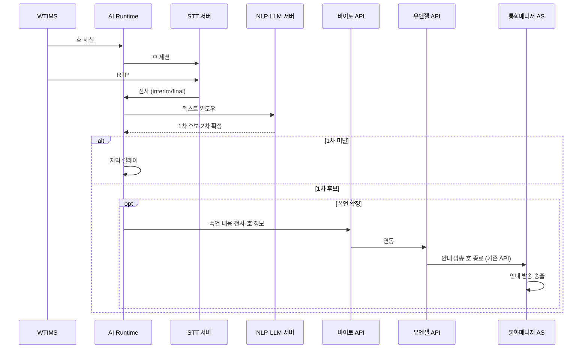
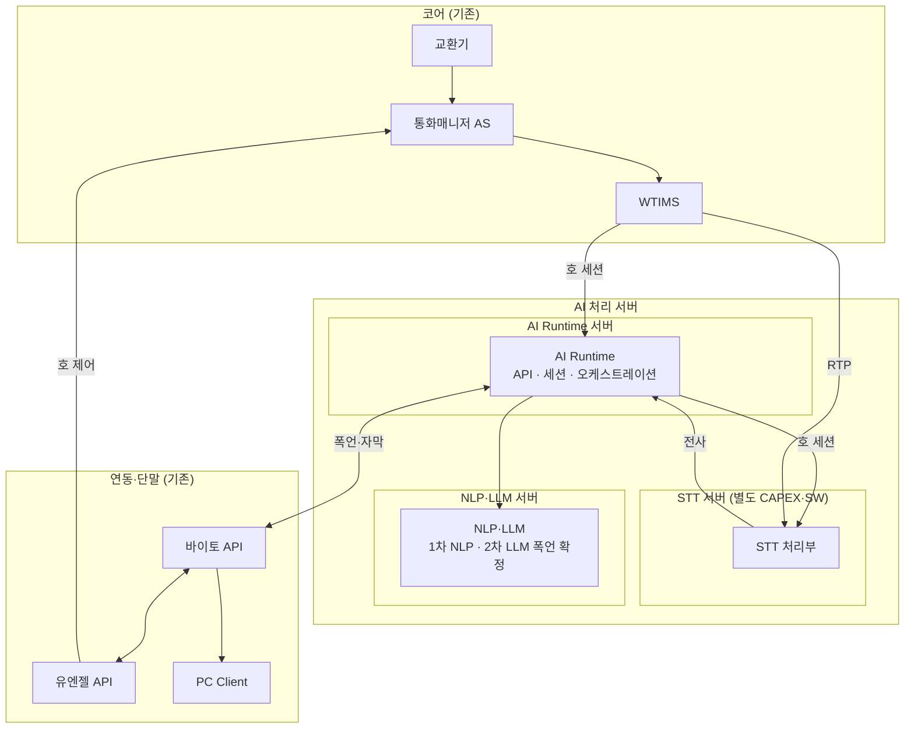

# 통화매니저 최소 구성 — 실시간 STT·폭언 감지·자막

## 문서 범위

[minimal-stt-profanity-architecture.md](./minimal-stt-profanity-architecture.md)를 **최소비용·최소구성·최소기능** 관점으로 축소한 기획안이다. **폭언·욕설 실시간 감지·호 종료 안내**와 **실시간 통화 자막** 두 기능만 제공한다.

| 구분 | 내용 |
|------|------|
| **목적** | 실시간 STT → 폭언·욕설 감지 → 바이토(수집) → 유엔젤(기존 호제어) → 통화매니저 AS(기존 안내·종료) |
| **신규 (본편 CAPEX·SW)** | **AI Runtime**, **EMS**, **NLP·LLM** |
| **신규 (별도 산출)** | **STT** — 아키텍처·CAPEX는 본 문서에 기재하되 **도입 비용 합계에는 포함하지 않음**(별도 과제·예산) |
| **제외** | **DB 서버**(PostgreSQL·VectorDB), TTS, NL-IVR, TIP·스팸·CID·RAG, Cloud API, **가동 후 운용비** |
| **EMS** | §2 **아키텍처 도식 미포함** · CAPEX **본편 포함**(§4.1) · 초기 SW **2.3 MM**(가상, §5.1, AI Call Agent 포함) |
| **기존 활용** | 교환기, 통화매니저 AS, WTIMS, 유엔젤/바이토 API, PC Client(자막·기존 폭언 알림) |
| **성능·용량** | **동시 625호·약 5.21 CPS·시간당 18,750콜** (120초/호, 실효 병목 **STT**, §3.2) |
| **CAPEX·서버 근거** | 상용 문서 §6.3·§11.2 (온프레미스·TTS·DB 제외) |

확장안(부가 기능·DB·전체 MM)은 [minimal-stt-profanity-architecture.md](./minimal-stt-profanity-architecture.md)를 본다.

---

## 도입 비용 요약 (CAPEX + 초기 SW)

**STT** 서버 CAPEX·STT SW는 **별도 산출**이며 **본편 합계에 넣지 않는다**. **EMS** 초기 SW(**2.3 MM** 가상)는 **AI Call Agent(11.5 MM)** 에 포함한다. **EMS HW** 는 §4.1 **본편 CAPEX**에 포함(AI Runtime과 **동일 단가**).

| 구분 | ROM | 상세 |
|------|-----|------|
| **CAPEX** (본편 HW **9대**) | **약 1.77억 원** | AI Runtime 3 + **EMS 3** + NLP·LLM 3 (§4.1) |
| **초기 SW 개발** (본편) | **약 3.00억 원** | **23.0 MM** — AI Call Agent **11.5** (§5.2) + 기존 노드 **11.5** (§5.3) |
| **합계** (본편) | **약 4.77억 원** | CAPEX(9대) + 초기 SW(본편) · **STT는 별도** |

---

## 1. 제공되는 기능 (사용자 관점)

호 종료 안내 방송·호 종료는 **통화매니저 AS·유엔젤 API 기존 기능**을 사용한다(AI Call Agent TTS·신규 망제어 개발 없음).

| # | 기능 | 가치 | 실현 수단 |
|---|------|------|-----------|
| 1 | **폭언·욕설 실시간 감지 및 호 종료 안내** *(핵심)* | 통화 중 폭언·욕설 감지 후 정책에 따라 **기존** 안내 방송·호 종료 | STT → 1차 NLP → 2차 LLM → 바이토 → 유엔젤(기존) → 통화매니저 AS |
| 2 | **실시간 통화 자막** | interim/final·화자 구분 자막(폭언 감지 입력) | STT 스트리밍, RTP 미러 → 바이토 → PC Client |

### 1.1 폭언·욕설 감지 흐름



| 단계 | 주체 | 처리 |
|------|------|------|
| 수집 | WTIMS → AI Runtime → STT(세션), WTIMS → STT(RTP) | 호 세션은 Runtime 경유, RTP는 STT 직연 |
| 1차 | 경량 NLP | 금칙어·패턴·경량 분류 |
| 2차 | LLM | 통화 전사 기반 폭언·욕설 **확정·오탐 완화** |
| 조치 | 바이토 → 유엔젤 → 통화매니저 AS | 폭언 수집, **기존** 호 종료 안내·호 종료 |
| 자막 | STT → AI Runtime → 바이토 → PC Client | 상시(기능 #2) |

> **DB 미사용:** 감사·이력·지식 저장은 본 최소 구성 범위 밖이다. 필요 시 추후 DB 도입 또는 외부 수집(바이토)만으로 운영한다.

---

## 2. 아키텍처

### 2.1 논리 계층

```
┌──────────────────────────────────────────────────────────────┐
│  단말·API           바이토 API ── PC Client (자막)           │
│                     유엔젤 API (기존 호제어)                 │
├──────────────────────────────────────────────────────────────┤
│  AI (신규)          AI Runtime ─ STT 서버 (별도 예산)        │
│                     NLP·LLM (동일 서버)                      │
├──────────────────────────────────────────────────────────────┤
│  코어 (기존)        교환기 ─ 통화매니저 AS ─ WTIMS           │
└──────────────────────────────────────────────────────────────┘
```

| 계층 | 구성 | 역할 |
|------|------|------|
| **코어** | 교환기, 통화매니저 AS, WTIMS | 호 설정, RTP 미러, **기존** 호 종료 안내 |
| **AI** | AI Runtime, STT, NLP·LLM | 세션·전사·폭언 감지·자막 릴레이 |
| **연동·단말** | 유엔젤 API, 바이토 API, PC Client | **기존** 호 제어, 자막·폭언 알림(기구현) |

### 2.2 물리 구성

신규 AI 측은 **AI 처리 서버** 영역 안에 **4종 서버**(AI Runtime · **EMS** · STT · NLP·LLM)로 구성한다. 물리 **12대**(본편 **9** + STT **3** 별도): **AI Runtime** 은 **Active/Standby 1+1 + TB 1**, **EMS·STT·NLP·LLM** 은 **All-Active 2 + TB 1**(종류당). **§3.2 용량**은 Runtime **Active 1대**, STT·LLM **운영 2대** 기준(TB 제외).

| 구분 | 경로 | 설명 |
|------|------|------|
| **호 세션** | WTIMS → **AI Runtime** → **STT 서버** | 호 ID·발신번호·화자 매핑 |
| **RTP** | WTIMS → **STT 서버** | 음성 스트림 직연 |
| **전사** | STT 서버 → **AI Runtime** | interim/final → 자막·폭언 파이프라인 |
| **폭언 판정** | AI Runtime → **NLP·LLM 서버** | 1차 NLP·2차 LLM **동일 호스트** 일체 |



### 2.3 데이터 경로

| ID | 경로 | 트리거 |
|----|------|--------|
| P-0 | WTIMS → AI Runtime → STT (호 세션), WTIMS → STT (RTP) | 통화 시작 |
| P-1 | STT → AI Runtime → NLP·LLM → 바이토 → 유엔젤 → 통화매니저 AS | 폭언 2차 확정 |
| P-2 | STT → AI Runtime → 바이토 → PC Client | 상시(자막) |

### 2.4 설계 원칙

1. **최소 기능** — §1 두 기능만 구현·운영 범위로 고정한다.
2. **시그널·미디어 분리** — 호 세션은 WTIMS → AI Runtime(**Active/Standby**) → STT, RTP는 WTIMS → STT 직연.
3. **DB 없음** — RDB·VectorDB 신규 구축 없이 Runtime·연동만으로 가동한다.
4. **STT 별도 예산** — STT HW·SW는 **별도 과제**로 관리하되, 연동·용량은 본 문서와 정합한다.
5. **기존 호제어 재사용** — 안내 방송·호 종료·폭언 담당자 알림은 **기구현** 전제.
6. **온프레미스** — NLP·LLM은 자체 GPU 서버(L40S×1/노드). STT도 온프레미스 전제(별도 산출).

---

## 3. AI Call Agent — 노드별 기능

| 서버 종류 | 구성 대수 | 이중화 | 기능 | 연관 §1 | 본편 CAPEX |
|-----------|-----------|--------|------|---------|------------|
| **AI Runtime** *(API·세션 통합)* | **3** *(A/S1+TB1)* | **Active/Standby** + **TB 1** | WTIMS 호·STT 세션, 전사 릴레이, 폭언·자막 오케스트레이션, 바이토/유엔젤 클라이언트 | #1, #2 | **포함** |
| **EMS** *(관측·별도 구역)* | **3** *(2+TB1)* | All-Active 2 + **TB 1** | OTel·메트릭·로그·트레이스·알람·Grafana(§4.1) | — | **포함** |
| **STT** | **3** *(2+TB1)* | All-Active 2 + **TB 1** | RTP 직연·전사(자막·폭언 입력) | #1, #2 | **별도** §4.1 |
| **NLP·LLM** *(동일 호스트)* | **3** *(2+TB1)* | All-Active 2 + **TB 1** | 1차 NLP·2차 LLM(**폭언·욕설 확정만**) | #1 | **포함** |

**물리 합계: 12대** (본편 **9대** + STT **3대** 별도). **용량 산정:** Runtime **Active 1대**, STT·LLM **운영 2대** 합산 — **실효 상한은 §3.2**.

### 3.2 성능·용량 기준 (가상 시나리오)

벤치 근거: STT·LLM은 [production-deployment-architecture.md](./production-deployment-architecture.md) **§5.1·§5.3**. **AI Runtime** 은 동 문서 §5.4의 **250세션/노드(풀 오케스트레이션)** 와 달리, 본 최소 구성(**STT 전사 스트림 릴레이·WSS·폭언 트리거**, RTP·TTS·DB·Vector **없음**)에 맞게 **별도 벤치 가정**을 둔다. **Active/Standby** 이므로 Runtime 용량은 **Active 1대**만 본다. **STT·LLM** 은 All-Active **2대** 합산(TB 제외). **NLP** 는 용량 산정 제외.

#### 공통 가상 시나리오

| 가정 | 값 |
|------|-----|
| 평균 통화 시간 | **120초/호** |
| 지속 부하 환산 | **CPS ≈ 동시 호 ÷ 120** · **동시 호 ≈ CPS × 120** |
| **STT** | **호당 2채널**(발신자·수신자 RTP 미러, 자막·폭언 공통) |
| **LLM** | **호당 1.1질의/호** — NLP 실시간 폭언 후보 시 LLM **0.1회** + **호 종료** 시 폭언·요약 **1.0회** |
| **Runtime** | **호당 1세션** + STT **interim/final** 이벤트 릴레이(자막·폭언 입력) |

#### AI Runtime 용량 재산정 (최소 구성)

상용 §5.4의 **250세션/노드** 는 TTS·LLM 다회 라우팅·DB·HITL 등 **풀 AI 오케스트레이션** 벤치이다. 본 문서 Runtime은 **CPU·I/O 중심**이다.

| 부하 요소 | 본 최소 구성 | 상용 풀 스택 대비 |
|-----------|--------------|-------------------|
| 미디어(RTP) | **없음** (WTIMS·STT 직연) | TTS·mirror 부하 없음 |
| 호당 작업 | 세션 상태 + STT gRPC 수신 + 바이토 WSS 송신 + 폭언 시 LLM **비동기** 호출 | 발화마다 동기 LLM·TTS 적음 |
| 연결 | **통화 1건 ≈ 장기 세션 1 + STT 스트림 1** | API/Realtime **WSS 5,000/Active** 벤치(§5.5)와 유사한 **연결 유지형** |

**가정(16 vCPU · 64 GB · Active 1대):** 동시 **2,000** 세션·스트림 유지를 **벤치 목표**로 두고, 운영은 **80% → 1,600** 권장. (스테이징에서 interim 빈도·WSS 팬아웃·p95 지연으로 확정.)

#### 서버당 제한 수치 (벤치)

| 서버 | 측정 단위 | **서버 1대** 상한 | **운영 용량** *(본 문서)* | 비고 |
|------|-----------|-------------------|---------------------------|------|
| **STT** | 동시 **ASR 채널** | **625** | **1,250** *(All-Active **2대**)* | 채널 1 = RTP 미러 1본 · L40S×1/노드 |
| **NLP·LLM** | LLM **QPS** *(NLP 미포함)* | 이론 **12.5** | 이론 **25** / 운영 **20** *(All-Active **2대**)* | 8B fp8 · **1,500 tok/s/노드** · **120 tok/질의** |
| **AI Runtime** | 동시 **세션·STT 릴레이** | **2,000** *(벤치)* | **1,600** 권장 *(**Active 1대**)* | **Active/Standby** · 상용 250과 **별도 가정** |

**LLM 질의·토큰 (120초 통화 가정)**

| 항목 | 값 |
|------|-----|
| 질의 1건당 토큰 | **120초 통화 전사·문맥**을 반영한 운영 가정 **평균 120 tok/질의**(출력 기준, 스테이징 재보정) |
| 호당 LLM 질의 | **1.1회/호** (위 0.1 + 1.0) |
| 호당 평균 LLM 부하 | **1.1 ÷ 120 ≈ 0.0092 QPS/호** |

#### 120초 시나리오 — 단독 역산 (동시 호 · CPS)

| 서버 | 역산 | **최대 동시 호** | **지속 CPS** |
|------|------|------------------|--------------|
| **STT** | **1,250 채널 ÷ 2채널/호** | **625호** | **625÷120 ≈ 5.21** |
| **LLM** | **20 QPS ÷ (1.1/120)** | **≈ 2,180호** | **≈ 18.2** |
| **AI Runtime** | **2,000 세션 ÷ 1/호** *(Active 1대 벤치)* | **2,000호** | **≈ 16.7** |
| **AI Runtime** | **1,600 세션** *(운영 80%)* | **1,600호** | **≈ 13.3** |

#### 실효 상한 (교차 병목)

| 항목 | 값 |
|------|-----|
| **실효 병목** | **STT** (2채널/호 · 클러스터 **1,250** 채널) |
| **실효 동시 호** | **625호** |
| **실효 CPS** | **≈ 5.21** |
| **시간당 콜** | **18,750** *(625×3600/120)* |
| **625호 시 Runtime** | **625 세션** / Active 벤치 2,000 → **여유** |
| **625호 시 STT** | **1,250 채널** / 한도 1,250 → **포화 인접** |
| **625호 시 LLM** | **≈ 5.7 QPS** / 운영 20 → **여유** |

> 확장안의 **AI 20%·호당 1.8 STT 채널** 등은 본 최소 구성 §3.2에 **적용하지 않는다**. **Runtime 2,000**·**STT 1,250**·**LLM 20 QPS** 는 스테이징 **5.21 CPS·625 동시호** 로 재확인한다.

---

## 4. CAPEX (서버·HW, 온프레미스)

산정 근거: [production-deployment-architecture.md](./production-deployment-architecture.md) **§11.2**.

**TB(Test Bed) 구성:** 서버 **종류당 1대**를 **TB 전용**으로 추가한다(운영과 **동일 스펙**). 연동·부하·릴리즈 검증용이며, **§3.2 용량(625호 등)에는 TB·Standby 대수를 넣지 않는다.**

**EMS:** 운영·장애 대응을 위해 **관측(EMS) 구축이 필요**하나, 본 최소 구성 **§2 아키텍처 도식에는 그리지 않는다**. **HW CAPEX** 는 아래 **§4.1 본편 표**에 포함하며, 노드 스펙·**노드당 ROM은 AI Runtime과 동일**하게 둔다. **초기 SW** 는 **약 0.30억(가상)** 으로 §5.1·§5.2에 반영(외부·전사 공용 관제 대체 시 재검토).

### 4.1 서버 종류별 구성 대수·CAPEX (AI 본편)

상용 문서는 EMS를 **OTel·Metrics·Log·Trace·Alert·Grafana** 등 **다수 프로세스**로 전개한다([production-deployment-architecture.md](./production-deployment-architecture.md) §2·§8). 본 최소 구성은 **EMS 전용 호스트 3대(운영 2 + TB 1)** 에 **통합 배치**하고, **스펙·CAPEX 단가는 AI Runtime과 동일**하게 산정한다.

| 서버 종류 | 운영 | TB | **합계** | 이중화·비고 | 권장 스펙(노드당, 요약) | 노드당 ROM | 합계 ROM |
|-----------|------|-----|----------|-------------|-------------------------|------------|----------|
| **AI Runtime** *(API·세션 통합)* | 1+1 | 1 | **3** | **Active/Standby** + TB 1 | 16 vCPU, 64 GB RAM, HDD 1 TB, 1 Gbps | 약 1,042만 원 | **약 3,126만 원** |
| **EMS** *(관측·별도 구역)* | 2 | 1 | **3** | 운영 All-Active + TB 1 | **AI Runtime과 동일** · 16 vCPU, 64 GB RAM, HDD 1 TB, 1 Gbps | 약 1,042만 원 | **약 3,126만 원** |
| **NLP·LLM** *(동일 호스트)* | 2 | 1 | **3** | 운영 All-Active + TB 1 | 32 vCPU, 256 GB RAM, **L40S×1**, HDD 2 TB, 1 Gbps | 약 3,804만 원 | **약 1.14억 원** |
| **STT** *(별도 산출)* | 2 | 1 | **3** | 운영 All-Active + TB 1 · **도입 비용 합계 제외** | 32 vCPU, 128 GB RAM, **L40S×1**, HDD 2 TB, 10 Gbps | 약 2,995만 원 | **약 0.90억 원** *(합계 미포함)* |
| **본편 합계** | 6 | 3 | **9대** | Runtime + **EMS** + NLP·LLM | — | — | **약 1.77억 원** |

| EMS (본편) | 본 문서 처리 |
|------------|----------------|
| **§2 아키텍처** | EMS **미표기** (코어·AI·연동만) |
| **관측 대상** | AI Runtime, STT, NLP·LLM 및 연동 구간(OTel 등 — 상용 §8 참고) |
| **초기 SW (§5.1)** | **2.3 MM(가상)** — **§5.2 AI Call Agent에 포함** |
| **대안** | 전사·외부 공용 관제로 **대체** 시 EMS 3대·EMS SW는 **0**으로 재검토 |

> **STT** 는 **별도 과제·예산**으로 발주한다(위 표 **STT 행** 참고, **「도입 비용 요약」·본편 합계에 미반영**). 본 문서 **§2·§3** 연동·용량은 STT 구축 시 **필수 전제**이다. STT **SW 개발 MM** 은 §5.1에서 **항목만 표기**하고 금액 합계에는 넣지 않는다.

---

## 5. OPEX — 초기 SW 개발비 (운용비 제외)

**월간 운용비가 아닌** 초기 **소프트웨어 개발비 ROM**이다. **단가:** [production-deployment-architecture.md](./production-deployment-architecture.md) **§11.4** — **약 1,300만 원/MM** (금액은 MM×단가 **ROM**, 합계는 반올림).

| 구분 | MM | 비고 |
|------|-----|------|
| **AI Call Agent (본편)** | **11.5** | Runtime **5.0** + NLP·LLM **4.0** + EMS **2.3**(§5.1) |
| **STT** | *(별도)* | §5.1 표기만, **MM·금액 합계 제외** |
| **기존 노드 연동** | **11.5** | WTIMS **6.5** + 유엔젤 **1.0** + 바이토·PC **4.0** (§5.3) |

**검증(E2E·부하·시뮬레이터) 전용 MM 행은 두지 않는다.** 각 서버 개발 범위에 **연동·단위·부하 검증**을 포함한다(**EMS** 포함).

### 5.1 서버별 개발 공수 (MM)

| 서버 | MM | §1 기능별 배분 | 금액 (ROM) |
|------|-----|----------------|------------|
| **AI Runtime** *(API·세션 통합)* | **5.0** | **#1** 폭언 오케스트레이션·API 처리 **2.0** · **#2** 자막 릴레이·WSS/REST **3.0** | **약 0.65억 원** |
| **EMS** *(관측·별도 구역)* | **2.3** *(가상)* | OTel·메트릭·로그·트레이스·알람·Grafana·AI 노드 연동(§4.1) | **약 0.30억 원** *(가상 ROM)* |
| **STT** | **—** | **#1, #2** 입력(전사) — **별도 과제** | *(AI Call Agent 합계 제외)* |
| **NLP·LLM** *(동일 호스트)* | **4.0** | **#1** 1차 NLP **1.0** · 2차 LLM 폭언 확정 **3.0** | **약 0.52억 원** |
| **합계 (AI Call Agent)** | **11.5** | STT 제외 | **약 1.50억 원** |

> 세부 MM 합(5.0+4.0+2.3)=**11.3** — 표 **11.5**·**1.50억** 은 ROM·가상 EMS 금액 기준 **반올림** 정합.

### 5.2 AI Call Agent 개발비 ROM

| 항목 | MM | 단가 | 금액 (ROM) |
|------|-----|------|------------|
| AI Call Agent SW (본편 HW 9대·§1, **EMS SW 포함**) | **11.5** | 약 1,300만 원/MM | **약 1.50억 원** |

> AI 측 **WTIMS·바이토·유엔젤 연동 클라이언트·규약**은 Runtime MM에 포함(폭언·API **2.0**·자막 **3.0**). **EMS 2.3 MM**(가상, ROM **0.30억**) 포함. **기존 제품 코드 변경**은 §5.3만 반영한다.

### 5.3 기존 노드·연동 개발비 ROM

| # | 노드 | 개발·연동 범위 (본 문서) | MM | 금액 (ROM) | 비고 |
|---|------|--------------------------|-----|------------|------|
| 1 | **WTIMS** | 실시간 STT 대상 호에 **AI Runtime** 세션·**STT** RTP 미러(§2.2) | **6.5** | **약 0.85억 원** | [production-deployment-architecture.md](./production-deployment-architecture.md) **§11.3** — 상용 이력·금액 기준 환산 |
| 2 | **통화매니저 API (유엔젤)** | 실시간 STT **필요 호**에 한해 **시그널·세션 정보를 WTIMS로 연동 전달** | **1.0** | **약 0.13억 원** | **안내 방송·호 종료**는 **기구현** — 본 과제 범위 외 |
| 3 | **통화매니저 API (바이토)** · **PC Client** | **실시간 STT** 수신·**PC Client 자막** 표시 | **4.0** | **약 0.52억 원** | **폭언 시 별도 담당자 알림**은 **기구현** — MM·금액 **산정 제외** |
| | **기존 노드 소계** | | **11.5** | **약 1.50억 원** | 6.5 + 1.0 + 4.0 |

### 5.4 초기 SW 개발비 합계

| 구분 | MM | ROM |
|------|-----|-----|
| AI Call Agent SW (§5.2, EMS 포함) | **11.5** | **약 1.50억 원** |
| 기존 노드·연동 (§5.3) | **11.5** | **약 1.50억 원** |
| **SW 개발 합계 (본편)** | **23.0** | **약 3.00억 원** |

※ **EMS 2.3 MM**(가상)은 §5.2 **AI Call Agent(11.5 MM)** 에 포함(§5.4 별도 행 없음). **STT SW** 는 별도 과제. CAPEX·전체 합계는 **「도입 비용 요약」** 참조.

### 5.5 기능별 개발 공수 상세 (MM)

| 기능 영역 | §1 | 담당 | MM | 비고 |
|-----------|-----|------|-----|------|
| WTIMS↔Runtime↔STT 세션·RTP·자막 릴레이·WSS/REST | #1, #2 | AI Runtime | **3.0** | |
| 폭언 오케스트레이션·API·바이토/유엔젤 트리거 | #1 | AI Runtime | **2.0** | 기존 호제어 호출 |
| 1차 NLP·규칙·후보 | #1 | NLP·LLM | **1.0** | |
| 2차 LLM·폭언·욕설 확정 | #1 | NLP·LLM | **3.0** | 통화 전사 → 판정만 |
| EMS·OTel·메트릭·로그·트레이스·알람·Grafana | — | EMS | **2.3** | 가상 · §4.1 |
| STT·온프레미스 ASR·품질 | #1, #2 | STT | **—** | **별도 과제** |
| **합계 (AI Call Agent)** | | | **11.5** | STT 제외 · §5.2 |

---

## 부록 — 참고 문서

[minimal-stt-profanity-architecture.md](./minimal-stt-profanity-architecture.md) (확장안) · [production-deployment-architecture.md](./production-deployment-architecture.md) · [prd.md](../product/prd.md)
