# Project Brief: Agentic AI Callbot — 듣고, 이해하고, 처리하는 통화 비서

**작성일**: 2026-04-28  
**버전**: 1.0  
**상태**: 발표용 소개 문서

---

## Executive Summary

**Agentic AI Callbot**은 회사의 대표번호로 걸려 오는 전화·문자에 사람처럼 응대하고,
그 자리에서 **예약·상담원 연결·일정 등록·문자 회신·후속 안내**까지 처리하는 **AI 통합 통화 플랫폼**입니다.

> 전화 한 통이 그저 "통화 한 건"으로 끝나지 않고,
> 그 통화가 만든 정보가 다음 통화의 답이 되는 구조가 핵심입니다.

기존 ARS와 콜봇은 메뉴 트리와 미리 만든 답변을 따라 움직입니다.
Agentic AI Callbot은 표준 SIP 기반 통화 제어 위에 실시간 음성 AI 파이프라인, 자기 학습형 지식 운영(Active RAG), 운영자 협업(HITL), 채널 통합(전화·문자·연결음·아웃바운드) 을 하나의 흐름으로 묶어 동작합니다.
운영하면 할수록 지식과 응대 품질이 자동으로 누적되며, 같은 플랫폼 위에서 여러 조직이 각자의 전용 AI를 운영할 수 있습니다.

---

## 1. 배경 — 기존 콜센터 자동화의 한계

기업이 전화 응대를 자동화하려고 하면 보통 다음과 같은 벽에 부딪힙니다.

| 문제 | 현장에서 일어나는 일 |
|------|----------------------|
| **메뉴식 ARS의 경직성** | "1번은 예약, 2번은 변경, 3번은 취소" — 고객이 한 번에 여러 가지를 묻기 어렵습니다. |
| **시나리오 구축 비용** | 도입까지 수개월의 기획·개발이 필요하고, 정책이 바뀔 때마다 다시 손봐야 합니다. |
| **정적인 지식** | 새로운 공지·요금·일정이 즉시 반영되지 않아 AI가 "모르겠습니다"를 반복합니다. |
| **상담원 연계 단절** | AI가 모를 때 전화·웹·문자·내선 전환이 따로 움직여 고객이 같은 설명을 반복합니다. |
| **부자연스러운 음성** | 침묵이 길고, 고객이 말을 끊지 못하며, AI 답변에서 끊김·지연이 자주 발생합니다. |
| **기록의 분절** | 통화·문자·예약·연락처가 별도 시스템에 흩어져 누가 언제 무엇을 약속했는지 추적이 어렵습니다. |
| **시간·상황별 정책 부재** | 야간·휴일·VIP·반복 문의 같은 상황을 단일 응답 모드로만 처리합니다. |
| **다지점 분리 운영의 어려움** | 같은 본사라도 매장·지점별로 어투·메뉴·정책이 다른데 시스템이 이를 분리해 주지 못합니다. |

이런 문제는 AI 기술 부족 때문이 아니라, **PBX·AI·운영 도구가 따로 노는 구조** 때문에 생깁니다.
Agentic AI Callbot은 통화 제어, AI 응대, 지식 운영, 사람 개입, 채널 통합, 정책 관리, 멀티테넌시를 **하나의 흐름으로 묶어서** 해결하는 데 초점을 둡니다.

---

## 2. Ideation — 어떤 발상에서 시작했는가

### 2.1 기존 방식은 어떻게 진행돼 왔는가

지금까지 콜센터 자동화는 대부분 **시나리오를 먼저 그리고, 고객을 그 시나리오 안으로 안내하는 방식** 으로 만들어졌습니다.

- FAQ를 미리 정리해 두고
- 인텐트(의도)를 정의하고
- ARS 메뉴를 단계별로 설계한 뒤
- 고객 발화를 그 메뉴 중 하나에 끼워 맞추는 구조였습니다.

이와 함께 통화 제어(PBX)·문자·캘린더·연락처·CRM은 별도의 시스템에서 운영되었고, 정책이 바뀌거나 운영 시간을 바꾸려면 또 다른 도구를 거쳐야 했습니다. 운영을 시작하면 빠르게 한계가 드러납니다. 시나리오를 다시 손봐야 하고, 복합 요청은 처리하지 못하며, 상담원이 통화로 답해 준 노하우는 통화가 끝나면 사라지고, 채널 사이의 맥락은 단절됩니다.

### 2.2 어떤 질문에서 출발했는가

이 플랫폼은 다음 일곱 가지 질문에서 출발했습니다.

| # | 질문 | 핵심 발상 |
|---|------|-----------|
| Q1 | 시나리오를 다 만들지 않고도 시작할 수 있을까? | 통화·문자·운영자 답변 자체를 학습 데이터로 보고, 운영하면서 지식을 쌓는다. |
| Q2 | 메뉴 트리 대신 고객의 목적을 바로 실행할 수 있을까? | 고객 발화에서 의도를 읽고, 예약·검색·전환 같은 실제 행동까지 AI가 직접 수행한다. |
| Q3 | AI가 틀릴 위험을 줄이면서도 상담원 부담을 낮출 수 있을까? | 어렵거나 민감한 질문은 운영자에게 짧게 위임하고, 그 답변을 다시 지식으로 환류한다. |
| Q4 | 시간·상황별로 다른 응답 정책을 코드 수정 없이 운영할 수 있을까? | 시간대·요일·발신자 조건을 데이터로 정의해 콘솔에서 직접 정책을 구성한다. |
| Q5 | 전화·문자·연결음을 한 두뇌에서 일관되게 처리할 수 있을까? | 채널은 다양해도 같은 의도 분류·지식·페르소나를 공유하도록 설계한다. |
| Q6 | 한 플랫폼에서 여러 조직(매장·지점)을 데이터 누수 없이 운영할 수 있을까? | 내선·조직 단위로 지식·페르소나·예약·정책·연락처를 완전히 분리하는 멀티테넌시. |
| Q7 | 통화·문자·예약·연락처가 한 화면에서 운영될 수 있을까? | 운영자 콘솔이 PBX·AI·CRM·예약 시스템의 단일 진입점을 제공한다. |

목표는 "정해진 시나리오를 잘 따라가는 챗봇"이 아니라,
전화·문자·예약·정책·사람 개입을 하나의 흐름으로 처리하는 통화 운영 OS입니다.

### 2.3 어떤 기술 방향으로 풀었는가

질문별 발상은 다음과 같은 기술 방향으로 정리됐습니다.

| 영역 | 적용한 접근 |
|------|-------------|
| 통화 신호·미디어 | 표준 **SIP B2BUA** 기반 자체 통화 제어 엔진, **RTP** 미디어 브리지/리코딩 |
| 실시간 대화 품질 | **VAD** 발화 감지, **바지인(barge-in)**, 스트리밍 **TTS**, 한글 숫자 정규화 |
| 의도 → 행동 연결 | **LangGraph** 그래프로 17개 의도 분류 후 캐시·RAG·예약·전환·HITL 분기 |
| 살아 있는 지식 | **Active RAG**: 통화·HITL·문서·운영자 입력을 모두 같은 벡터 저장소(`ChromaDB`)에 흡수 |
| 사람 개입 | **HITL** 운영자 콘솔 입력을 LLM이 전화용 어투로 다듬어 자연스러운 음성으로 송출 |
| 채널 통합 | 음성·**SIP MESSAGE**(문자)·통화 연결음·아웃바운드 발신을 같은 두뇌가 처리 |
| 운영 정책 | **Call Control** 라우팅 규칙(시간·요일·공휴일·발신자 필터·착신 그룹)을 콘솔에서 정의 |
| 멀티테넌시 | 내선·조직 단위로 지식·캐시·페르소나·예약·연락처 컬렉션을 완전 분리 |
| 외부 연동 | **Google Cloud STT/TTS/Gemini**, **Google Calendar**, **Suno**(연결음 음원), **MCP** 확장 인터페이스 |

### 2.4 구현으로는 어떻게 녹였는가 — 질문별 케이스

각 질문은 시스템 안에서 별도의 동작 케이스로 구체화됩니다.

#### Case A — Q1·Q2 응답: 의도 기반 음성 응대 + 자기학습 지식 (인바운드 통화)

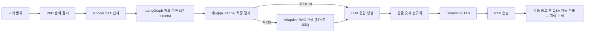

#### Case B — Q3 응답: AI가 자신 없을 때의 운영자 협업 (HITL)

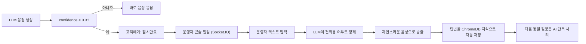

#### Case C — Q4 응답: 착신 정책 라우팅 (Call Control)

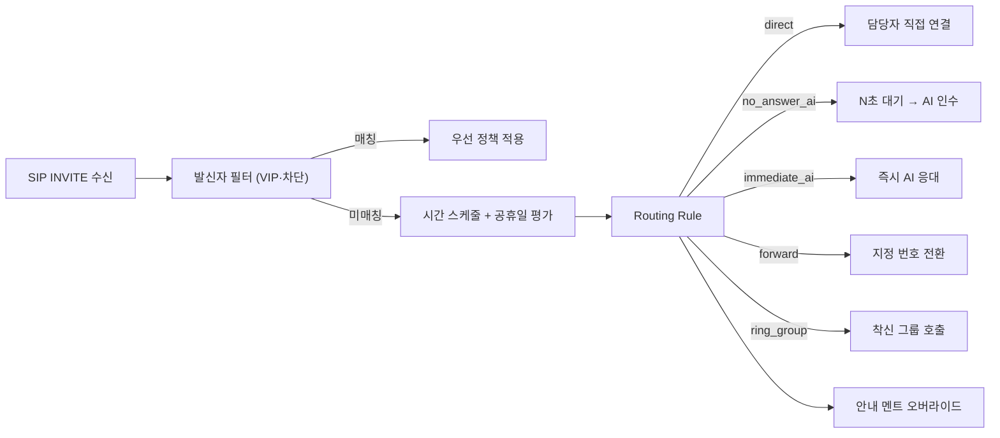

#### Case D — Q5 응답: 채널 통합 (음성·문자·연결음·아웃바운드)

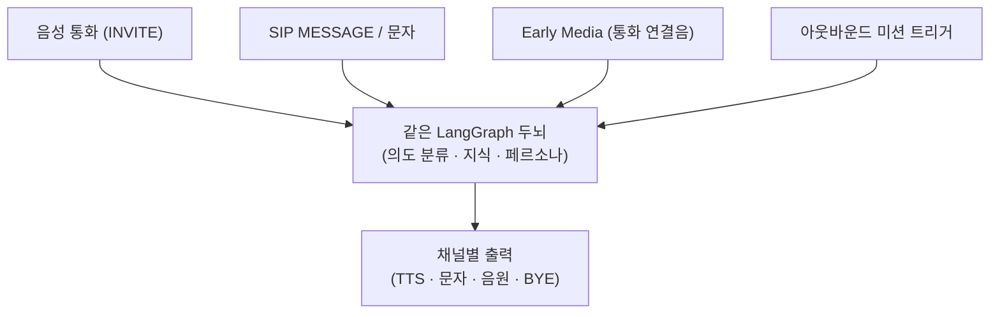

#### Case E — Q6·Q7 응답: 멀티테넌시 + 단일 운영자 콘솔

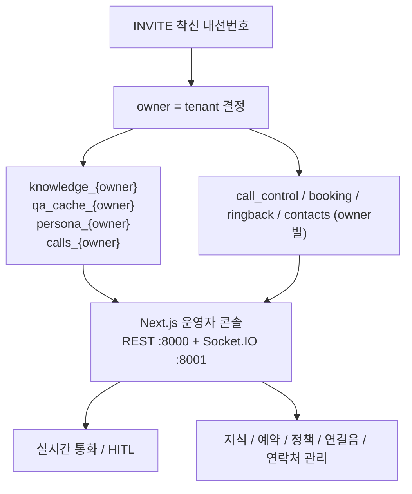

### 2.5 기대 효과

- **도입 부담 축소** — 모든 시나리오를 미리 짜지 않아도, 문서 업로드와 운영 중 통화로 지식이 자라납니다.
- **고객 경험 개선** — 메뉴를 누르는 대신 자연어로 말하고, 그 자리에서 예약·전환·문자가 끝납니다.
- **상담원 업무 경감** — 모든 전화를 직접 받지 않고 어려운 구간에만 짧게 개입합니다.
- **시간과 함께 좋아지는 품질** — 운영자 답변·통화·문자가 모두 다음 응대 품질을 끌어올립니다.
- **정책 운영의 자율성** — 시간대·휴일·VIP 정책을 코드 수정 없이 콘솔에서 정의·즉시 적용합니다.
- **멀티 채널 일관성** — 전화·문자·연결음·아웃바운드가 같은 두뇌 위에서 동일한 어투·지식으로 동작합니다.
- **단일 플랫폼, 다조직 운영** — 본사·지점·프랜차이즈를 한 인프라에서 데이터 누수 없이 운영합니다.

---

## 3. 솔루션 아키텍처

### 3.1 한눈에 보기

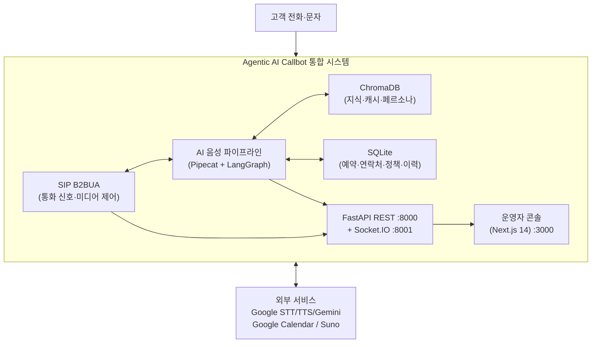

### 3.2 6레이어 아키텍처

시스템은 책임이 분리된 6개 레이어 + 외부 AI 서비스 클러스터로 구성됩니다.

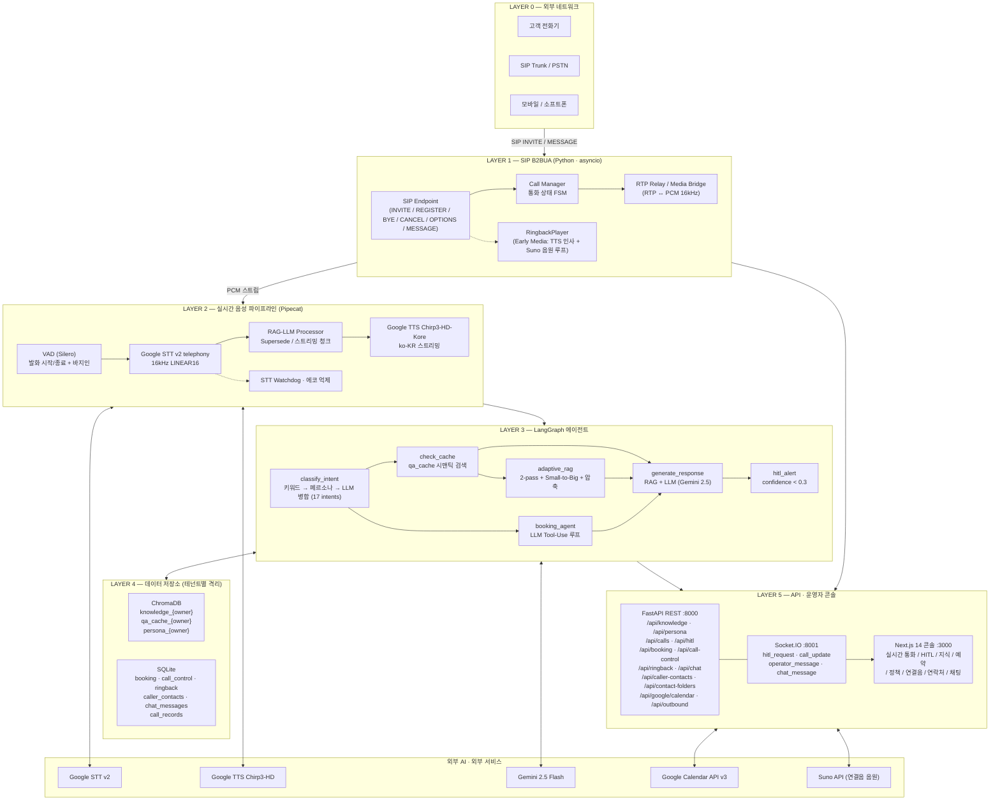

**임베딩**: `all-MiniLM-L6-v2` (384차원), 코사인 유사도, `where={owner}` 테넌트 필터.

### 3.3 통화 한 건의 여정 (End-to-End)

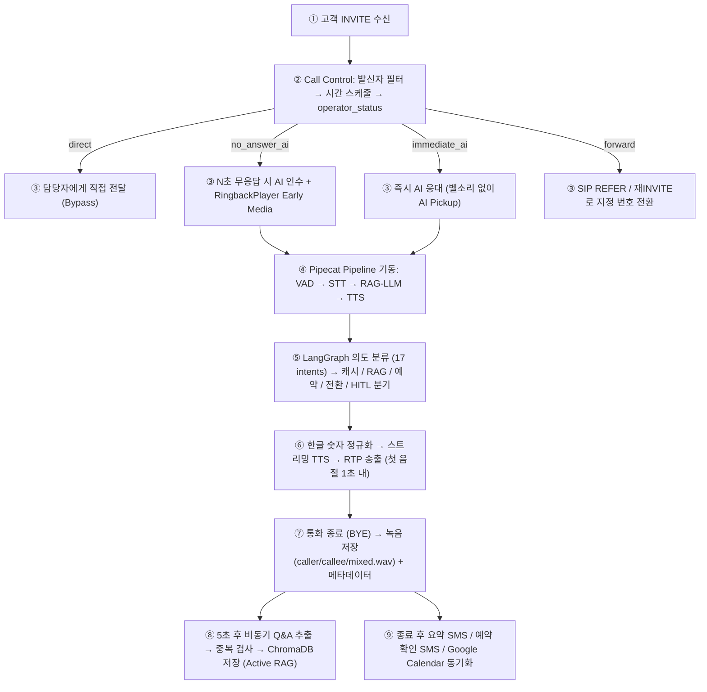

### 3.4 LangGraph 의도 라우팅 구조

17개 의도를 6 레인으로 라우팅합니다.

```mermaid
flowchart TD
    In["사용자 발화"] --> CI["classify_intent\n키워드 → 규칙 → 페르소나 유사도 → LLM 병합"]
    CI --> RU["route_utterance"]

    RU -->|소셜 / chitchat / out_of_scope| GS["generate_response\n(RAG 스킵)"]
    RU -->|greeting / farewell| GFB["greeting_farewell_kb\n(ChromaDB 직접 조회 ~0.01s)"]
    RU -->|템플릿 (affirm/deny/repeat/clarification 등)| TMPL["template_response\n(LLM 0회)"]
    RU -->|booking| BOOK["booking_agent\n(LLM + Tool Use Loop)"]
    RU -->|transfer| TRF["transfer_handler\n(Contact KB → SIP REFER)"]
    RU -->|knowledge (question/complaint/help)| CC["check_cache\n(qa_cache 시맨틱 검색)"]

    CC -->|HIT ~0.1s| GHIT["generate_response\n(캐시 즉시)"]
    CC -->|MISS| RW["rewrite_query\n(짧은 발화·대명사 시)"]
    RW --> RAG["adaptive_rag\n(2-pass + Small-to-Big + 압축)"]
    RAG --> GEN["generate_response\n(RAG 컨텍스트 최대 3건)"]

    GS --> H["hitl_alert\nconfidence < 0.3"]
    GHIT --> H
    GEN --> H
    BOOK --> H
    H --> END["update_cache → END"]
```

**의도 분류 5단계 파이프라인**

1. **키워드 매칭** — `INTENT_KEYWORDS` 사전 매칭 (≈1ms, confidence=1.0)
2. **특수 규칙** — 인사+질문 동시 발화 시 `question` 우선 등 오분류 방어
3. **페르소나 유사도** — 발화와 페르소나 `description` 임베딩 유사도(임계 0.6) 비교, 업무 외는 `chitchat`로 분리
4. **기본 폴백** — LLM 사용 불가 환경에서 짧은 발화는 `question` 처리
5. **LLM 병합 호출** — 단일 LLM 요청으로 `intent` + `search_query` 동시 생성 (기존 2회 호출을 1회로 통합)

### 3.5 멀티테넌트 격리

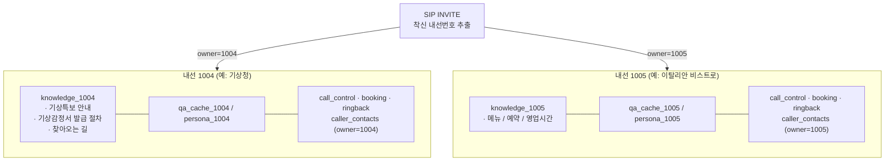

벡터 검색·SQLite 조회 모두 `where={owner}` 필터를 강제하므로, 같은 LLM·같은 인프라 위에서도 데이터가 절대 섞이지 않습니다.

### 3.6 채널 통합 — 음성·문자·연결음·아웃바운드

| 채널 | 입출력 | 공유 자원 |
|------|--------|-----------|
| **인바운드 음성** | INVITE → RTP | LangGraph · 페르소나 · 지식 · 예약 |
| **아웃바운드 음성** | API/콘솔 트리거 → INVITE → RTP | 위와 동일 + 미션(JSON) 컨텍스트 |
| **통화 연결음** | 18x Early Media RTP | TTS 인사 + Suno 음원 캐시 |
| **SIP MESSAGE (문자)** | MESSAGE 메서드 | 같은 페르소나·지식·자동응답 정책 |
| **운영자 채팅(HITL)** | Socket.IO `hitl_request` | LLM 정제 → TTS 송출 → 지식 환류 |
| **외부 알림** | Webhook (HTTP POST) | Booking 변경, 통화 이벤트 |

---

## 4. 핵심 기능 (중요도 순)

> 각 기능은 **아키텍처 → 동작 FLOW → 상세 기능 설명 → 사용자 스토리** 순으로 정리했습니다.

---

### 4.1 자연어 음성 상담 — 기존 ARS를 대체하는 첫 번째 가치

**무엇을 해결하는가**: "1번을 누르세요" 식의 메뉴를 없애고, 고객이 말하는 그대로 응대합니다.

#### 아키텍처

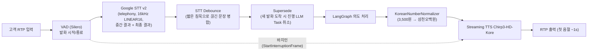

#### 동작 FLOW

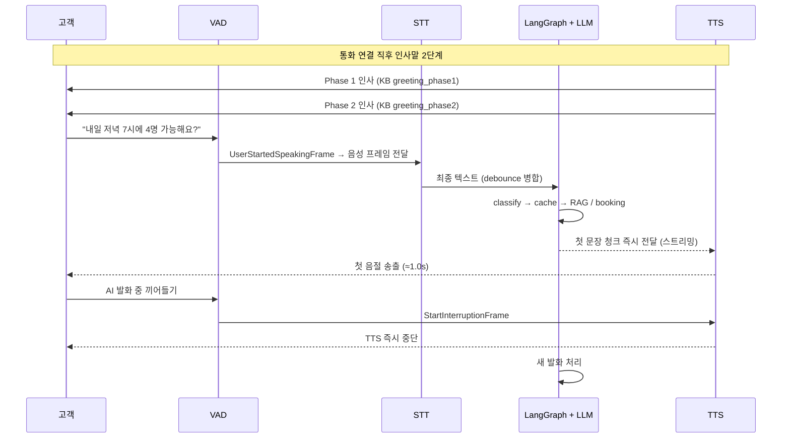

#### 상세 기능

- **자연어 응대** — 한 문장에 날짜·시간·인원·요청을 동시에 담아도 인식합니다.
- **Barge-in (바지인)** — VAD가 사용자 발화를 감지하는 즉시 `StartInterruptionFrame`으로 TTS를 끊고 새 의도를 처리합니다.
- **Streaming TTS** — LLM 첫 문장이 완성되는 즉시 합성·송출이 시작됩니다.
- **STT Debounce** — 짧은 침묵으로 끊긴 발화를 1.2초 윈도로 합쳐서 한 발화로 처리합니다.
- **STT Supersede** — 동일 통화에서 새 발화가 도착하면 진행 중이던 LLM 작업을 취소하고 병합 재처리합니다.
- **STT 에코 억제** — TTS 재생 중 STT 입력 게이팅과 단독 감탄사 필터(`STTPostFilter`)로 자기 음성 재인식을 차단합니다.
- **STT Watchdog** — 30초 무응답 시 경고 로그/대기 멘트를 트리거합니다.
- **한글 숫자 정규화** — `KoreanNumberNormalizer`가 날짜·금액·전화번호를 한국어 어법에 맞게 변환합니다.
- **2단계 인사** — `greeting_phase1`(연결 직후 짧은 인사) 후 `greeting_phase2`(자유 응대 유도)로 자연스러운 호흡을 줍니다.
- **대기 멘트** — LLM 처리가 12초 이상 길어지면 "확인 중입니다" 같은 짧은 안내를 자동 송출합니다.
- **대화 단계 추적** — `initial / inquiry / resolution / closing` 단계를 LLM 프롬프트에 주입해 단계별 어투를 제어합니다.

#### 사용자 스토리

- **US-1.1 (메뉴 없이 한 번에 묻기)**
  - **상황** — 고객이 한 문장으로 "내일 저녁 7시 4명 창가 자리 있어요?" 라고 말합니다.
  - **시스템 처리** — STT가 한 발화로 인식하고, `classify_intent` → `booking_agent` 가 날짜·시간·인원·요청사항을 동시에 추출합니다.
  - **결과** — AI가 "내일 저녁 7시 4인 창가 자리 가능합니다. 예약해 드릴까요?" 한 번에 응답합니다.
- **US-1.2 (말 끊고 다른 질문)**
  - **상황** — AI가 영업시간을 안내하는 도중 고객이 "잠깐, 주차는 돼요?" 라고 끼어듭니다.
  - **시스템 처리** — VAD가 끼어들기를 감지하고 `StartInterruptionFrame`이 TTS를 즉시 중단시킵니다.
  - **결과** — 영업시간 설명을 멈추고 "지하 주차장 무료로 이용 가능합니다." 로 자연스럽게 전환됩니다.
- **US-1.3 (어색한 침묵 제거)**
  - **상황** — 고객이 전화 직후 침묵을 우려합니다.
  - **시스템 처리** — 연결 0.5초 안정화 후 Phase 1 인사를 즉시 송출하고, 본 응답 준비가 끝나면 이어서 Phase 2를 송출합니다.
  - **결과** — 고객은 "안녕하세요, OO입니다" 를 즉시 듣고, 끊긴 통화가 아닌지 의심하지 않습니다.

---

### 4.2 회사 지식이 스스로 자라는 구조 (Active RAG)

**무엇을 해결하는가**: "FAQ를 먼저 다 채워야 시작할 수 있다" 는 도입 부담을 해소합니다.

#### 아키텍처

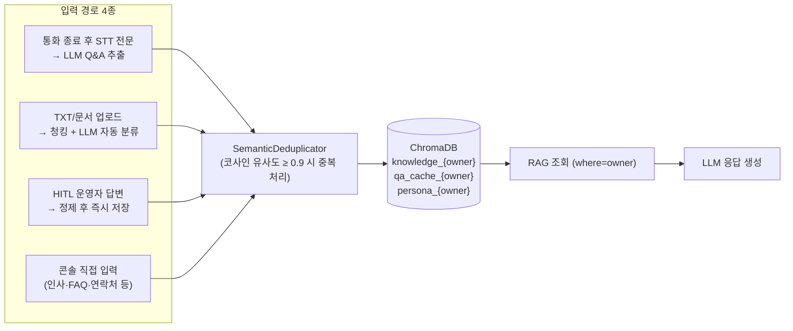

#### 동작 FLOW — 통화 자동 축적 (Active RAG)

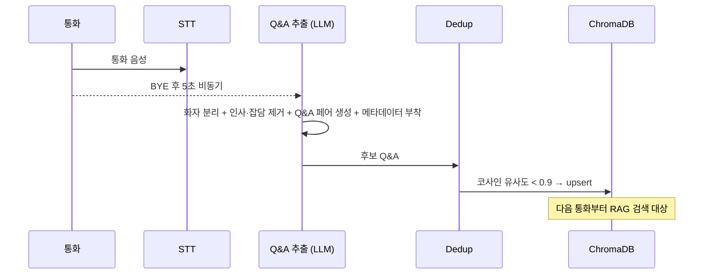

#### 상세 기능

- **지식 입력 4경로** — ① 통화 자동 축적(`source=call`), ② TXT/문서 업로드(`source=api`, 청크 2~8KB·오버랩 100자), ③ HITL 보정(`source=hitl`, 통화 종료 시 일괄 flush 포함), ④ 콘솔 직접 입력(인사말·FAQ·연락처 카테고리).
- **카테고리 체계** — `question / greeting_phase1 / greeting_phase2 / farewell / help / transfer / contact / chitchat / complaint`.
- **임베딩** — `all-MiniLM-L6-v2`(384차원), 코사인 유사도, owner 필터 강제.
- **2-pass 검색** — 1차 LLM 재작성 쿼리, 2차 STT 원문 쿼리로 별도 검색 후 병합·중복 제거(최대 15~20건).
- **Small-to-Big Expansion** — 문장 단위 검색 결과를 상위 단락(`parent_text`)으로 확장해 문맥 유실 방지.
- **Contextual Compression** — 쿼리 키워드와 겹치는 문장만 추출(최대 1,200자), LLM 호출 없이 빠른 압축.
- **Confidence 산출** — `min(1.0, (top×0.7 + avg×0.3) × 1.1)`. ≥0.5 정상, 0.3~0.5 응답+HITL 알림(complaint), <0.3 즉시 HITL.
- **시맨틱 캐시 (`qa_cache`)** — 유사도 ≥0.85 + TTL 7일 + intent 필터, 캐시 적중 시 LLM 생략(~0.1초).
- **help 캐시 자동 구성** — 서버 기동 시 `help` KB → 없으면 `question` 상위 5개에서 LLM이 안내 제목 자동 추출.
- **중복 제거** — `SemanticDeduplicator`가 유사도 0.9 이상이면 upsert·병합으로 처리해 KB 비대화를 방지합니다.

#### 사용자 스토리

- **US-2.1 (매뉴얼 업로드 한 번으로 응답 시작)**
  - **상황** — 운영자가 새로 만든 메뉴 텍스트를 콘솔에 업로드합니다.
  - **시스템 처리** — 청킹 → LLM 분류 → 중복 검사 → ChromaDB 저장이 자동으로 완료됩니다.
  - **결과** — 다음 통화부터 "오늘 메뉴에 파스타 있어요?" 같은 질문에 RAG 컨텍스트 기반으로 답합니다.
- **US-2.2 (운영자 답변이 다음 응대의 지식으로)**
  - **상황** — 처음 받는 질문 "주차권 할인 되나요?" 에 운영자가 콘솔 채팅으로 짧게 답합니다.
  - **시스템 처리** — `source=hitl` 로 정제 후 KB에 저장됩니다(통화 종료 시 미저장 건은 일괄 flush).
  - **결과** — 같은 질문이 다음에 들어오면 운영자 도움 없이 AI가 직접 응답합니다.
- **US-2.3 (반복 질문은 즉시 응답)**
  - **상황** — "영업시간이 어떻게 돼요?" 같은 질문이 하루에도 수십 번 들어옵니다.
  - **시스템 처리** — `qa_cache`에서 유사도 ≥0.85 적중되어 LLM 호출 없이 즉시 반환됩니다.
  - **결과** — 평균 응답이 약 0.1초로 단축되고 LLM 토큰 비용이 통화량과 정비례하지 않습니다.

---

### 4.3 예약·상담 슬롯의 음성 자동화

**무엇을 해결하는가**: "내일 저녁 4명 가능해요?" 한 번으로 끝나는 진짜 예약 처리.

#### 아키텍처

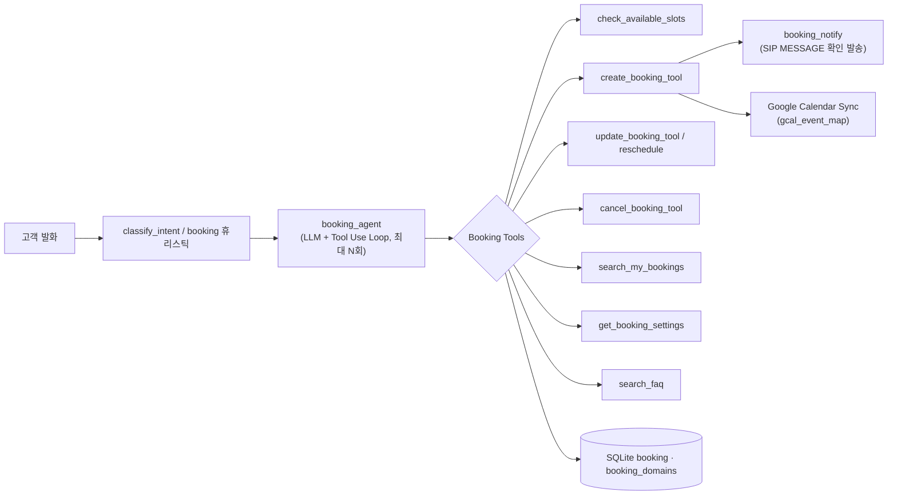

#### 동작 FLOW

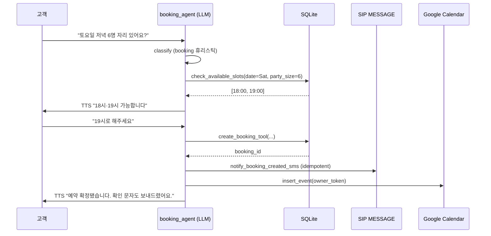

#### 상세 기능

- **Booking Tools (LangChain Tool Use)** — `check_available_slots / get_booking_info / create_booking_tool / cancel_booking_tool / update_booking_tool / reschedule_booking / search_my_bookings / get_booking_settings / search_faq`. LLM이 단일 발화에서 필요한 Tool을 순차 호출(Progressive Slot Filling).
- **Booking Domain (도메인별 수집 항목)** — `booking_domains` 테이블에 도메인 단위로 필수/선택 필드(`name / phone / desired_service / 생년월일 / 진료여부` 등)를 정의하면 AI가 도메인에 맞는 질문만 합니다.
- **이중 예약 방지** — DB UNIQUE 제약과 Tool 응답의 `booking_committed / booking_rejected` 이벤트로 동시성 안전.
- **Google Calendar 동기화** — OAuth 2.0 + `google-api-python-client`로 owner 토큰을 SQLite에 저장. `create / update / cancel / reschedule` 시 Google Calendar 이벤트 자동 CRUD. 동기화 실패가 예약 자체를 차단하지 않습니다(`logger.warning` 후 진행).
- **`gcal_event_map` 테이블** — `booking_id → gcal_event_id` 1:1 매핑으로 update/cancel 시 정확히 같은 이벤트를 수정합니다.
- **일괄 동기화** — `POST /api/google/calendar/sync` 로 미래 확정 예약을 한 번에 캘린더에 적재.
- **확정 문자 (SIP MESSAGE)** — `booking_confirmation_sms` 멱등 테이블로 중복 발송을 차단하고 변경/취소도 별도 알림.
- **종료 후 요약 SMS** — 통화 종료 시 KB 인사말 + LLM 300자 요약 + 예약 블록을 결합한 후속 문자가 발송됩니다.
- **음성 예약 휴리스틱** — `booking_intent_heuristic` 패턴/컨텍스트 매칭으로 `intent=question`이지만 실은 예약인 발화를 booking 레인으로 승격합니다.

#### 사용자 스토리

- **US-3.1 (한 통화로 예약 완료)**
  - **상황** — 고객이 "토요일 저녁 6명 자리 있어요?" 라고 묻습니다.
  - **시스템 처리** — `check_available_slots` → 시간 선택 → `create_booking_tool` → SIP MESSAGE 확인 발송 → Google Calendar 이벤트 생성이 한 흐름으로 이어집니다.
  - **결과** — 고객은 통화 한 번으로 예약·문자·일정 등록을 모두 완료합니다.
- **US-3.2 (예약 변경)**
  - **상황** — 고객이 "토요일 김OO 디자이너 예약을 다음 주로 옮겨주세요" 라고 말합니다.
  - **시스템 처리** — `search_my_bookings`(발신 번호 기준) → `reschedule_booking` → `gcal_event_map`을 통해 동일 이벤트 update.
  - **결과** — 캘린더와 고객 문자에 변경 내용이 동시에 반영됩니다.
- **US-3.3 (도메인별 수집 항목 자동 분기)**
  - **상황** — 같은 매장에서 "4인 테이블"과 "디자이너 시술 상담" 두 도메인을 운영합니다.
  - **시스템 처리** — `booking_domains.required_fields`/`optional_fields` 정의에 따라 booking_agent가 묻는 질문이 달라집니다.
  - **결과** — 테이블 예약은 짧게 끝나고, 시술 상담은 시술 종류·생년월일까지 빠짐없이 수집됩니다.

---

### 4.4 사람 도움 받기 (HITL) — AI가 실수하지 않는 안전 장치

**무엇을 해결하는가**: AI가 자신 없는 답을 그냥 말해 버리는 위험을 없애고, 운영자가 짧게 개입할 수 있도록 합니다.

#### 아키텍처

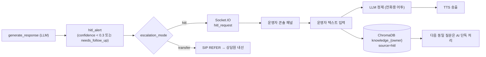

#### 동작 FLOW

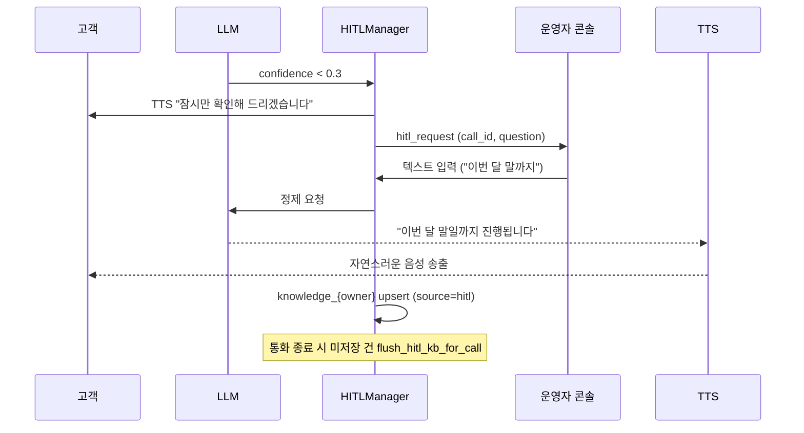

#### 상세 기능

- **신뢰도 게이트** — `generate_response` 가 confidence를 산출하고, 0.3 미만이거나 `needs_follow_up=True` 시 HITL 트리거.
- **에스컬레이션 모드 2종** — 페르소나 단위로 `escalation_mode = hitl | transfer` 선택 가능. `transfer` 모드에서는 HITL 알림 없이 즉시 상담원 내선으로 SIP 호 전환.
- **운영자 콘솔 패널** — Socket.IO `hitl_request` 이벤트 + `operator_message` 응답 채널. 1명이 다수 통화 동시 지원.
- **LLM 텍스트 정제** — 운영자 입력을 원문 그대로 읽지 않고 전화용 어투로 다듬어 TTS 송출.
- **지식 즉시 환류** — 답변은 `source=hitl` 로 KB에 저장되어 다음 동일 질문은 AI가 단독 응답.
- **통화 종료 시 flush** — `flush_hitl_kb_for_call` 가 통화 중 저장되지 않은 Q&A를 BYE 시점에 일괄 ChromaDB upsert.
- **미해결 통화 보드** — `hitl_status` 가 `pending`/`unresolved`인 건은 별도 보드로 후속 처리.
- **AI 한계 멘트** — `transfer` 모드에서는 "잠시만요, 담당 상담원에게 연결해 드리겠습니다." 같은 표준 멘트 후 SIP REFER.

#### 사용자 스토리

- **US-4.1 (모르는 신규 정책)**
  - **상황** — 새로 시작한 행사 관련 질문 "그 신메뉴 할인 며칠까지 해요?" 가 들어옵니다.
  - **시스템 처리** — confidence가 임계 미만으로 떨어져 HITL 트리거, "잠시만 확인해 드리겠습니다" TTS 후 운영자 콘솔에 `hitl_request` 푸시.
  - **결과** — 운영자 한 줄 입력이 LLM 정제를 거쳐 자연스러운 음성으로 전달되고 KB에도 자동 저장됩니다.
- **US-4.2 (한 운영자가 동시에 여러 통화 지원)**
  - **상황** — 점심 피크에 5건 통화가 동시 진행되고 그중 2건만 HITL 요청이 뜹니다.
  - **시스템 처리** — Socket.IO 이벤트가 콘솔 큐에 적재되어 운영자가 순서대로 응답합니다.
  - **결과** — 운영자 1명이 5건 통화의 응대 품질을 모두 유지합니다.
- **US-4.3 (조직별 에스컬레이션 모드 선택)**
  - **상황** — 매장 A는 콘솔 답변을 선호하고, 매장 B는 즉시 사람 연결을 선호합니다.
  - **시스템 처리** — 각 페르소나의 `escalation_mode` 값을 다르게 설정합니다.
  - **결과** — 같은 플랫폼에서 매장마다 다른 운영 방식이 자연스럽게 동작합니다.

---

### 4.5 착신 제어 (Call Control) — 시간·상황별 응답 정책

**무엇을 해결하는가**: 같은 대표번호라도 평일 낮·야간·휴일·VIP·블랙리스트에 따라 다른 응답이 필요합니다.

#### 아키텍처

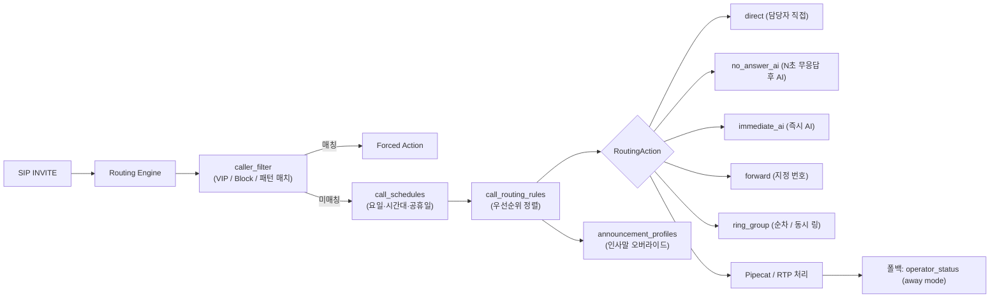

#### 동작 FLOW

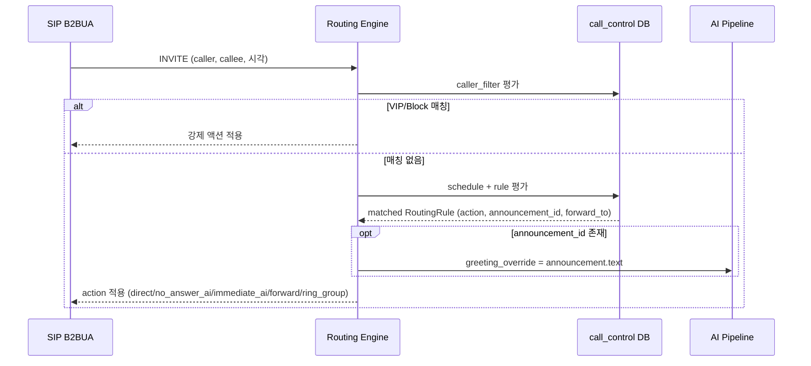

#### 상세 기능

- **DB 스키마** — `call_routing_rules / call_schedules / announcement_profiles / call_ring_groups / call_caller_filters / call_overflow_policies` (별도 `data/call_control.db`).
- **5가지 라우팅 액션** — `direct / no_answer_ai / immediate_ai / forward / ring_group`.
- **공휴일 자동 인식** — `holidays` 패키지(선택 의존성). 미설치 시 공휴일 조건만 비활성, 나머지 정상.
- **발신자 필터** — VIP·차단·번호 패턴별 강제 액션. 일반 정책보다 우선 평가.
- **안내 멘트 오버라이드** — `announcement_id` 매칭 시 Pipecat `pipeline_builder.send_greeting`에 `greeting_override` 텍스트 주입.
- **폴백 호환성** — Call Control 규칙이 없으면 기존 `operator_status`(자리비움 모드)로 폴백.
- **헤더 상태 배지** — 콘솔 헤더에 현재 적용 정책 이름을 읽기 전용 배지로 표시.
- **Immediate AI 200 OK ACK Takeover** — `immediate_ai` 정책 시 벨소리 없이 즉시 200 OK 응답 후 AI Pipeline 인수.

#### 사용자 스토리

- **US-5.1 (점심 피크에 사람 대신 AI 인수)**
  - **상황** — 점심 시간에 점장이 손님을 받느라 전화를 받지 못합니다.
  - **시스템 처리** — `no_answer_ai` 규칙이 10초 무응답을 감지하고 AI Pipeline을 인수합니다.
  - **결과** — 고객은 끊지 않고 AI에게 예약·문의를 그대로 진행합니다.
- **US-5.2 (야간·휴일 자동 안내)**
  - **상황** — 토요일 밤 11시에 환자가 전화합니다.
  - **시스템 처리** — 야간/공휴일 스케줄 + `immediate_ai` 액션 + 휴일 전용 `announcement_profile`.
  - **결과** — 첫 응답부터 AI가 받고 휴일 안내 멘트로 시작합니다.
- **US-5.3 (VIP 발신자 우선 처리)**
  - **상황** — VIP 거래처가 야간에 대표번호로 전화합니다.
  - **시스템 처리** — `caller_filter` 가 일반 스케줄보다 먼저 평가되어 강제 액션이 적용됩니다.
  - **결과** — 야간이라도 지정된 담당자 휴대폰으로 즉시 연결됩니다.

---

### 4.6 통화 연결음 — 대기 시간을 브랜드 경험으로

**무엇을 해결하는가**: 전화 연결 전 침묵을 없애고, 그 짧은 시간을 브랜드 안내·음악으로 활용합니다.

#### 아키텍처

```mermaid
flowchart LR
    INVITE["INVITE 수신 (Early Bind)"] --> RP["RingbackPlayer\n(asyncio.create_task)"]
    RP --> TTS["Greeting TTS\n(Google TTS · 16kHz PCM)"]
    RP --> Loop["Suno 음원 루프\n(MP3 → ffmpeg/pydub → PCM)"]
    TTS --> RTP["RTP send_ai_audio\n(LINEAR16 → G.711 μ-law)"]
    Loop --> RTP
    RP -. stop on 200 OK / AI takeover .-> RTP
    Console["콘솔 /settings/ringback"] --> Suno["Suno API\n(가사·BPM·길이 입력)"]
    Suno --> Cache["data/ringback/*.mp3 캐시"]
    Cache --> Loop
```

#### 동작 FLOW

```mermaid
sequenceDiagram
    participant Caller as 발신자
    participant SIP as SIP B2BUA
    participant RP as RingbackPlayer
    participant T as Google TTS
    participant S as Suno 음원 캐시
    Caller->>SIP: INVITE
    SIP->>RP: Early Bind 후 start (asyncio.create_task)
    RP->>T: greeting 텍스트 → PCM
    RP->>Caller: RTP 송출 (인사말)
    RP->>S: 음원 PCM 변환 (ffmpeg → pydub fallback)
    RP->>Caller: 음원 루프 송출
    SIP-->>RP: 200 OK 또는 AI takeover
    RP->>RP: stop() (RTP 송출 중단, 큐 비움)
    SIP->>Caller: 통화 연결 / AI 응답 시작
```

#### 상세 기능

- **Early Media RTP 재사용** — 별도 포트 없이 `_start_rtp_relay`에서 할당된 포트를 그대로 사용. `rtp_worker.send_ai_audio(pcm_bytes)` 경로 공유.
- **오디오 포맷** — 입력 16kHz mono LINEAR16, 출력 G.711 μ-law(전화망 호환). MP3 → PCM 변환은 ffmpeg 우선, 실패 시 pydub 폴백.
- **`RingbackPlayer` 생명주기** — `_handle_invite_b2bua`(Early Bind 후 시작) → `_handle_sip_response`(200 OK)/`_handle_no_answer_timeout`(AI takeover) 시점에 `stop()`.
- **Suno API 연동** — `customMode=True / instrumental=False / model=V4_5`. `POST /api/v1/generate` + `GET /api/v1/feed/{task_id}` 폴링. 콜백 URL은 ngrok 터널 사용 가능.
- **콘솔 운영** — `/settings/ringback` 에서 가사 키워드·분위기·BPM·성별·목표 시간을 입력하면 후보 곡(최대 2곡) 생성, 미리듣기 후 적용.
- **테넌트별 음원** — `ringback_settings` 테이블에 owner 단위로 1건 보유.
- **자동 중지** — 200 OK 또는 AI Pickup 시 `_ringback_players: Dict[call_id, RingbackPlayer]`에서 해당 인스턴스 정리.
- **KB 인사말 폴백** — 음원 미설정 시 KB `greeting_phase1`로 폴백.

#### 사용자 스토리

- **US-6.1 (첫 인상 강화)**
  - **상황** — 고객이 매장에 처음 전화를 겁니다.
  - **시스템 처리** — INVITE 직후 Early Bind 후 `RingbackPlayer`가 시작되어 인사 TTS + 음원이 RTP로 송출됩니다.
  - **결과** — 사람이 받기 전 침묵이 사라지고 매장 분위기를 첫 통화부터 경험합니다.
- **US-6.2 (운영자가 직접 만드는 매장 음원)**
  - **상황** — 운영자가 "여름 한정 메뉴 안내곡" 을 콘솔에서 만들고 싶어 합니다.
  - **시스템 처리** — Suno API로 가사/스타일/BPM을 입력해 후보 2곡을 생성하고 미리듣기 후 적용합니다.
  - **결과** — 클릭 한 번으로 음원이 교체됩니다.
- **US-6.3 (자연스러운 정지)**
  - **상황** — 음원이 흐르는 도중 점장이 통화를 받습니다.
  - **시스템 처리** — 200 OK 응답 시 `_stop_ringback_player()`가 RTP 송출을 부드럽게 끊습니다.
  - **결과** — 음원과 사람 목소리가 겹치지 않고 깔끔하게 인사로 이어집니다.

---

### 4.7 문자 (SMS · SIP MESSAGE) 응대 — 같은 AI, 다른 채널

**무엇을 해결하는가**: 전화가 부담스러운 고객도 같은 품질로 응대받을 수 있게 합니다.

#### 아키텍처

```mermaid
flowchart LR
    InMSG["SIP MESSAGE 수신"] --> Gate["chat_relay_settings\nmessage_ai_reply_enabled / 접두어"]
    Gate -->|허용| Brain["같은 LangGraph 두뇌\n(intent → cache → RAG)"]
    Brain --> Out["SIP MESSAGE 송출\n(REGISTER 맵 기반 From 헤더)"]
    Out --> DB[("chat_messages (status, error_code)")]
    OperConsole["운영자 콘솔 /chat"] --> Send["대화방 전송 / 실패 재전송"]
    Send --> Out
    Booking["예약 생성/변경/취소"] --> NotifySvc["booking_notify_service\n(idempotent)"]
    NotifySvc --> Out
    EndCall["통화 종료"] --> Sum["LLM 300자 요약\n(KB 인사말 + 예약 블록)"]
    Sum --> Out
```

#### 동작 FLOW — 인입 문자 자동 응대

```mermaid
sequenceDiagram
    participant C as 고객
    participant SIP as SIP Endpoint
    participant Gate as chat_relay_settings
    participant L as LangGraph
    participant Out as Outbound MESSAGE
    C->>SIP: SIP MESSAGE "오늘 영업해요?"
    SIP->>Gate: message_ai_reply_enabled?
    Gate-->>SIP: true
    SIP->>L: 같은 두뇌로 처리
    L->>L: classify=question → cache → RAG
    L-->>Out: "오늘은 오후 9시까지 영업합니다"
    Out-->>C: SIP MESSAGE
    Note over Out: chat_messages 테이블에 inbound/outbound 모두 저장
```

#### 상세 기능

- **SIP MESSAGE (RFC 3428) 핸들러** — `_handle_sip_message`에서 MESSAGE 메서드를 직접 처리. UTF-8 surrogate 인코딩 안전 처리.
- **자동 응답 정책** — `chat_relay_settings.message_ai_reply_enabled` 단일 스위치 + 접두어 트리거. 페르소나 의존을 제거해 운영 혼선을 줄였습니다.
- **REGISTER 맵 기반 발신** — `lookup_registered_user`로 발신 owner의 등록 주소를 찾아 `From=<sip:{owner}@{listen_ip}>` 형식으로 전송.
- **`chat_messages` 테이블** — `direction (in/out) / status / error_code / thread_id / owner` 보존. 실패 시에도 HTTP 200 + `success:false` 로 응답하고 UI에서 재전송.
- **예약 알림 (멱등)** — `booking_confirmation_sms` 테이블로 동일 이벤트 중복 발송 차단. 생성/변경/취소/리스케줄 라이프사이클 모두 지원.
- **종료 후 요약 SMS** — `send_end_call_summary_sms` 가 KB 인사 + LLM 300자 요약 + 예약 블록 + 후속 안내 문구를 결합. 비동기 `asyncio.create_task` 처리(내부 타임아웃 120초).
- **자가 회신 차단** — 자기 발송 응답에 다시 응답하지 않도록 안전장치 적용(SIP CPIM 시그널 필터, charset 정규화).
- **운영자 채팅방** — `/chat` 페이지에서 대화방별 inbound/outbound 메시지 타임라인 + 실패 건 재전송.

#### 사용자 스토리

- **US-7.1 (전화 대신 문자로 문의)**
  - **상황** — 회의 중인 고객이 통화 대신 "오늘 영업해요?" 라고 문자를 보냅니다.
  - **시스템 처리** — 같은 LangGraph 두뇌가 question 으로 분류 → KB 검색 → SIP MESSAGE 응답.
  - **결과** — "오늘은 오후 9시까지 영업합니다" 라는 문자 회신이 즉시 도착합니다.
- **US-7.2 (예약 확정 문자 자동 발송)**
  - **상황** — 통화로 예약이 막 확정됩니다.
  - **시스템 처리** — `booking_notify_service` 가 idempotency 테이블을 확인 후 SIP MESSAGE 발송.
  - **결과** — 고객이 캡처해 일정에 보관할 수 있고 노쇼 위험이 줄어듭니다.
- **US-7.3 (통화 종료 후 요약 문자)**
  - **상황** — 고객이 여러 안내를 듣고 통화를 마칩니다.
  - **시스템 처리** — 종료 직후 LLM이 대화 핵심을 300자로 요약해 발송.
  - **결과** — 고객이 들었던 내용을 잊지 않고 재확인할 수 있습니다.

---

### 4.8 발신 연락처 (CID) · 통화 도크 — 전화 받자마자 보이는 고객 카드

**무엇을 해결하는가**: 전화가 오는 순간 누가, 몇 번째 전화인지, 무슨 맥락인지 즉시 파악합니다.

#### 아키텍처

```mermaid
flowchart LR
    INVITE["INVITE 수신"] --> Needle["caller_match_needle\n(canonical phone + 끝 4자리)"]
    Needle --> Ctx["GET /api/calls/caller-context\n(연락처 + 30d/누적 통계)"]
    Ctx --> Dock["GlobalCallDock (이중 라인 표시)"]
    EndCall["통화 종료"] --> AutoFill["caller_contact_autofill\n(예약명 우선 → LLM JSON 추출)"]
    AutoFill --> CCDB[("caller_contacts\ndisplay_name + tail4")]
    CCDB --> Tree["Contact Folder Tree (DnD)"]
```

#### 동작 FLOW

```mermaid
sequenceDiagram
    participant SIP as SIP Endpoint
    participant API as call_history API
    participant Dock as GlobalCallDock
    participant End as End-of-Call Hook
    participant LLM as LLM
    SIP->>API: caller-context (caller, owner)
    API->>API: caller_match_needle 정규화
    API->>API: count_inbound_calls_for_caller (30d / all, 현재 통화 제외)
    API-->>Dock: name + tail4 + counts
    Dock-->>Operator: "홍길동·5678 / 30일 5회 누적 47회"
    SIP->>End: BYE
    End->>End: bookings.customer_name 우선 조회
    alt 예약명 있음
        End->>CCDB: upsert (source=auto_booking_hint)
    else 없음
        End->>LLM: transcript 발췌 → JSON 이름 추출
        LLM-->>End: {"name": "..."}
        End->>CCDB: upsert (source=auto_llm)
    end
```

#### 상세 기능

- **이중 라인 도크** — 1행 발신 식별(전화번호), 2행 표시명("이름_끝4자리").
- **재인입 통계** — 최근 30일·누적 인입 횟수(현재 통화 제외) 표시로 단골/반복 문의 즉시 인지.
- **자동 표시명 등록** — 통화 종료 시 ① `bookings.customer_name`(`auto_booking_hint`) 우선 → ② transcript 기반 LLM JSON 추출(`auto_llm`).
- **수동 우선** — `source=manual` 인 항목은 자동 갱신을 건너뜁니다.
- **`caller_match_needle`** — 한국 휴대폰·국번 패턴 정규화로 다양한 표기 통일.
- **연락처 폴더 트리** — `contact_folders` 테이블 + `caller_contacts.folder_id`. `@dnd-kit` 기반 끌어다 놓기, 폴더 삭제 시 하위 폴더·연락처 승격.
- **연락처 CRUD** — `GET/POST/PATCH/DELETE /api/caller-contacts`. PATCH 시 중복 `canonical_phone` 409.
- **CID 도크 항상 가시화** — 컨택트 도크와 활성 통화 도크가 사이드 탭 형태로 항상 노출되어 화면 전환 없이 운영합니다.

#### 사용자 스토리

- **US-8.1 (단골 식별)**
  - **상황** — 단골 고객이 평소처럼 전화를 겁니다.
  - **시스템 처리** — `caller-context` 응답에 30일 5회·누적 47회가 포함되고 도크에 즉시 표시.
  - **결과** — 운영자는 "홍길동님 안녕하세요" 부터 응대를 시작합니다.
- **US-8.2 (신규 고객 자동 등록)**
  - **상황** — 처음 보는 번호에서 통화가 들어와 예약이 확정됩니다.
  - **시스템 처리** — End-of-Call 훅이 `customer_name` 또는 LLM 추출 이름으로 `caller_contacts` 를 upsert.
  - **결과** — 다음 통화부터 도크에 자동으로 이름이 표시됩니다.
- **US-8.3 (폴더로 연락처 정리)**
  - **상황** — 운영자가 단골/VIP/블랙리스트 그룹을 구분 관리하고 싶어 합니다.
  - **시스템 처리** — `contact_folders` 트리에서 끌어다 놓기로 `folder_id` 만 변경(소스는 보존).
  - **결과** — 그룹 전환이 즉시 반영되고 정책 연결도 손쉬워집니다.

---

### 4.9 호 전환 (Call Transfer) — 끊김 없는 사람 연결

**무엇을 해결하는가**: AI가 답할 수 없는 상황, 고객이 직접 사람을 찾는 상황에서도 통화가 끊기지 않도록 합니다.

#### 아키텍처

```mermaid
flowchart LR
    Utt["고객 발화"] --> CI["classify_intent=transfer 또는\nescalation_mode=transfer"]
    CI --> Ext["ContactKnowledgeExtractor\n(category=contact 벡터 검색)"]
    Ext --> Ann["LLM 안내 멘트"]
    Ann --> TTS["TTS 송출"]
    TTS --> Refer["SIP REFER / 재INVITE"]
    Refer --> Bridge["RTP Bridge 모드 전환"]
    Bridge --> Done["발신자 ↔ 담당자 (<500ms)"]
    Console["운영자 콘솔"] --> Manual["manual_transfer_request\n(WebSocket)"]
    Manual --> Refer
    Refer -. fail .-> AIBack["AI 모드 자동 복귀"]
```

#### 동작 FLOW — 부서 자동 전환

```mermaid
sequenceDiagram
    participant C as 고객
    participant L as LangGraph
    participant Ext as Contact KB
    participant SIP as SIP Endpoint
    participant Tgt as 담당자
    C->>L: "배송팀 연결해주세요"
    L->>Ext: "배송팀 연결" 벡터 검색 (category=contact)
    Ext-->>L: {department: 배송팀, phone: 02-1234-5001}
    L-->>C: TTS "배송팀으로 연결해 드리겠습니다"
    L->>SIP: SIP INVITE (target)
    SIP->>Tgt: INVITE
    Tgt-->>SIP: 200 OK
    SIP->>SIP: AI Pipeline 종료 → RTP Bridge 모드
    Note over C,Tgt: 발신자 ↔ 담당자 직통 (<500ms)
    alt 부재중/486
        SIP-->>L: AI 모드 자동 복귀
        L-->>C: "지금 연결이 어렵습니다. 메모 남겨 드릴까요?"
    end
```

#### 상세 기능

- **3가지 전환 방식**
  1. **고객 요청 자동 전환** — `intent=transfer` → `ContactKnowledgeExtractor` (category=contact 벡터 검색) → SIP INVITE.
  2. **운영자 즉시 개입** — 콘솔 `manual_transfer_request` Socket.IO 이벤트로 자기 내선으로 가로채기.
  3. **부서/외부 번호** — Call Control `forward` 액션 또는 contact KB의 등록된 부서 매핑.
- **연락처 KB 등록** — `POST /api/knowledge/contacts` 로 `department / keywords / phone_number / available_hours / auto_transfer / priority` 등록.
- **상태 머신** — `ANNOUNCE → RINGING → CONNECTED → ENDED`, 실패 시 `FAILED → AI 모드 복귀`.
- **자동 복구** — 링 타임아웃(기본 30초) 초과 / 486 통화중 → AI 모드 자동 복귀, 재시도 정책(`max_retries=2`).
- **CDR 기록** — 전환 시작·연결·통화 시간·부서명·성공 여부 모두 기록.
- **에스컬레이션 모드와 연동** — 페르소나의 `transfer` 모드 시 HITL 알림을 건너뛰고 즉시 SIP REFER.
- **AI Escalation None** — Call Control `transfer` 액션과의 분기 충돌을 방지하는 우선순위 규칙.

#### 사용자 스토리

- **US-9.1 (부서 자동 연결)**
  - **상황** — 고객이 "결제 관련해서 담당자 연결해 주세요" 라고 말합니다.
  - **시스템 처리** — `intent=transfer` → category=contact 벡터 검색에서 결제 부서 매칭 → SIP INVITE.
  - **결과** — ARS 메뉴 누르지 않고 한마디로 담당자에게 연결됩니다.
- **US-9.2 (운영자가 직접 통화 인수)**
  - **상황** — 운영자가 모니터링 중 직접 받기로 결정합니다.
  - **시스템 처리** — 콘솔에서 `manual_transfer_request` 클릭 → 자기 내선 INVITE.
  - **결과** — 고객 입장에서 통화가 끊기지 않고 자연스럽게 사람과 이어집니다.
- **US-9.3 (전환 실패 시 안전 복귀)**
  - **상황** — 담당자가 부재중이라 호 전환이 실패합니다.
  - **시스템 처리** — `FAILED` 상태로 진입 후 AI 모드 자동 복귀.
  - **결과** — 고객이 "지금 자리를 비웠습니다. 메모 남겨 드릴까요?" 같은 후속 안내를 받습니다.

---

### 4.10 발신 (Outbound) — AI가 먼저 거는 전화

**무엇을 해결하는가**: 만족도 조사·예약 리마인드·미회신 안내 같은 반복 발신 업무를 자동화합니다.

#### 아키텍처

```mermaid
flowchart LR
    Trig["콘솔 / REST POST /api/outbound\n(callee, purpose, questions)"] --> SIP["SIP B2BUA INVITE"]
    SIP --> RTP["RTP Worker (outbound)"]
    RTP --> Pipe["Pipecat Pipeline\n(VAD + STT + RAG-LLM + TTS)\n+ STT 에코 억제"]
    Pipe --> Greet["2단계 인사\n(Phase1 인사 + Phase2 purpose+첫 질문)"]
    Greet --> Loop["발화 처리 루프\n(LLM JSON: response/answered/is_answer)"]
    Loop --> MissionCheck{"모든 questions 답변?"}
    MissionCheck -->|아니오| Loop
    MissionCheck -->|예| Bye["KB farewell TTS → BYE"]
    Bye --> Save["caller/callee/mixed.wav + transcript + metadata.json"]
```

#### 동작 FLOW — LLM 단일 호출 응답

```mermaid
sequenceDiagram
    participant Bot as AI 발신 봇
    participant Cust as 착신자
    participant L as LLM (generate_response)
    Bot->>Cust: "안녕하세요, AI Voicebot입니다." (Phase 1)
    Bot->>Cust: "만족도 조사 드립니다. 몇 점 주시겠어요?" (Phase 2 = purpose + 첫 질문)
    Cust-->>Bot: "5점이요"
    Bot->>L: outbound 시스템 프롬프트 + purpose + questions
    L-->>Bot: {"response": "감사합니다", "answered": [{"question":"...","answer":"5점이요"}], "is_answer": true}
    Bot->>Cust: TTS "5점 주셔서 감사합니다"
    Bot->>Bot: _check_outbound_mission_complete (fast path: 모든 질문 답변됨)
    Bot->>Cust: KB farewell "좋은 하루 되세요"
    Bot->>Bot: TTS 완료 대기 (asyncio.Event 10s)
    Bot->>Cust: SIP BYE
```

#### 상세 기능

- **미션 등록** — `purpose` + `questions` 배열을 콘솔 또는 REST(`POST /api/outbound`)로 등록.
- **LLM 단일 호출 JSON 출력** — `response / answered / is_answer` 세 필드를 한 번에 받아 LLM 호출 비용 절감.
- **`is_answer=false` 처리** — 욕설·거절·감탄사 시 LLM이 자연스러운 양해 멘트를 만들고 원 질문을 재질문.
- **fast path 미션 완료** — `_outbound_answers ⊇ questions` 가 충족되는 즉시 LLM 없이 미션 완료 결정.
- **STT 에코 억제** — `VADWrapperProcessor` 가 `tts_playing=True` 동안 STT 입력 프레임을 차단(아웃바운드 전용 강화).
- **녹음 저장** — `caller.wav / callee.wav / mixed.wav / transcript.txt / metadata.json`. `metadata.json`에 `outbound_mission` 결과(JSON) 보존.
- **상태 관리** — `pending → calling → answered → completed | failed`, 미응답 시 자동 재시도.
- **페르소나 적용** — 인바운드와 같은 페르소나 `description` 을 `[업무 범위]` 블록으로 시스템 프롬프트에 주입.

#### 사용자 스토리

- **US-10.1 (만족도 조사 자동 캠페인)**
  - **상황** — 매장에서 지난주 방문 고객 100명에게 만족도 조사가 필요합니다.
  - **시스템 처리** — 캠페인 등록 → 시간대를 지키며 자동 발신 → LLM 단일 호출 JSON 응답으로 점수·코멘트 수집.
  - **결과** — 점수와 코멘트가 표 형태로 콘솔에 정리되고, 부재중은 재시도 큐에 적재됩니다.
- **US-10.2 (예약 리마인드 발신)**
  - **상황** — 내일 예약된 고객에게 잊지 않도록 안내가 필요합니다.
  - **시스템 처리** — 예약 24시간 전 자동 발신 + 변경/취소 의사 확인.
  - **결과** — 노쇼가 줄고 고객의 변경 의사가 즉시 캘린더·SMS로 반영됩니다.
- **US-10.3 (잡담·거절에도 자연스러운 회복)**
  - **상황** — 고객이 조사 도중 "지금 바빠요" 라고 합니다.
  - **시스템 처리** — `is_answer=false` 분기에서 LLM이 양해 멘트 생성 + 콜백 정보 적재.
  - **결과** — 무리하게 진행하지 않고 다음 기회를 만듭니다.

---

### 4.11 운영자 콘솔 — 한 화면에서 보는 운영 도구

**무엇을 해결하는가**: 통화·예약·문자·지식·정책·연락처를 따로따로 보지 않고 한 화면에서 운영합니다.

#### 아키텍처

```mermaid
flowchart LR
    SIP["SIP B2BUA"] --> WS["Socket.IO :8001\nhitl_request · call_update\noperator_message · chat_message"]
    Pipe["Pipecat / LangGraph"] --> WS
    DB[("ChromaDB · SQLite")] --> REST["FastAPI :8000\n/api/knowledge · /api/persona\n/api/calls · /api/hitl\n/api/booking · /api/call-control\n/api/ringback · /api/chat\n/api/caller-contacts · /api/contact-folders\n/api/google/calendar · /api/outbound"]
    WS --> UI["Next.js 14 콘솔 :3000"]
    REST --> UI
    UI --> Pages["대시보드 / 통화이력 / HITL\n지식·페르소나 / 예약·도메인\n착신 제어 / 연결음 / 채팅\n연락처 트리 / 발신 캠페인"]
```

#### 동작 FLOW — 실시간 통화 모니터링

```mermaid
sequenceDiagram
    participant SIP as SIP B2BUA
    participant Pipe as Pipecat
    participant WS as Socket.IO
    participant UI as 콘솔
    participant Op as 운영자
    SIP->>WS: call_started (call_id, caller, callee)
    UI-->>Op: 활성 통화 카드 표시
    Pipe->>WS: stt_interim / stt_final / llm_done / tts_complete
    UI-->>Op: 실시간 STT/TTS 피드 + 처리 단계
    Pipe->>WS: hitl_request (confidence < 0.3)
    UI-->>Op: HITL 패널 알림
    Op->>WS: operator_message (텍스트)
    WS->>Pipe: 정제 → TTS → KB 저장
    SIP->>WS: call_ended → 통화 이력 보드 갱신
```

#### 상세 기능

- **실시간 통화 모니터링** — 진행 중인 통화의 STT/TTS 피드, CDR 단계 추적(rag/llm/tts), confidence를 실시간 표시.
- **HITL 응답 패널** — `hitl_request` 큐를 카드로 표시, 텍스트 입력 후 즉시 정제·송출.
- **지식베이스 / 페르소나 관리** — 항목 CRUD, 카테고리 지정, 인사말·어투·`scope_keywords`·`chitchat_response_template`·`escalation_mode` 설정.
- **예약 / 슬롯 / 도메인 관리** — `/booking`·`/booking/slots`·`/booking/domains`, 상태별 필터, 도메인별 필수/선택 필드 정의.
- **착신 제어 (Call Control)** — `/settings/call-control` 에서 라우팅 규칙·스케줄·안내 멘트·발신자 필터·착신 그룹 관리. 헤더에 현재 정책 배지.
- **통화 연결음** — `/settings/ringback` 에서 인사말·음원 생성·미리듣기·적용.
- **채팅 관리** — `/chat` 페이지의 대화방·실패 재전송·통화 종료 SMS 자동 미리보기.
- **연락처 트리** — `/contacts` 와 `GlobalContactsDock` 의 폴더 DnD UI.
- **통화 이력 / 미해결 보드** — `unresolved` 토글, `noted` 메모 필터, transcripts/녹음 재생.
- **Google Calendar 연동 화면** — `/settings/integrations` 에서 OAuth 시작/해제/일괄 동기화.
- **발신 캠페인** — 미션·질문·재시도 정책 등록, 진행률 모니터링.

#### 사용자 스토리

- **US-11.1 (실시간 모니터링과 즉시 개입)**
  - **상황** — 운영자가 모니터링 중 진행 통화가 어색하게 흘러갑니다.
  - **시스템 처리** — STT/TTS 피드와 confidence를 실시간 보고, `manual_transfer_request` 클릭 한 번으로 통화를 인수.
  - **결과** — 문제가 커지기 전에 사람이 자연스럽게 개입합니다.
- **US-11.2 (미해결 통화 후속 처리)**
  - **상황** — 야간 통화 중 운영자 확인이 필요한 건이 모입니다.
  - **시스템 처리** — `hitl_status=unresolved` 보드에 자동 분류.
  - **결과** — 다음 날 아침 보드 하나만 보고 우선순위대로 콜백/문자 회신.
- **US-11.3 (정책을 코드 수정 없이 변경)**
  - **상황** — 점심 정책을 다음 주부터 바꿉니다.
  - **시스템 처리** — `/settings/call-control` 에서 시간대·동작을 수정 후 저장.
  - **결과** — 개발자 호출 없이 다음 통화부터 새 정책 적용.

---

### 4.12 멀티테넌트 — 한 플랫폼 위 여러 조직의 "나만의 AI"

**무엇을 해결하는가**: 같은 인프라 위에서 여러 고객사·매장·지점이 각자의 AI를 운영합니다.

#### 아키텍처

```mermaid
flowchart TB
    INVITE["SIP INVITE 착신 내선번호"] --> Owner["owner = tenant"]
    Owner --> Iso["테넌트별 격리 자원"]
    Iso --> Chroma["ChromaDB\nknowledge_{owner}\nqa_cache_{owner}\npersona_{owner}"]
    Iso --> SQL["SQLite (owner 컬럼)\nbooking · call_control · ringback\ncaller_contacts · chat_messages"]
    Iso --> Pol["Routing / Persona / Escalation 정책"]
    Chroma --> Search["RAG 검색 (where=owner)"]
    SQL --> Query["SQL 조회 (WHERE owner=?)"]
    Search --> LLM["같은 LLM, 다른 컨텍스트"]
    Query --> LLM
```

#### 동작 FLOW — owner 결정과 격리 검색

```mermaid
sequenceDiagram
    participant SIP as SIP B2BUA
    participant CM as Call Manager
    participant L as LangGraph
    participant CH as ChromaDB
    SIP->>CM: INVITE (To: <sip:1004@host>)
    CM->>L: owner=1004 컨텍스트 주입
    L->>CH: search(where={owner:"1004"})
    CH-->>L: knowledge_1004 결과만 반환
    Note over CH: 같은 인프라의 1005 데이터는 결코 노출되지 않음
```

#### 상세 기능

- **owner 결정** — `INVITE` To 헤더에서 착신 내선번호를 추출해 owner 결정. 아웃바운드는 `callee` 우선, 없으면 발신 owner 폴백.
- **ChromaDB 컬렉션 분리** — `knowledge_{owner} / qa_cache_{owner} / persona_{owner}` 각각 별도 컬렉션.
- **SQLite owner 컬럼 + UNIQUE 제약** — 모든 테이블이 owner 컬럼을 가지고 (owner, key) 단위로 UNIQUE.
- **테넌트별 정책** — Call Control 규칙·예약 도메인·연결음·연락처 폴더가 모두 owner 단위.
- **페르소나 분리** — 같은 LLM 위에서도 `description / scope_keywords / chitchat_response_template / escalation_mode` 가 다르므로 어투와 의도 분류 결과까지 달라집니다.
- **운영 시작 4단계** — ① 내선 등록, ② 페르소나 설정, ③ 초기 지식 업로드(선택), ④ 통화 시작.

#### 사용자 스토리

- **US-12.1 (한 플랫폼, 여러 매장 운영)**
  - **상황** — 같은 본사가 운영하는 카페와 미용실이 같은 시스템을 사용합니다.
  - **시스템 처리** — owner 단위 격리로 카페 INVITE 는 카페 KB·도메인만, 미용실 INVITE 는 미용실 자원만 사용.
  - **결과** — 두 매장은 완전히 별개 AI처럼 보이고 데이터가 절대 섞이지 않습니다.
- **US-12.2 (지점별 어투·페르소나 분리)**
  - **상황** — 강남점은 격식 있는 어투, 홍대점은 캐주얼한 어투를 원합니다.
  - **시스템 처리** — 같은 LLM 위에서 페르소나·`scope_keywords`만 달리 설정.
  - **결과** — 같은 브랜드라도 지점 분위기에 맞는 응대가 자동으로 이루어집니다.
- **US-12.3 (가맹점 신규 추가)**
  - **상황** — 새 가맹점이 오픈해 즉시 운영을 시작해야 합니다.
  - **시스템 처리** — 신규 owner 등록 → 페르소나·기본 지식·정책만 입력.
  - **결과** — 별도 인프라 구축 없이 새 매장 전용 AI가 즉시 동작합니다.

---

## 5. 사용 시나리오

### 시나리오 A. 점심 피크 시간의 식당
업무 시간에는 점장이 직접 받지만, 점심·저녁 피크는 `no_answer_ai` 정책으로 AI가 인수합니다. "내일 저녁 6명 자리 있어요?" 라는 질문에 AI가 슬롯을 조회·확정하고 SIP MESSAGE 확인 + Google Calendar 동기화까지 마칩니다.

### 시나리오 B. 야간 병원 안내
밤 10시 이후는 `immediate_ai` + 야간 안내 멘트가 적용됩니다. 진료 가능 시간·응급 안내·예약 접수 후 후속 안내 SMS가 자동 발송되고, 민감 의료 질문은 confidence 게이트가 HITL을 트리거합니다.

### 시나리오 C. 미용실 예약 변경
"이번 주 토요일 디자이너 김OO 예약을 다음 주로 옮겨 주세요" → `search_my_bookings` → `reschedule_booking` → `gcal_event_map`을 통해 동일 캘린더 이벤트가 update 되고 변경 SMS가 발송됩니다.

### 시나리오 D. 만족도 조사 발신 캠페인
운영자가 미션을 등록하면 발신 봇이 시간대를 지키며 자동 발신합니다. LLM 단일 호출 JSON 응답으로 점수·코멘트가 수집되고, 부재중 고객은 재시도 또는 SMS 후속 안내로 분기됩니다.

### 시나리오 E. 단골 고객 식별
단골 손님이 전화하자마자 도크에 "이름·끝 4자리 / 30일 5회 누적 47회" 가 표시되어 운영자가 첫마디부터 단골임을 인지하고 응대를 시작합니다.

### 시나리오 F. VIP 우선 응대 + 안내 멘트 분기
VIP 거래처가 야간에 전화하면 `caller_filter` 가 일반 정책보다 먼저 평가되어 강제 액션이 적용되고, 야간 안내 멘트도 거래처 전용으로 오버라이드됩니다.

---

## 6. 운영 가치 — 시간이 지나면서 좋아지는 구조

| 시점 | AI 직접 처리 | 운영자 개입 | 응답 속도 |
|------|--------------|-------------|------------|
| **도입 직후** | 기본 FAQ 수준 | 자주 발생 | 일반 통화 평균 |
| **1~3개월 후** | 통화·HITL 누적으로 처리율 상승 | 점진적 감소 | 캐시 적중으로 빨라짐 |
| **운영 안정화 이후** | 다수 반복 질의 자동 응대 | 민감·예외 구간만 개입 | 자주 묻는 질문은 즉시 응답 |

**비즈니스 효과**

- 야간·주말·점심 피크에도 응대 누락이 줄어듭니다.
- 운영자는 모든 통화를 직접 받지 않고 의미 있는 개입에만 집중합니다.
- 같은 정보를 여러 채널에서 따로 관리할 필요가 없습니다.
- 통화량이 늘어도 사람 인력을 같은 비율로 늘리지 않아도 됩니다.
- 정책·인사말·연결음을 코드 수정 없이 콘솔에서 즉시 변경합니다.

---

## 7. 적용 대상

| 대상 | 활용 예 |
|------|---------|
| **공공기관·민원센터** | 야간 자동 안내, 부서 연결, 민원 접수 |
| **병원·클리닉** | 예약 접수·변경, 진료 안내, 영업시간 응대, 야간 응급 분기 |
| **레스토랑·매장** | 영업시간·주차·예약·대기 안내, 단골 식별 |
| **B2B 고객센터** | 기술·정책 문의, 담당자 연결, 통화 후 요약 SMS |
| **교육·상담 기관** | 상담 예약, 일정 변경, 후속 SMS 안내 |
| **캠페인 운영팀** | 만족도 조사, 미응답 고객 리마인드, 안내 발신 |
| **다지점 프랜차이즈** | 매장별 전용 AI, 통합 콘솔 운영, 본사·지점 정책 분리 |

---

## 8. 적용 절차 (도입 단계)

| 단계 | 내용 |
|------|------|
| **1. 연결** | 표준 SIP 환경에 시스템 연결 (회선·내선 등록, RTP 포트 개방) |
| **2. 페르소나 설정** | 조직 이름·인사말·말투·`scope_keywords`·업무 범위·`escalation_mode` 입력 |
| **3. 초기 지식 등록** | 매뉴얼·FAQ 텍스트 업로드 또는 핵심 항목 직접 등록 |
| **4. 정책 설정** | 평일·야간·휴일 라우팅 규칙, 호 전환 대상, 안내 멘트, 연결음 |
| **5. 외부 연동(선택)** | Google Calendar OAuth, Suno API Key, ngrok/Webhook |
| **6. 운영 시작** | 통화·문자가 들어오면서 Active RAG 자동 학습 시작 |
| **7. 운영 중 개선** | HITL 답변·자주 묻는 질문 캐시 누적 → 자동화율 자연 상승 |

---

## 9. 비전

> 모든 조직이 "우리 회사 전화 받는 AI"를 기본으로 가질 수 있고,
> 운영하면 할수록 더 정확해지고 더 저렴해지는 통화 운영을 누릴 수 있게 합니다.

Agentic AI Callbot은 단순한 콜봇이 아니라,
전화·문자·예약·정책·상담원 협업이 한 흐름으로 돌아가는 **통화 운영 OS**를 지향합니다.

---

## 10. 부록

| 문서 | 내용 |
|------|------|
| `docs/SYSTEM_OVERVIEW.md` | 전체 시스템 아키텍처와 기능 상세 |
| `docs/reports/` | 일자별 구현·점검 리포트 |
| `docs/QUICK_START.md` | 운영 시작 가이드 |

---

*본 문서는 Agentic AI Callbot 시스템의 대외 소개·발표용 Project Brief입니다.*
