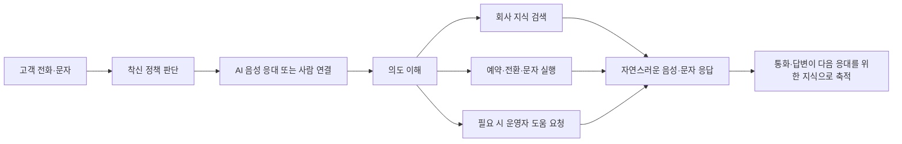
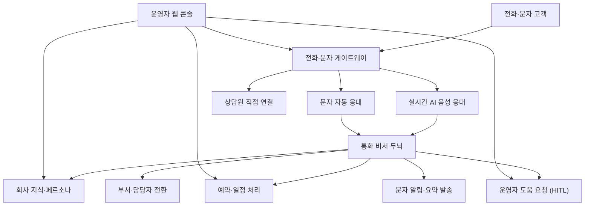
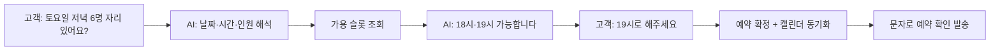
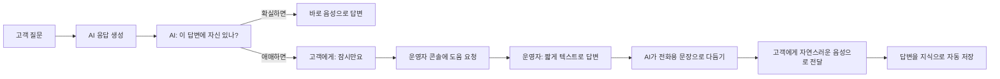

# Project Brief: Agentic AI Callbot — 듣고, 이해하고, 처리하는 통화 비서

**작성일**: 2026-04-28  
**버전**: 1.0  
**상태**: 발표용 소개 문서

---

## Executive Summary

**Agentic AI Callbot**은 회사의 대표번호로 걸려 오는 전화와 문자에 사람처럼 응대하고,
그 자리에서 **예약·상담원 연결·일정 등록·문자 회신·후속 안내**까지 처리하는 **AI 통합 통화 플랫폼**입니다.

> 전화 한 통이 그저 "통화 한 건"으로 끝나지 않고,
> **그 통화가 만든 정보가 다음 통화의 답이 되는 구조**가 핵심입니다.

기존 ARS와 콜봇은 메뉴 트리와 미리 만든 답변을 따라 움직입니다.
Agentic AI Callbot은 고객의 말을 자연어로 듣고, 회사 지식을 검색하고, 필요한 업무를 직접 수행한 뒤,
사람이 도와야 할 때만 운영자에게 짧게 도움을 요청합니다.
운영하면 할수록 지식과 응대 품질이 자동으로 쌓이며, 같은 플랫폼 위에서 여러 조직이 각자의 전용 AI를 운영할 수 있습니다.

---

## 1. 배경 — 기존 콜센터 자동화의 한계

기업이 전화 응대를 자동화하려고 하면 보통 다음과 같은 벽에 부딪힙니다.

| 문제 | 현장에서 일어나는 일 |
|------|----------------------|
| **메뉴식 ARS의 경직성** | "1번은 예약, 2번은 변경, 3번은 취소" — 고객이 한 번에 여러 가지를 묻기 어렵습니다. |
| **시나리오 구축 비용** | 도입까지 수개월의 기획·개발이 필요하고, 정책이 바뀔 때마다 다시 손봐야 합니다. |
| **정적인 지식** | 새로운 공지·요금·일정이 즉시 반영되지 않아 AI가 "모르겠습니다"를 반복합니다. |
| **상담원 연계 단절** | AI가 모를 때 전화·웹·문자·내선 전환이 따로 움직여 고객이 같은 설명을 반복합니다. |
| **부자연스러운 음성** | 침묵이 길고, 고객이 말을 끊지 못하며, AI 답변에서 끊김·지연이 자주 발생합니다. |
| **기록의 분절** | 통화·문자·예약·연락처가 별도 시스템에 흩어져 누가 언제 무엇을 약속했는지 추적이 어렵습니다. |

이런 문제는 AI 기술 부족 때문이 아니라, **PBX·AI·운영 도구가 따로 노는 구조** 때문에 생깁니다.
Agentic AI Callbot은 통화 제어, AI 응대, 지식 운영, 사람 개입, 후속 안내를 **하나의 흐름으로 묶어서** 해결하는 데 초점을 둡니다.

---

## 2. Ideation — 어떤 발상에서 시작했는가

### 2.1 기존 방식은 어떻게 진행돼 왔는가

지금까지 콜센터 자동화는 대부분 **시나리오를 먼저 그리고, 고객을 그 시나리오 안으로 안내하는 방식**으로 만들어졌습니다.

- FAQ를 미리 정리해 두고
- 인텐트(의도)를 정의하고
- ARS 메뉴를 단계별로 설계한 뒤
- 고객 발화를 그 메뉴 중 하나에 끼워 맞추는 구조였습니다.

운영을 시작하면 빠르게 한계가 드러납니다. 정책이 바뀌면 시나리오를 다시 손봐야 하고, 복합 요청은 처리하지 못하며, 상담원이 통화로 답해 준 노하우는 통화가 끝나면 사라집니다.

### 2.2 어떤 질문에서 출발했는가

이 플랫폼은 다음 세 가지 질문에서 출발했습니다.

| 질문 | 핵심 발상 |
|------|-----------|
| **시나리오를 다 만들지 않고도 시작할 수 있을까?** | 통화·문자·운영자 답변 자체를 학습 데이터로 보고, 운영하면서 지식을 쌓는다. |
| **메뉴 트리 대신 고객의 목적을 바로 실행할 수 있을까?** | 고객 발화에서 의도를 읽고, 예약·검색·전환 같은 실제 행동까지 AI가 직접 수행한다. |
| **AI가 틀릴 위험을 줄이면서도 상담원 부담을 낮출 수 있을까?** | 어렵거나 민감한 질문은 운영자에게 짧게 위임하고, 그 답변을 다시 지식으로 환류한다. |

목표는 "정해진 시나리오를 잘 따라가는 챗봇"이 아니라,
**"전화·문자·예약·사람 개입을 하나의 흐름으로 처리하는 통화 에이전트"**입니다.

### 2.3 어떤 기술 방향으로 풀었는가

질문별 발상은 다음과 같은 기술 방향으로 정리됐습니다.

| 방향 | 적용한 접근 |
|------|-------------|
| 통화는 표준 PBX처럼 안정적으로 제어 | 표준 SIP·RTP 기반의 자체 통화 제어 엔진 |
| 음성 대화는 사람과 비슷한 호흡으로 | 발화 감지(VAD), 끼어들기(바지인), 스트리밍 음성 합성 |
| 고객 의도는 "행동"으로 연결 | 의도 분류 → 지식 검색·예약·문자·전환을 그래프로 라우팅 |
| 지식은 운영 중에도 살아 있게 | 통화·문자·운영자 답변·문서 업로드를 모두 같은 지식 저장소로 흡수 |
| 조직별 AI는 완전히 분리 | 내선·조직 단위로 지식·페르소나·예약·정책을 격리한 멀티테넌트 구조 |
| 사람 개입은 통화 흐름 안에서 | 운영자 콘솔에서의 짧은 텍스트 입력이 자연스러운 음성·문자로 전달 |

### 2.4 구현으로는 어떻게 녹였는가

한 통화가 시스템을 통과하는 흐름은 대략 이렇게 정리할 수 있습니다.

### 2.5 기대 효과

- **도입 부담이 작습니다.** 모든 시나리오를 미리 짜지 않아도, 문서 업로드와 운영 중 통화로 지식이 자라납니다.
- **고객 경험이 개선됩니다.** 메뉴를 누르는 대신 자연어로 말하고, 그 자리에서 예약과 안내가 끝납니다.
- **상담원 업무가 가벼워집니다.** 모든 전화를 직접 받지 않고 어려운 구간에만 짧게 개입하면 됩니다.
- **품질이 시간과 함께 좋아집니다.** 운영자 답변, 통화, 문자가 모두 다음 응대 품질을 끌어올립니다.
- **여러 조직을 한 플랫폼에서 운영합니다.** 각 조직별로 전용 AI·지식·정책·연락처를 분리할 수 있습니다.

---

## 3. 한눈에 보는 솔루션

| 구성 요소 | 역할 |
|-----------|------|
| **전화·문자 게이트웨이** | 표준 전화망과 연결되어 통화·문자를 받고 보냅니다. 무응답·야간·VIP 등 정책을 판별합니다. |
| **AI 음성 응대** | 고객 발화를 듣고, 의도를 이해하고, 필요한 행동을 수행한 뒤 자연스러운 음성으로 응답합니다. |
| **문자 자동 응대** | 전화 대신 문자로 들어온 문의도 같은 AI가 같은 기준으로 답합니다. |
| **회사 지식·페르소나** | 조직별 매뉴얼·FAQ·말투를 저장하며, 통화·운영자 답변이 계속 추가됩니다. |
| **예약·일정 처리** | 예약 가능 시간 조회·확정·변경·취소를 음성·문자만으로 처리합니다. |
| **운영자 콘솔** | 실시간 통화 모니터링, 채팅 개입, 지식·예약·정책 관리를 한 화면에서 제공합니다. |

---

## 4. 핵심 기능 (중요도 순)

> 청중이 한정된 시간에 들었을 때 가장 가치를 체감하는 순서로 배치했습니다.
> 각 기능마다 **실제 상황 → 시스템 처리 → 결과** 순으로 사용자 스토리를 함께 제시합니다.

---

### 4.1 자연어 음성 상담 — 기존 ARS를 대체하는 첫 번째 가치

**무엇을 해결하는가**: "1번을 누르세요" 식의 메뉴를 없애고, 고객이 말하는 그대로 응대합니다.

| 기능 | 설명 |
|------|------|
| **자연어 응대** | "내일 저녁 7시에 4명 가능해요?" 처럼 그대로 말하면 의도를 이해합니다. |
| **고객 끼어들기 허용** | AI가 안내하는 도중 고객이 말을 시작하면 즉시 멈추고 다음 질문에 응답합니다. |
| **빠른 첫 음절** | 응답 전체를 만들고 말하는 게 아니라, 첫 문장이 준비되는 즉시 말하기 시작해 침묵을 줄입니다. |
| **자연스러운 한국어 발음** | 날짜·금액·전화번호를 한국어 어법에 맞게 읽도록 보정합니다. |
| **대기 안내** | 검색·계산이 길어지면 "확인 중입니다" 같은 짧은 안내를 자동으로 송출합니다. |
| **2단계 인사** | 통화가 연결되는 순간 짧은 인사를 먼저 보내, "전화가 안 받는 건가" 하는 어색함을 없앱니다. |

**사용자 스토리**

- **US-1.1 (메뉴 없이 한 번에 묻기)** —
  *상황*: 고객이 "내일 저녁 7시에 4명 자리 있어요? 창가로 부탁해요." 라고 한 번에 말합니다.
  *시스템 처리*: 한 문장에서 날짜·시간·인원·요청사항을 동시에 파악합니다.
  *결과*: AI가 "내일 저녁 7시에 4인 창가 자리 가능합니다. 예약해 드릴까요?" 라고 한 번에 답합니다.

- **US-1.2 (말 끊고 다른 질문)** —
  *상황*: AI가 영업시간을 안내하는 도중 고객이 "잠깐, 주차는 돼요?" 라고 끼어듭니다.
  *시스템 처리*: 고객 발화를 감지한 즉시 안내를 중단하고 새 질문을 처리합니다.
  *결과*: AI가 영업시간 설명을 멈추고 "지하 주차장 무료로 이용 가능합니다." 로 자연스럽게 전환합니다.

- **US-1.3 (어색한 침묵 제거)** —
  *상황*: 고객이 전화를 걸자마자 신호음 직후 침묵을 우려합니다.
  *시스템 처리*: 통화 연결 즉시 짧은 인사를 먼저 송출하고, 본 응답 준비가 끝나면 이어서 첫 문장을 말합니다.
  *결과*: 고객은 "안녕하세요, OO입니다" 를 바로 듣고, 끊긴 통화가 아닌지 의심하지 않습니다.

---

### 4.2 회사 지식이 스스로 자라는 구조 (Active RAG)

**무엇을 해결하는가**: "FAQ를 먼저 다 채워야 시작할 수 있다"는 도입 부담을 해소합니다.

지식은 다음 네 가지 경로로 동시에 채워집니다.

| 경로 | 누가 | 어떻게 |
|------|------|--------|
| **운영자 직접 입력** | 관리자 | 콘솔에서 인사말·FAQ·연락처를 항목 단위로 등록합니다. |
| **문서 업로드** | 관리자 | 텍스트 매뉴얼을 업로드하면 자동으로 의미 단위로 정리되어 저장됩니다. |
| **통화 자동 축적** | 시스템 | 통화 내용에서 의미 있는 질문·답변 쌍을 자동으로 추출해 저장합니다. |
| **운영자 답변 환류** | 운영자 | 운영자가 한 번 답한 내용은 다음번에 AI가 직접 사용할 수 있게 저장됩니다. |

조회 단계에서는 "메뉴 단가"처럼 자주 묻는 동일 질문은 캐시에서 바로 꺼내 응답 시간을 짧게 유지합니다.

**사용자 스토리**

- **US-2.1 (매뉴얼 업로드 한 번으로 응답 시작)** —
  *상황*: 운영자가 새로 만든 메뉴판 텍스트를 콘솔에 업로드합니다.
  *시스템 처리*: 문서를 의미 단위로 자동 분할해 지식 저장소에 적재합니다.
  *결과*: 다음 통화부터 "오늘 메뉴에 파스타 있어요?" 같은 질문에 AI가 즉시 답합니다.

- **US-2.2 (운영자 답변이 다음 응대의 지식으로)** —
  *상황*: 처음 받는 질문 "주차권 할인 되나요?" 에 운영자가 콘솔에서 짧게 답합니다.
  *시스템 처리*: 운영자 답변을 정제해 지식으로 자동 저장합니다.
  *결과*: 같은 질문이 다음에 들어오면 운영자 도움 없이 AI가 직접 응답합니다.

- **US-2.3 (반복 질문은 즉시 응답)** —
  *상황*: "영업시간이 어떻게 돼요?" 같은 질문이 하루에도 수십 번 들어옵니다.
  *시스템 처리*: 동일 질문은 캐시에서 바로 꺼내 LLM 호출을 생략합니다.
  *결과*: 평균 응답 속도가 짧아지고, 운영 비용이 통화량과 정비례로 증가하지 않습니다.

---

### 4.3 예약·상담 슬롯의 음성 자동화

**무엇을 해결하는가**: "내일 저녁 4명 가능해요?" 한마디로 끝나는 진짜 예약 처리입니다.

이 기능은 레스토랑·미용실·병원·상담소처럼 슬롯 기반 예약을 다루는 모든 업종에서 즉시 활용할 수 있습니다.

**대표 흐름**

**제공하는 기능**

- **자연어로 슬롯 조회·확정·변경·취소**
- **도메인별 수집 항목**: "4인 테이블"은 이름·전화만, "디자이너 상담"은 시술 종류까지 수집하도록 운영자가 정의할 수 있습니다.
- **이중 예약 방지**: 같은 슬롯에 동시에 예약이 들어와도 한 건만 성립하도록 안전하게 처리합니다.
- **Google 캘린더 동기화**: 사장님 계정과 연결하면 확정된 예약이 자동으로 구글 캘린더에 등록·변경·취소됩니다.
- **예약 확정 문자 발송**: 통화 직후 예약 내역을 문자로도 보냅니다.
- **운영자 콘솔에서 슬롯·예약·도메인 관리**: 빈 슬롯 추가·차단, 예약 목록 조회·상태 변경이 한 화면에서 가능합니다.

**사용자 스토리**

- **US-3.1 (한 통화로 예약 완료)** —
  *상황*: 고객이 "토요일 저녁 6명 자리 있어요?" 라고 묻습니다.
  *시스템 처리*: 토요일 저녁 가용 슬롯을 조회 → 고객이 시간을 선택하면 즉시 예약을 확정하고, 사장님 구글 캘린더에 등록 후 확인 문자를 발송합니다.
  *결과*: 고객은 통화 한 번으로 예약·문자·일정 등록까지 한 번에 마칩니다.

- **US-3.2 (예약 변경)** —
  *상황*: 고객이 "이번 주 토요일 김OO 디자이너 예약을 다음 주로 옮기고 싶어요." 라고 말합니다.
  *시스템 처리*: 발신 번호로 본인 예약을 검색하고, 다음 주 가용 시간을 안내한 뒤 변경을 확정합니다.
  *결과*: 캘린더와 고객 문자에 변경 내용이 동시에 반영되며, 사장님은 별도 작업 없이 일정에서 확인합니다.

- **US-3.3 (도메인별 다른 정보 수집)** —
  *상황*: 같은 매장에서 "4인 테이블 예약"과 "디자이너 시술 상담" 두 가지 예약을 운영합니다.
  *시스템 처리*: 운영자가 도메인별 필수·선택 항목을 미리 정의해 두면 AI가 예약 종류에 따라 묻는 질문을 다르게 가져갑니다.
  *결과*: 테이블 예약은 짧게 끝나고, 시술 상담은 시술 종류·생년월일까지 빠짐없이 수집됩니다.

---

### 4.4 사람 도움 받기(HITL) — AI가 실수하지 않는 안전 장치

**무엇을 해결하는가**: AI가 자신 없는 답을 그냥 말해 버리는 위험을 없애고, 운영자가 짧게 개입할 수 있도록 합니다.

**핵심 포인트**

- **운영자는 전화를 받지 않습니다.** 콘솔에 짧은 텍스트만 입력합니다.
- **고객은 자연스러운 음성을 듣습니다.** 운영자 텍스트를 그대로 읽어 주는 게 아니라, AI가 전화용 어투로 다듬어 안내합니다.
- **운영자 1명이 여러 통화를 동시에 도울 수 있습니다.**
- **답변은 자동으로 학습됩니다.** 한 번 도와준 내용은 다음번에 AI가 직접 처리합니다.
- **에스컬레이션 모드 선택**: 조직마다 "운영자 도움(HITL)" 또는 "상담원 내선으로 즉시 전환"을 선택해 둘 수 있습니다.

**사용자 스토리**

- **US-4.1 (모르는 신규 정책)** —
  *상황*: 새로 시작한 이벤트에 대해 고객이 "그 신메뉴 할인 행사 며칠까지 해요?" 라고 묻습니다.
  *시스템 처리*: AI가 답변에 자신 없음을 인지하고 고객에게 "잠시만 확인해 드릴게요" 라고 안내한 뒤, 운영자 콘솔에 도움을 요청합니다.
  *결과*: 운영자가 "이번 달 말까지" 라고 한 줄 입력하면, AI가 "이번 달 말일까지 진행됩니다" 같은 자연스러운 음성으로 고객에게 전달하고 그 답변을 지식에도 자동 저장합니다.

- **US-4.2 (한 운영자가 동시에 여러 통화 지원)** —
  *상황*: 점심 피크에 5건의 통화가 동시에 들어옵니다.
  *시스템 처리*: 5건 모두 AI가 응대하다가, 그중 2건만 도움 요청을 띄웁니다.
  *결과*: 운영자 1명이 5건의 통화를 직접 받지 않고도, 콘솔에서 텍스트 두 번 입력으로 모든 응대 품질을 유지합니다.

- **US-4.3 (조직별 에스컬레이션 정책 선택)** —
  *상황*: 한 매장은 "운영자가 콘솔에서 답을 도와주는 방식"을, 다른 매장은 "어렵다 싶으면 즉시 상담원에게 전화 자체를 넘기는 방식"을 원합니다.
  *시스템 처리*: 페르소나 설정에서 에스컬레이션 모드를 각각 다르게 지정합니다.
  *결과*: 같은 플랫폼에서 매장마다 다른 운영 방식이 자연스럽게 동작합니다.

---

### 4.5 착신 제어 — 시간·상황별 응답 정책

**무엇을 해결하는가**: 같은 대표번호라도 평일 낮·야간·휴일·VIP·블랙리스트마다 다른 응답이 필요합니다.

운영자는 다음 다섯 가지 동작 중에서 시간대·요일·발신자 조건에 맞춰 정책을 만들 수 있습니다.

| 정책 | 동작 |
|------|------|
| **상담원 직접 연결** | 업무 시간에는 사람에게 바로 연결 |
| **무응답 시 AI 인수** | 일정 시간 동안 받지 않으면 AI가 인수 |
| **첫 응답 AI** | 야간·휴일에는 AI가 처음부터 응대 |
| **다른 번호로 전환** | 지정된 외부 번호·내선으로 자동 전달 |
| **착신 그룹** | 여러 담당자에게 순차 또는 동시에 벨이 울리도록 그룹 호출 |

추가로:

- **VIP·차단 발신자 필터**를 만들어 정책보다 우선시할 수 있습니다.
- **공휴일 자동 인식**으로 휴일에는 별도 안내를 트리거할 수 있습니다.
- **안내 멘트(인사말) 오버라이드**로 같은 통화 정책에 어울리는 인사를 지정할 수 있습니다.

**사용자 스토리**

- **US-5.1 (점심 피크에 사람 대신 AI 인수)** —
  *상황*: 점심 시간에 사장님이 손님을 받느라 전화를 못 받습니다.
  *시스템 처리*: "10초 무응답 시 AI 인수" 정책이 작동해 자동으로 AI가 통화를 이어받습니다.
  *결과*: 고객은 끊지 않고도 AI에게 예약·문의를 그대로 진행할 수 있습니다.

- **US-5.2 (야간·휴일 자동 안내)** —
  *상황*: 토요일 밤 11시에 환자가 전화합니다.
  *시스템 처리*: 휴일·야간 시간대 정책이 작동해 첫 응답부터 AI가 받고, 휴일 전용 인사말을 사용합니다.
  *결과*: "오늘은 휴일이라 일요일 오전 9시부터 진료합니다" 같은 안내를 즉시 받고, 필요하면 응급 안내까지 이어집니다.

- **US-5.3 (VIP 발신자 우선 처리)** —
  *상황*: VIP로 등록된 거래처가 대표번호로 전화합니다.
  *시스템 처리*: 발신자 필터가 일반 정책보다 먼저 평가되어 정책 적용을 건너뜁니다.
  *결과*: 야간·휴일이라도 지정된 담당자 핸드폰으로 즉시 연결됩니다.

---

### 4.6 통화 연결음 — 대기 시간을 브랜드 경험으로

**무엇을 해결하는가**: 전화가 연결되기 전 침묵을 없애고, 그 짧은 시간을 브랜드 안내·음악으로 활용합니다.

- **인사 멘트 + 음원 조합**: 짧은 음성 인사와 음원을 이어서 송출합니다.
- **AI 음원 생성**: 가사·분위기·BPM을 입력하면 외부 음원 생성 서비스로 짧은 곡을 만들어 미리 들어 보고 적용합니다.
- **자동 중지**: 사람이 받거나 AI가 응답을 시작하는 순간 연결음을 부드럽게 끊어 두 소리가 겹치지 않게 합니다.
- **테넌트별 멘트·음원 관리**: 조직마다 다른 인사말과 음원을 운영자가 콘솔에서 직접 등록·교체할 수 있습니다.

**사용자 스토리**

- **US-6.1 (첫 인상 강화)** —
  *상황*: 고객이 매장에 처음 전화를 겁니다.
  *시스템 처리*: 통화가 연결되는 순간 "안녕하세요, OO입니다" 짧은 인사 후 매장 분위기에 맞는 음원이 흐릅니다.
  *결과*: 사람이 받기 전 침묵이 사라지고, 고객은 매장의 분위기를 첫 통화부터 경험합니다.

- **US-6.2 (운영자가 직접 만드는 매장 음원)** —
  *상황*: 운영자가 "여름 한정 메뉴 안내곡"을 만들고 싶어 합니다.
  *시스템 처리*: 콘솔에서 가사 키워드와 분위기·길이를 입력하면 AI가 음원 후보를 생성합니다.
  *결과*: 운영자가 미리 들어 보고 마음에 드는 곡을 한 번 클릭으로 적용합니다.

- **US-6.3 (자연스러운 정지)** —
  *상황*: 연결음이 흐르는 도중 사장님이 전화를 받습니다.
  *시스템 처리*: 통화가 연결되는 즉시 연결음을 부드럽게 끊습니다.
  *결과*: 음악과 사람 목소리가 겹치지 않고 깔끔하게 인사로 이어집니다.

---

### 4.7 문자(SMS·SIP MESSAGE) 응대 — 같은 AI, 다른 채널

**무엇을 해결하는가**: 전화가 부담스러운 고객도 같은 품질로 응대받을 수 있게 합니다.

- **인입 문자 자동 응대**: 문자 문의가 들어오면 음성과 같은 AI·지식·페르소나로 답합니다.
- **예약 확정·변경·취소 자동 문자 발송**: 예약이 만들어지거나 바뀌면 안내 문자가 자동으로 나갑니다.
- **통화 종료 후 요약 문자**: 통화 마무리 시점에 AI가 대화를 요약해 고객에게 문자로 남깁니다.
- **운영자 콘솔의 채팅방 기능**: 고객별 대화방에서 운영자가 직접 답하거나 발송 실패 건을 재전송할 수 있습니다.
- **자기 발송 응답에 다시 응답하지 않도록** 안전장치가 들어 있습니다.

**사용자 스토리**

- **US-7.1 (전화 대신 문자로 문의)** —
  *상황*: 회의 중인 고객이 통화 대신 "오늘 영업해요?" 라고 문자로 보냅니다.
  *시스템 처리*: 문자도 통화와 동일한 AI가 받아 영업시간 지식을 검색합니다.
  *결과*: 고객은 즉시 "오늘은 오후 9시까지 영업합니다" 라는 문자 답변을 받습니다.

- **US-7.2 (예약 확정 문자 자동 발송)** —
  *상황*: 통화로 예약이 막 확정됐습니다.
  *시스템 처리*: 예약 직후 확정 정보(날짜·시간·인원)를 문자로 자동 발송합니다.
  *결과*: 고객이 캡처해 일정에 보관할 수 있고, 노쇼 위험이 줄어듭니다.

- **US-7.3 (통화 종료 후 요약 문자)** —
  *상황*: 고객이 여러 가지 안내를 듣고 통화를 마칩니다.
  *시스템 처리*: 통화 종료 직후 AI가 대화 요점과 후속 연락처를 요약해 문자로 발송합니다.
  *결과*: 고객은 들었던 내용을 잊지 않고 다시 확인할 수 있습니다.

---

### 4.8 발신 연락처(CID)와 통화 도크 — 전화 받자마자 보이는 고객 카드

**무엇을 해결하는가**: 전화가 오는 순간 누가, 몇 번째 전화인지, 무슨 맥락인지 운영자가 즉시 파악할 수 있게 합니다.

- **상단 도크 자동 표시**: 통화가 시작되면 화면 어디서든 발신자 카드가 나타납니다.
- **이중 라인 정보**: 전화번호와 함께 "이름 + 끝 4자리" 형식의 표시명을 보여 줍니다.
- **재인입 통계**: 최근 30일 통화 횟수와 누적 통화 횟수를 표시해 단골·반복 문의 여부를 즉시 인지하게 합니다.
- **자동 이름 채움**: 예약자 이름이 있으면 그대로, 없으면 AI가 통화에서 이름을 추출해 표시명을 자동 등록합니다.
- **연락처 트리·폴더**: 운영자가 폴더로 연락처를 묶고, 끌어다 놓기로 정리할 수 있습니다.

**사용자 스토리**

- **US-8.1 (단골 식별)** —
  *상황*: 한 단골 고객이 평소처럼 전화를 겁니다.
  *시스템 처리*: 통화 시작과 동시에 도크에 "홍길동·5678 / 최근 30일 5회, 누적 47회" 가 표시됩니다.
  *결과*: 운영자는 "홍길동님 안녕하세요" 부터 응대를 시작할 수 있고, 같은 설명을 다시 묻지 않습니다.

- **US-8.2 (신규 고객 자동 등록)** —
  *상황*: 처음 보는 번호에서 통화가 들어와 예약이 확정됩니다.
  *시스템 처리*: 통화 종료 시점에 예약자 이름 또는 통화에서 추출한 이름으로 연락처를 자동 등록합니다.
  *결과*: 다음번 같은 번호에서 전화가 오면 도크에 자동으로 이름이 보입니다.

- **US-8.3 (폴더로 연락처 정리)** —
  *상황*: 운영자가 단골·VIP·블랙리스트 등을 구분해서 관리하고 싶어 합니다.
  *시스템 처리*: 콘솔에서 폴더를 만들고 연락처를 끌어다 놓아 옮길 수 있습니다.
  *결과*: 빠르게 그룹별 연락처를 찾고, 정책과도 손쉽게 연결할 수 있습니다.

---

### 4.9 호 전환 — 끊김 없는 사람 연결

**무엇을 해결하는가**: AI가 답할 수 없는 상황, 고객이 직접 사람을 찾는 상황에서도 통화가 끊기지 않도록 합니다.

세 가지 전환 방식을 지원합니다.

1. **고객 요청 자동 전환** — "담당자 연결해 주세요" 같은 발화를 듣고, 등록된 부서·연락처로 자동 연결합니다.
2. **운영자 즉시 개입** — 운영자가 콘솔에서 직접 통화를 가로채 자기 내선으로 전환합니다.
3. **부서·외부 번호 전환** — 지정된 부서나 외부 번호로 안내 후 연결합니다.

전환 실패(부재중·통화중 등) 시에는 자동으로 AI 모드로 복귀해 안내를 이어갑니다.

**사용자 스토리**

- **US-9.1 (고객 요청으로 부서 연결)** —
  *상황*: 고객이 "결제 관련해서 담당자 연결해 주세요" 라고 말합니다.
  *시스템 처리*: AI가 의도를 부서 전환으로 인식해 등록된 결제 담당 내선으로 안내합니다.
  *결과*: 고객은 ARS 메뉴를 누르지 않고 한마디로 담당자에게 연결됩니다.

- **US-9.2 (운영자가 직접 통화 인수)** —
  *상황*: AI 응대를 모니터링하던 운영자가 "이건 내가 직접 받아야겠다" 고 판단합니다.
  *시스템 처리*: 콘솔에서 한 번 클릭으로 통화를 가로채 자신의 내선으로 전환합니다.
  *결과*: 고객 입장에서 통화가 끊기지 않고 자연스럽게 사람과 이어집니다.

- **US-9.3 (전환 실패 시 안전 복귀)** —
  *상황*: 담당자가 부재중이라 호 전환이 실패합니다.
  *시스템 처리*: 통화를 끊지 않고 즉시 AI 모드로 복귀합니다.
  *결과*: 고객은 "지금 담당자가 자리를 비웠습니다. 메모 남겨 드릴까요?" 같은 후속 안내를 받습니다.

---

### 4.10 발신(아웃바운드) — AI가 먼저 거는 전화

**무엇을 해결하는가**: 만족도 조사·예약 리마인드·미회신 안내 같은 반복 발신 업무를 자동화합니다.

- **목적 + 질문 등록**: "만족도 조사 / 1~5점으로 평가" 같은 미션을 등록하면 AI가 자연스럽게 질문하고 답을 수집합니다.
- **자연스러운 대화 진행**: 거절·회피·잡담에도 AI가 적절히 응대하고 다시 본 미션으로 돌아옵니다.
- **답변 수집 완료 시 자동 종료**: 모든 질문에 답이 모이면 인사말 후 자동으로 통화를 종료합니다.
- **녹음·요약 보존**: 통화 내용은 녹음·STT 대본·미션 결과(JSON)로 저장됩니다.

**사용자 스토리**

- **US-10.1 (만족도 조사 자동 캠페인)** —
  *상황*: 매장에서 지난주 방문 고객 100명에게 만족도 조사를 하고 싶어 합니다.
  *시스템 처리*: 운영자가 캠페인을 등록하면 AI가 시간대를 지키며 자동으로 한 명씩 전화를 걸고, 미리 정의된 질문을 자연스럽게 묻습니다.
  *결과*: 점수와 코멘트가 표 형태로 정리되어 운영자 콘솔에서 한눈에 확인됩니다.

- **US-10.2 (예약 리마인드 발신)** —
  *상황*: 내일 예약된 고객에게 잊지 않도록 안내가 필요합니다.
  *시스템 처리*: 예약 24시간 전에 자동으로 전화를 걸고, 변경·취소 의사도 함께 확인합니다.
  *결과*: 노쇼가 줄고, 고객 변경 의사도 즉시 캘린더에 반영됩니다.

- **US-10.3 (잡담·거절에도 자연스러운 회복)** —
  *상황*: 고객이 조사 도중 "지금 바빠요" 라고 합니다.
  *시스템 처리*: AI가 양해 멘트로 응대하고, 다음번 시도를 위한 콜백 정보를 남깁니다.
  *결과*: 무리하게 진행하지 않고, 고객 부담 없이 다음 기회를 만듭니다.

---

### 4.11 운영자 콘솔 — 한 화면에서 보는 운영 도구

**무엇을 해결하는가**: 통화·예약·문자·지식·정책을 따로따로 보지 않고, 한 화면에서 운영합니다.

- **실시간 통화 모니터링**: 진행 중 통화의 STT/TTS 피드, 처리 단계, 신뢰도가 실시간으로 표시됩니다.
- **HITL 응답 패널**: AI 도움 요청에 즉시 답할 수 있습니다.
- **지식베이스·페르소나 관리**: 항목 추가·수정, 인사말, 어투, 업무 범위를 콘솔에서 정의합니다.
- **예약·슬롯·도메인 관리 페이지**: 예약 일정·도메인 설정을 한 자리에서 관리합니다.
- **착신 정책·연결음 설정**: 운영 정책과 첫인상 음원을 시각적으로 구성합니다.
- **채팅 관리**: 고객별 문자 대화방과 운영자 회신·재전송을 제공합니다.
- **통화 이력·미해결 통화 보드**: 통화 후 처리해야 할 건을 따로 모아 후속 처리할 수 있습니다.

**사용자 스토리**

- **US-11.1 (실시간 모니터링과 즉시 개입)** —
  *상황*: 운영자가 모니터링 중 진행 중인 통화가 어색하게 흘러가는 것을 봅니다.
  *시스템 처리*: 콘솔에서 해당 통화의 대화 내용을 실시간으로 보고, 한 번 클릭으로 통화를 인수합니다.
  *결과*: 문제가 커지기 전에 사람이 자연스럽게 개입해 고객 경험을 지킵니다.

- **US-11.2 (미해결 통화 후속 처리)** —
  *상황*: 야간에 들어온 통화 중 운영자 확인이 필요한 건이 모입니다.
  *시스템 처리*: 미해결 통화 보드에 자동 분류되어 별도 목록으로 보입니다.
  *결과*: 다음 날 아침 운영자가 보드 하나만 보고 우선순위대로 콜백·문자 회신을 처리합니다.

- **US-11.3 (정책을 코드 수정 없이 변경)** —
  *상황*: 사장님이 "다음 주부터 점심 정책을 바꾸자" 고 합니다.
  *시스템 처리*: 운영자가 콘솔에서 시간대·동작을 수정하고 저장합니다.
  *결과*: 개발자 호출 없이 다음 통화부터 새 정책이 적용됩니다.

---

### 4.12 멀티테넌트 — 한 플랫폼 위 여러 조직의 "나만의 AI"

**무엇을 해결하는가**: 같은 인프라 위에서 여러 고객사·매장·지점이 각자의 AI를 운영하도록 합니다.

- 조직마다 별도의 지식·페르소나·예약·연락처·정책을 보유하며, 서로의 데이터가 섞이지 않습니다.
- 같은 LLM 위에서 동작하더라도 조직별 어투·업무 범위가 유지됩니다.
- 본사·지점·프랜차이즈 모델, 다중 임대(SaaS) 운영에 모두 적용할 수 있습니다.

**사용자 스토리**

- **US-12.1 (한 플랫폼, 여러 매장 운영)** —
  *상황*: 같은 본사가 운영하는 카페와 미용실이 동일 시스템을 사용합니다.
  *시스템 처리*: 카페 번호로 들어온 통화는 카페 메뉴·예약 도메인을, 미용실 번호로 들어온 통화는 시술·디자이너 도메인을 사용하도록 격리합니다.
  *결과*: 고객 입장에서 두 매장은 완전히 별개의 AI를 가진 것처럼 보이고, 데이터가 서로 섞이지 않습니다.

- **US-12.2 (지점별 어투·페르소나 분리)** —
  *상황*: 강남점은 격식 있는 어투, 홍대점은 캐주얼한 어투를 원합니다.
  *시스템 처리*: 같은 LLM 위에서 지점별 페르소나(인사말·말투·업무 범위)를 다르게 적용합니다.
  *결과*: 같은 브랜드라도 지점 분위기에 맞는 응대가 자동으로 이루어집니다.

- **US-12.3 (가맹점 신규 추가)** —
  *상황*: 새 가맹점이 오픈해 즉시 운영을 시작해야 합니다.
  *시스템 처리*: 신규 테넌트를 만들고 페르소나·기본 지식·정책만 등록하면 됩니다.
  *결과*: 별도 인프라 구축 없이 같은 플랫폼에서 새 매장 전용 AI가 즉시 동작합니다.

---

## 5. 사용 시나리오

### 시나리오 A. 점심 피크 시간의 식당
업무 시간에는 점장이 직접 받지만, 점심·저녁 피크는 무응답 정책으로 AI가 인수합니다.
"내일 저녁 6명 자리 있어요?"라는 질문에 AI가 슬롯을 조회·확정하고 문자로 확인까지 보냅니다.
구글 캘린더에도 자동으로 등록되어 점장 휴대폰에서 일정으로 확인됩니다.

### 시나리오 B. 야간 병원 안내
밤 10시에 환자가 전화하면 첫 응답을 AI가 맡습니다.
진료 가능 시간, 응급 상황 안내, 예약 접수까지 처리한 뒤 후속 안내 문자를 보냅니다.
민감한 의료 질문이 들어오면 운영자에게 도움 요청을 띄우고, 운영자가 짧게 답한 내용이 자연스러운 음성으로 전달됩니다.

### 시나리오 C. 미용실 예약 변경
"이번 주 토요일 디자이너 김OO 예약을 다음 주로 옮겨 주세요"라는 발화에 AI가 기존 예약을 찾고, 가능한 슬롯을 안내한 뒤, 변경을 확정합니다. 변경 사실이 캘린더와 문자로 동시에 전달됩니다.

### 시나리오 D. 만족도 조사 발신 캠페인
운영자가 만족도 조사 캠페인을 등록합니다. 시스템이 시간대를 지키며 자동으로 전화를 걸고,
점수와 코멘트를 수집한 뒤 자동 종료합니다. 부재중인 고객은 재시도 정책에 따라 다시 시도되거나 문자로 후속 안내됩니다.

### 시나리오 E. 단골 고객 식별
단골 손님이 전화를 걸자마자 운영자 화면에 "이름 + 끝 4자리"와 "최근 30일 5회, 누적 47회" 정보가 뜹니다.
운영자는 첫마디부터 단골임을 알고 응대를 시작합니다.

---

## 6. 운영 가치 — 시간이 지나면서 좋아지는 구조

| 시점 | AI 직접 처리 | 운영자 개입 | 응답 속도 |
|------|--------------|-------------|------------|
| **도입 직후** | 기본 FAQ 수준 | 자주 발생 | 일반 통화 평균 |
| **1~3개월 후** | 통화·HITL이 쌓이며 처리율 상승 | 점진적 감소 | 캐시 적중으로 빨라짐 |
| **운영 안정화 이후** | 다수 반복 질의를 자동 응대 | 민감·예외 구간만 개입 | 자주 묻는 질문은 즉시 응답 |

**비즈니스 효과**

- 야간·주말·점심 피크에도 응대 누락이 줄어듭니다.
- 운영자는 모든 통화를 직접 받지 않고, 의미 있는 개입에만 집중합니다.
- 같은 정보를 여러 채널에서 따로 관리할 필요가 없습니다.
- 통화량이 늘어도 사람 인력을 같은 비율로 늘리지 않아도 됩니다.

---

## 7. 적용 대상

| 대상 | 활용 예 |
|------|---------|
| **공공기관·민원센터** | 야간 자동 안내, 부서 연결, 민원 접수 |
| **병원·클리닉** | 예약 접수·변경, 진료 안내, 영업시간 응대 |
| **레스토랑·매장** | 영업시간·주차·예약·대기 안내 |
| **B2B 고객센터** | 기술·정책 문의, 담당자 연결, 통화 후 요약 문자 |
| **교육·상담 기관** | 상담 예약, 일정 변경, 후속 문자 안내 |
| **캠페인 운영팀** | 만족도 조사, 미응답 고객 리마인드, 안내 발신 |
| **다지점 프랜차이즈** | 각 매장별 전용 AI, 통합 콘솔 운영 |

---

## 8. 적용 절차 (도입 단계)

| 단계 | 내용 |
|------|------|
| **1. 연결** | 표준 SIP 환경에 시스템을 연결합니다. (회선·내선 등록) |
| **2. 페르소나 설정** | 조직 이름·인사말·말투·업무 범위를 입력합니다. |
| **3. 초기 지식 등록** | 매뉴얼·FAQ 텍스트를 업로드하거나 핵심 항목을 직접 등록합니다. |
| **4. 정책 설정** | 평일·야간·휴일별 응답 정책과 호 전환 대상, 안내 멘트를 구성합니다. |
| **5. 운영 시작** | 통화·문자가 들어오면서 자동 학습이 시작됩니다. |
| **6. 운영 중 개선** | HITL 답변·자주 묻는 질문 캐시가 누적되면서 자동화율이 자연스럽게 상승합니다. |

---

## 9. 비전

> 모든 조직이 "우리 회사 전화 받는 AI"를 기본으로 가질 수 있고,
> 운영하면 할수록 더 정확해지고 더 저렴해지는 통화 운영을 누릴 수 있게 합니다.

Agentic AI Callbot은 단순한 콜봇이 아니라,
**전화·문자·예약·상담원 협업이 한 흐름으로 돌아가는 통화 운영 OS**를 지향합니다.

---

## 10. 부록

| 문서 | 내용 |
|------|------|
| `docs/SYSTEM_OVERVIEW.md` | 전체 시스템 아키텍처와 기능 상세 |
| `docs/reports/` | 일자별 구현·점검 리포트 |
| `docs/QUICK_START.md` | 운영 시작 가이드 |

---

*본 문서는 Agentic AI Callbot 시스템의 대외 소개·발표용 Project Brief입니다.*
