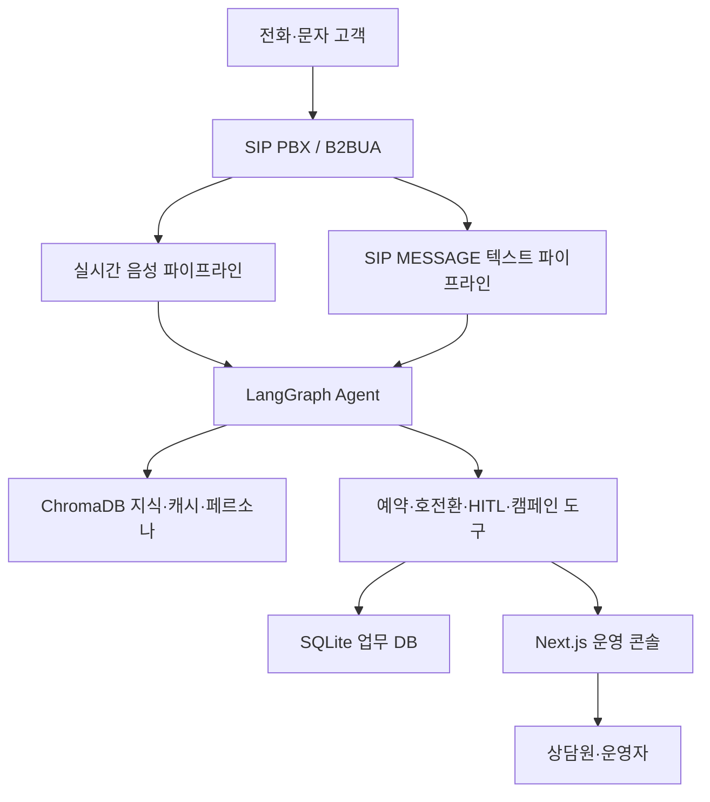
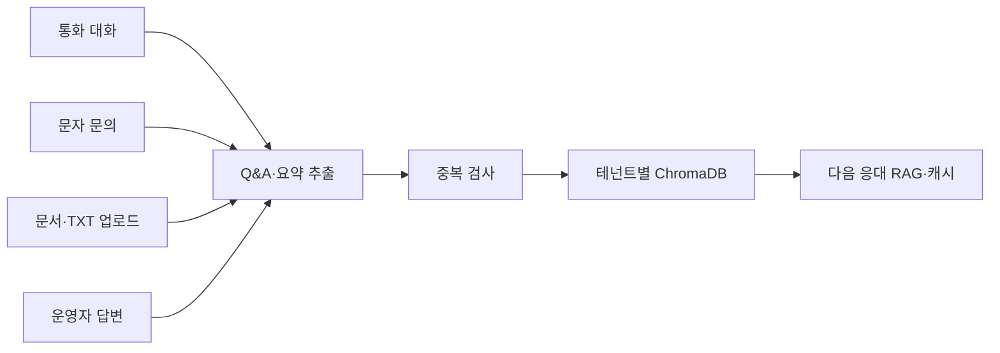
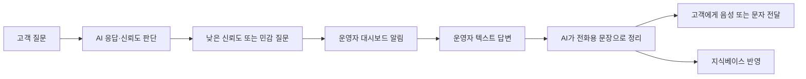

# Project Brief: AI SIP PBX

**작성일**: 2026-04-28  
**버전**: 2.0  
**상태**: 발표용 소개 문서

---

## Executive Summary

**AI SIP PBX**는 표준 SIP/RTP 기반 PBX 위에 실시간 음성 AI, Agentic Workflow, 지식베이스, 예약, 문자, 발신 캠페인, 운영자 협업을 통합한 **Agentic AICC 플랫폼**입니다.

> 전화는 단순 연결 채널이 아니라, 기업의 지식과 업무가 실행되는 실시간 인터페이스가 됩니다.

기존 ARS와 시나리오형 콜봇은 정해진 메뉴와 고정 스크립트에 의존합니다. AI SIP PBX는 고객 발화를 자연어로 이해하고, 조직별 지식과 페르소나를 바탕으로 응답하며, 필요하면 예약 도구를 호출하거나 상담원에게 연결하고, 문자와 아웃바운드 캠페인까지 같은 흐름으로 처리합니다.

핵심은 **통화할수록 지식이 쌓이고, 운영할수록 자동화율이 높아지는 구조**입니다. 통화, 문자, 상담원 개입, 문서 업로드가 모두 테넌트별 지식과 캐시에 축적되어 다음 응대 품질을 끌어올립니다.

---

## 1. 배경

### 기존 콜센터 자동화의 한계

기업이 콜봇이나 ARS를 도입할 때 가장 큰 부담은 기술 자체보다 **구축과 운영 방식**에 있습니다.

| 문제 | 현장 영향 |
|------|-----------|
| 높은 초기 구축비 | 시나리오, 인텐트, FAQ를 미리 설계해야 하며 도입까지 시간이 오래 걸림 |
| 경직된 ARS 트리 | 고객이 메뉴를 외워야 하고 복합 요청을 한 번에 처리하기 어려움 |
| 정적 지식 | 정책, 가격, 일정, 공지 변경이 즉시 반영되지 않음 |
| 음성 경험 품질 | 긴 침묵, 끼어들기 불가, 부자연스러운 TTS로 고객 피로 증가 |
| 상담원 연계 단절 | AI가 모를 때 통화, 웹, 문자, 담당자 연결이 따로 움직임 |
| 채널 분리 | 전화, 문자, 예약, 발신 캠페인이 서로 다른 시스템으로 운영됨 |

AI SIP PBX는 이 문제를 **PBX 제어, AI 에이전트, 지식 운영, 상담원 협업을 하나의 통화 흐름 안에 통합**해 해결합니다.

---

## 2. 제품 비전

### 한 줄 정의

**AI SIP PBX는 기업이 자신만의 AI 상담원을 운영할 수 있게 하는 멀티테넌트 AI PBX 플랫폼입니다.**

### 지향점

- **Agentic AICC**: 고객 발화를 단순 답변으로 끝내지 않고, 예약 조회, 지식 검색, 호전환, HITL, 발신 미션 수행 같은 행동으로 연결합니다.
- **Active RAG**: 통화, 문자, 문서, 상담원 답변이 테넌트별 지식베이스로 축적되어 AI가 점점 더 많은 질문을 직접 처리합니다.
- **Human-in-the-Loop**: AI가 불확실하거나 민감한 질문은 운영자에게 넘기고, 운영자 답변을 자연스러운 음성 또는 문자로 고객에게 전달합니다.
- **멀티채널 운영**: 인바운드 전화, SIP MESSAGE 문자, 예약 알림, 아웃바운드 캠페인을 같은 AI·지식·페르소나 체계로 다룹니다.
- **멀티테넌트 격리**: 내선 또는 조직 단위로 지식, 캐시, 페르소나, 예약, 착신 정책을 분리해 한 플랫폼에서 여러 조직의 “나만의 AI”를 운영합니다.

---

## 3. 핵심 가치 제안

| 구분 | 기존 방식 | AI SIP PBX |
|------|-----------|------------|
| 지식 구축 | 수동 FAQ, 시나리오 설계 | 통화·문자·문서·HITL 기반 자동 축적 |
| 대화 방식 | ARS 메뉴, 규칙 매칭 | 자연어 의도 분류 + LLM + RAG + Tool Use |
| 상담원 개입 | 전화 직접 응대 또는 별도 시스템 | 대시보드 텍스트 개입 → AI 음성/문자 전달 |
| 예약 처리 | 상담원 수기 접수 | AI가 슬롯 조회, 생성, 변경, 취소 수행 |
| 문자 응대 | 별도 채널 | SIP MESSAGE를 같은 AI 파이프라인으로 처리 |
| 발신 업무 | 사람이 수동 전화 | 대기열·재시도·미션 기반 아웃바운드 캠페인 |
| 착신 정책 | PBX 설정에 분산 | direct, no-answer AI, immediate AI, forward, ring group 정책화 |
| 운영 확장 | 상담원 수에 비례 | 지식·캐시가 쌓일수록 한계 비용 감소 |

---

## 4. 솔루션 개요

### 4.1 전체 구조

AI SIP PBX는 다음 계층으로 구성됩니다.

### 4.2 통화 제어: SIP B2BUA

시스템의 기반은 Python 기반 **SIP B2BUA**입니다. 발신 레그와 착신 레그를 분리해 제어하므로, 한 통화 안에서 다음 흐름을 유연하게 구성할 수 있습니다.

- 상담원에게 먼저 벨을 울리고, 무응답이면 AI가 인수
- 야간·휴일에는 AI가 첫 응답
- 고객 요청 또는 운영자 판단에 따라 내선·부서·링 그룹으로 전환
- 발신 캠페인에서 서버가 직접 OUT INVITE 수행
- 연결 전 early media 또는 브랜드 연결음 송출

고객 입장에서는 “전화를 다시 걸지 않고 같은 통화 안에서 응답 주체가 바뀌는 경험”을 얻게 됩니다.

---

## 5. 주요 기능

### 5.1 실시간 AI 음성 상담

AI 음성 파이프라인은 STT, VAD, LangGraph, RAG, TTS를 연결해 고객과 실시간으로 대화합니다.

주요 특징은 다음과 같습니다.

- **VAD 기반 발화 감지**: 고객이 말하기 시작하고 멈추는 시점을 감지합니다.
- **스마트 바지인**: AI가 말하는 중 고객이 실제 질문을 하면 TTS를 끊고 새 턴으로 전환합니다.
- **짧은 맞장구 필터링**: “네”, “아” 같은 반응과 실제 끼어들기를 구분합니다.
- **스트리밍 TTS**: LLM 응답을 모두 기다리지 않고 문장 단위로 합성해 체감 지연을 줄입니다.
- **한국어 숫자·단위 보정**: 날짜, 금액, 전화번호를 자연스럽게 읽도록 전처리합니다.

### 5.2 LangGraph 기반 의도·행동 라우팅

고객 발화는 의도 분류를 거쳐 가장 적합한 실행 경로로 이동합니다.

| 고객 발화 예시 | 시스템 처리 |
|----------------|-------------|
| “영업시간 알려주세요” | 테넌트 지식 RAG 검색 후 답변 |
| “내일 저녁 예약 가능한가요?” | 예약 도구로 슬롯 조회 |
| “상담원 연결해주세요” | HITL 또는 호전환 정책 확인 |
| “왜 계속 안 되나요?” | 불만 의도 감지, 안전 응답 및 사람 개입 판단 |
| “문자로 예약 바꿔줘요” | SIP MESSAGE 텍스트 파이프라인에서 동일 에이전트 처리 |

이 구조 덕분에 AI는 단순히 말로 응답하는 봇이 아니라, **업무를 수행하는 상담 에이전트**가 됩니다.

### 5.3 Active RAG 지식베이스

지식은 한 번 구축하고 끝나는 정적 FAQ가 아니라, 운영 중 계속 성장하는 자산입니다.

지식 축적 경로는 네 가지입니다.

- **통화 자동 축적**: 통화 내용에서 의미 있는 Q&A를 추출해 저장합니다.
- **문서 업로드**: 기존 매뉴얼, FAQ, 공지를 지식으로 변환합니다.
- **HITL 답변 반영**: 운영자가 답한 내용을 다음 응대에 재사용합니다.
- **대시보드 직접 입력**: 인사말, 종료 멘트, 연락처, FAQ를 직접 등록합니다.

테넌트별 지식과 캐시는 독립적으로 관리되며, 다른 조직의 지식이 섞이지 않습니다.

### 5.4 HITL 운영자 협업

AI가 확신하지 못하거나 민감한 질문을 받으면 운영자에게 실시간으로 도움을 요청합니다.

운영자는 전화를 직접 받지 않아도 짧은 텍스트로 개입할 수 있습니다. 고객은 내부 채팅을 보는 것이 아니라, AI가 정리한 자연스러운 음성 또는 문자 안내를 받습니다.

### 5.5 범용 AI 예약 시스템

예약 기능은 특정 업종에 묶이지 않는 범용 구조입니다. 레스토랑, 병원, 미용실, 상담소 등 다양한 도메인에서 설정만 바꿔 사용할 수 있습니다.

구성 요소는 다음과 같습니다.

- **예약 설정**: 테넌트별 업종, 슬롯 길이, 확인 메시지, 추가 수집 필드 정의
- **슬롯 관리**: 날짜·시간·용량·차단 여부 관리
- **예약 도구**: 슬롯 조회, 예약 생성, 예약 조회, 취소, 설정 조회
- **동시성 제어**: 예약 생성 시 충돌과 초과 예약 방지
- **운영 UI**: 예약 목록, 슬롯 관리, 설정 화면 제공

고객은 “내일 저녁 7시에 4명 예약 가능해요?”처럼 자연어로 말하고, AI는 실제 슬롯을 조회한 뒤 예약을 확정합니다.

### 5.6 SIP MESSAGE 문자 응대

문자 문의는 RTP와 STT를 거치지 않고 텍스트 에이전트로 바로 들어갑니다. 전화와 같은 지식, 페르소나, 의도 라우팅을 공유하므로 채널이 바뀌어도 상담 품질은 유지됩니다.

주요 사용 사례는 다음과 같습니다.

- 고객이 전화 대신 문자로 영업시간, 예약, 정책 문의
- 통화 후 같은 사건을 문자로 이어서 처리
- AI가 처리하지 못한 문자 문의를 웹 상담사가 이어받음
- 시스템이 보낸 문자에 다시 AI가 반응하지 않도록 루프 방지 플래그 적용

### 5.7 아웃바운드 발신 캠페인

AI SIP PBX는 고객이 걸어오는 전화만 받지 않고, 서버가 직접 발신 업무를 수행할 수 있습니다.

| 요소 | 설명 |
|------|------|
| 발신 작업 등록 | 대상 번호, 목적, 질문, 시간 조건을 API 또는 웹에서 등록 |
| 대기열 제어 | 최대 동시 통화, 발신 가능 시간, 재시도 정책 적용 |
| AI 미션 수행 | 예약 리마인드, 만족도 조사, 미납 안내 등 목적 기반 대화 |
| 고객 반응 처리 | 응답, 거절, 변경 요청, 사람 연결 요청에 따라 분기 |
| 성과 추적 | 성공, 실패, 부재, 재시도, 전환 여부를 상태로 관리 |

반복 안내 전화, 예약 확인, 만족도 조사, 미응답 고객 후속 조치 같은 업무를 캠페인 단위로 자동화할 수 있습니다.

### 5.8 착신 제어와 연결음

조직마다 원하는 첫 응답 정책은 다릅니다. AI SIP PBX는 착신 제어를 DB 규칙으로 모델링해 상황별로 다른 통화 흐름을 선택합니다.

| 정책 | 동작 |
|------|------|
| `direct` | 업무 시간에는 상담원에게 바로 연결 |
| `no_answer_ai` | N초 동안 무응답이면 AI가 인수 |
| `immediate_ai` | 야간·휴일 등에서 AI가 첫 응답 |
| `forward_*` | 특정 번호 또는 외부 대상으로 전달 |
| `ring_group` | 여러 내선 또는 담당자를 순차·동시 호출 |

착신 전 대기 구간에는 early media, TTS 인사, 짧은 브랜드 음원 등을 활용해 고객이 “끊긴 것 같다”고 느끼지 않도록 합니다.

### 5.9 운영자 대시보드

운영자는 웹 콘솔에서 AI 상담과 PBX 동작을 모니터링하고 제어합니다.

- 실시간 통화 상태와 STT/TTS 피드 확인
- HITL 요청 승인·수정·응답
- 지식베이스, 페르소나, 연락처 관리
- 예약 목록, 슬롯, 설정 관리
- 착신 정책과 연결음 프로필 관리
- 아웃바운드 캠페인 상태 추적
- 통화·문자·예약·전환 이벤트 기반 품질 분석

대시보드는 AI가 “블랙박스”처럼 동작하지 않도록 운영 투명성을 제공합니다.

---

## 6. 사용자 시나리오

### 시나리오 A: 무응답 후 AI가 인수

고객이 대표번호로 전화합니다. 상담원이 일정 시간 받지 않으면 AI가 자연스럽게 인사하고 문의를 처리합니다. 고객은 계속 벨만 듣다 끊지 않고, 기본 안내·예약·문자 후속·사람 연결 경로를 이어갈 수 있습니다.

### 시나리오 B: 야간 AI 첫 응답

밤 10시에 고객이 전화하면 착신 정책이 `immediate_ai`를 선택합니다. AI는 영업시간이 종료되었음을 안내하고, 가능한 업무 범위 안에서 FAQ, 예약 접수, 후속 연락 요청을 처리합니다.

### 시나리오 C: 예약 자동 처리

고객이 “이번 주 토요일 저녁 7시에 4명 예약 가능해요?”라고 묻습니다. AI는 예약 도구로 슬롯을 조회하고, 가능하면 예약을 확정한 뒤 문자 알림까지 보냅니다.

### 시나리오 D: AI가 모르는 질문에 운영자 개입

고객이 지식베이스에 없는 민감한 질문을 합니다. AI는 낮은 신뢰도를 감지해 운영자 대시보드에 알리고, 운영자는 짧게 답변합니다. 시스템은 이를 고객에게 자연스러운 음성으로 전달하고, 이후 같은 질문에 재사용할 수 있도록 지식에 반영합니다.

### 시나리오 E: 문자로 이어지는 상담

고객이 통화 후 문자로 “예약 시간을 바꿀 수 있나요?”라고 보냅니다. 시스템은 SIP MESSAGE를 텍스트 에이전트에 전달하고, 같은 고객·사건 맥락에서 예약 변경 흐름을 이어갑니다.

### 시나리오 F: 아웃바운드 예약 리마인드

운영자가 내일 예약 고객을 대상으로 리마인드 캠페인을 등록합니다. 시스템은 발신 가능 시간과 최대 동시 통화 수를 지키며 전화를 걸고, 고객이 응답하면 AI가 브랜드 톤으로 예약을 확인합니다. 부재중이면 재시도 또는 문자 후속 조치를 남깁니다.

---

## 7. 기대 효과

### 고객 경험

- 메뉴 번호를 누르지 않고 자연어로 요청
- 전화, 문자, 예약, 사람 연결이 같은 맥락에서 이어짐
- 상담원이 부재중이어도 AI가 즉시 응답
- AI가 모르는 질문은 사람의 판단을 반영해 정확도 확보
- 통화 대기 중 연결음과 안내로 이탈 감소

### 운영 효율

- 반복 문의와 예약 접수 자동화
- 상담원은 모든 전화를 받지 않고도 중요한 판단에만 개입
- 통화·문자·예약·발신 이벤트를 한 화면에서 추적
- 지식베이스와 캐시가 쌓일수록 AI 직접 처리율 증가
- 아웃바운드 캠페인으로 리마인드, 회수, 안내 업무 자동화

### 비즈니스 확장성

- 내선 또는 조직 단위 멀티테넌트 구조로 여러 고객사를 한 플랫폼에서 운영
- 업종별 예약 설정과 페르소나로 다양한 산업군에 적용
- PBX, AI, 웹 운영 콘솔을 통합해 별도 CTI·챗봇·예약 솔루션 의존도 감소

---

## 8. 기술 스택

| 영역 | 기술 |
|------|------|
| 런타임 | Python 3.11+, asyncio |
| API | FastAPI, python-socketio, aiohttp |
| SIP/RTP | 자체 SIP B2BUA, RTP 릴레이, SDP·코덱 처리 |
| 음성 AI | Pipecat, VAD, Google STT/TTS |
| 에이전트 | LangGraph, LangChain Tools |
| LLM | Google Gemini 계열 |
| 지식 저장소 | ChromaDB, sentence-transformers 임베딩 |
| 업무 DB | SQLite |
| 프론트엔드 | Next.js App Router, TypeScript, Tailwind, Zustand |
| 외부 옵션 | SMS/RCS, Google Calendar OAuth, Suno API, ngrok |

---

## 9. 적용 대상

AI SIP PBX는 전화 응대가 많고, 반복 문의·예약·후속 안내가 중요한 조직에 적합합니다.

| 대상 | 활용 예 |
|------|---------|
| 공공기관 | 민원 안내, 부서 연결, 야간 자동 응대 |
| 병원·클리닉 | 예약, 리마인드, 기본 진료 안내 |
| 레스토랑·매장 | 영업시간, 주차, 예약, 대기 안내 |
| B2B 고객센터 | 기술 문의, 계약·정책 안내, 상담원 연결 |
| 교육·상담 기관 | 상담 예약, 일정 변경, 문자 후속 안내 |
| 캠페인 운영팀 | 만족도 조사, 미응답 고객 리마인드, 안내 전화 |

---

## 10. 로드맵

### 현재 제공 역량

- SIP B2BUA 기반 인바운드·아웃바운드 통화 제어
- 실시간 AI 음성 상담, 스마트 바지인, 스트리밍 TTS
- LangGraph 기반 의도 라우팅과 Tool Use
- 테넌트별 Active RAG, 시맨틱 캐시, 페르소나
- HITL 운영자 협업과 대시보드 응답
- 범용 예약 시스템과 예약 관리 UI
- SIP MESSAGE 문자 응대
- 발신 캠페인 대기열·재시도·상태 추적
- 착신 제어 정책과 연결음 구성
- 운영자 대시보드 기반 모니터링과 설정 관리

### 확장 방향

- 캠페인 결과 리포팅과 자동 후속 조치 고도화
- 감정 분석 기반 HITL 우선순위 조정
- 외부 CRM, 캘린더, 결제, 업무 시스템 연동
- 문자·전화·웹 상담을 아우르는 사건 단위 이력 관리 강화
- 멀티테넌트 SaaS 운영을 위한 권한, 과금, 분석 체계 확장

---

## 11. 결론

AI SIP PBX는 단순한 AI 콜봇이 아니라 **PBX와 AI 업무 자동화를 결합한 전화 기반 운영 플랫폼**입니다.

전화가 오면 응답하고, 고객 의도를 이해하고, 조직 지식을 검색하고, 예약을 만들고, 사람에게 넘기고, 문자로 이어가고, 필요하면 먼저 전화를 겁니다. 이 모든 흐름은 테넌트별 지식과 페르소나 안에서 돌아가며, 운영 데이터가 쌓일수록 더 빠르고 정확해집니다.

> 모든 조직이 자신만의 AI 상담원을 갖고, 운영할수록 더 낮은 비용으로 더 나은 고객 경험을 제공하는 것이 AI SIP PBX의 목표입니다.

---

## 부록: 관련 문서

| 문서 | 설명 |
|------|------|
| [SYSTEM_OVERVIEW.md](../SYSTEM_OVERVIEW.md) | 전체 시스템 아키텍처와 기능 상세 |
| [docs/reports/](../reports/) | 날짜별 구현·분석·장애 대응 리포트 |
| [QUICK_START.md](../QUICK_START.md) | 실행 및 운영 시작 가이드 |

---

*본 문서는 AI SIP PBX 시스템의 대외 소개 및 발표용 Project Brief입니다.*
