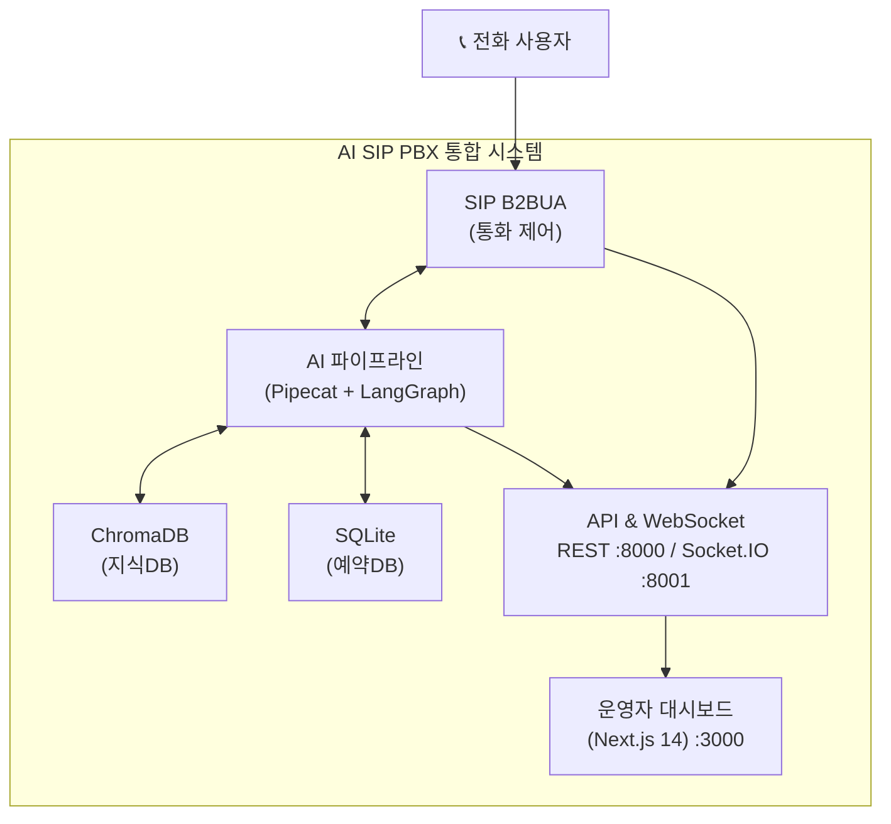
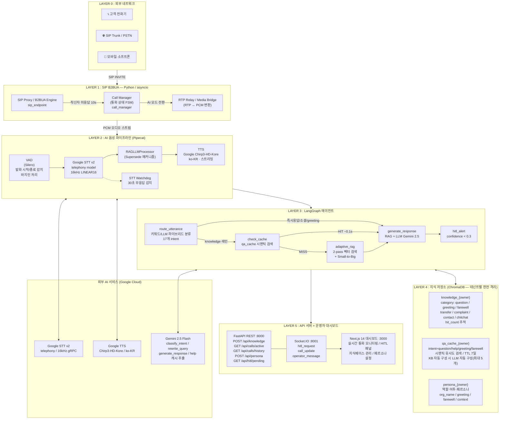
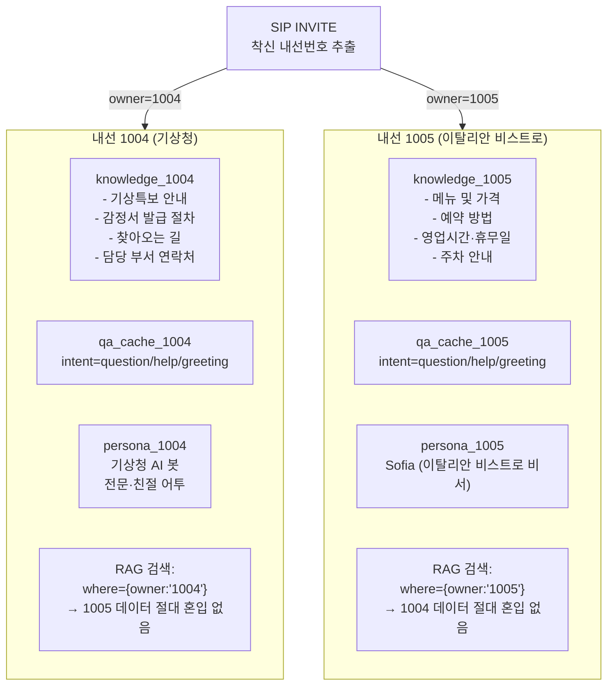
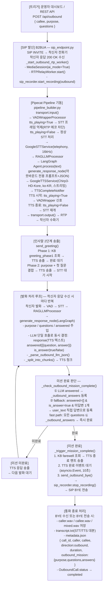
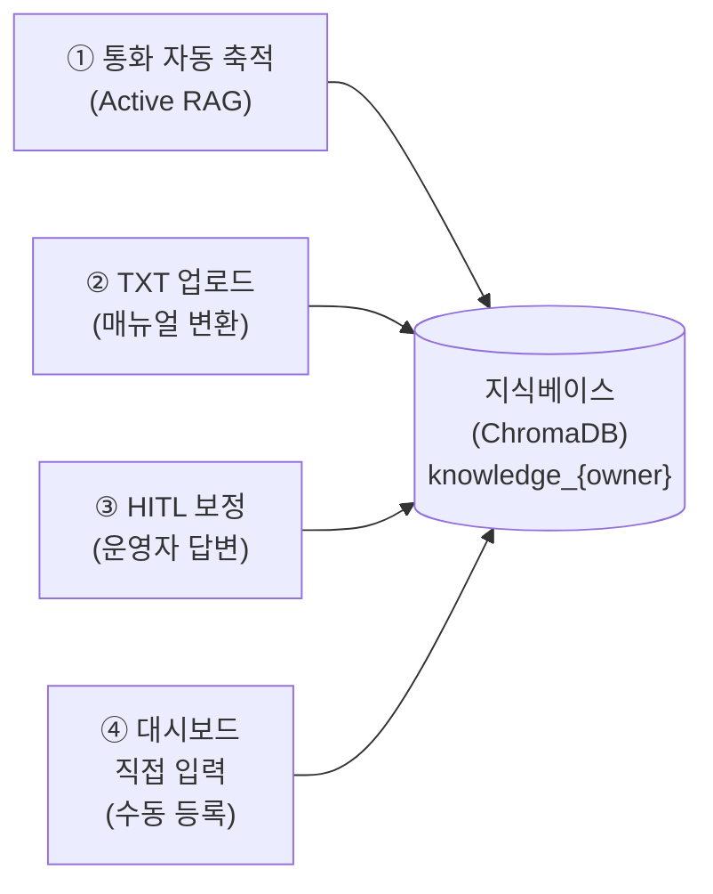
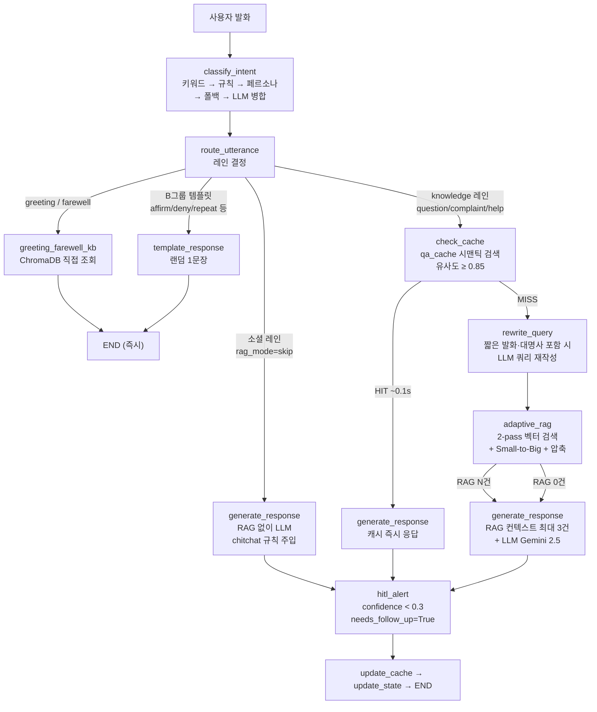

# Project Brief: Agentic AI CallBot — 자율 학습형 AI 컨택센터 솔루션

**작성일**: 2026-03-30  
**최종 수정**: 2026-04-08  
**버전**: 1.12  
**상태**: 발표용 소개 문서

---

## Executive Summary

**AI SIP PBX**는 기존 콜센터 ARS·챗봇의 구조적 한계를 넘어,
**스스로 학습하고 행동하는(Agentic)** 차세대 AI 컨택센터(AICC) 플랫폼입니다.

> *"전화 한 통 한 통이 쌓일수록, AI는 더 똑똑해집니다."*

사람 간 통화 이력을 실시간으로 지식 자산화하고, LLM·RAG·VectorDB를 결합하여
**별도 시나리오 구축 없이** 운영 첫날부터 AI 응대가 가능합니다.
시간이 지날수록 지식이 자동으로 성장하여 운영 비용이 낮아지는
**Zero Marginal Cost** 모델을 실현합니다.

---

## 1. 배경 — 왜 만들었는가

### 기존 AI 콜봇·ARS의 한계

기업이 AI 응대 시스템을 도입하려면 다음과 같은 장벽을 마주합니다.

| 문제 | 현실 |
|---|---|
| **시나리오 구축 비용** | 수개월의 기획·개발 공수, 수천만 원의 초기 투자 |
| **경직된 ARS 트리** | "1번은 배송, 2번은 반품" — 복합 의도 처리 불가 |
| **고정된 답변** | 사전 정의된 FAQ 범위를 벗어나면 "모르겠습니다" 반복 |
| **지식 관리 부담** | 신상품·정책 변경 시 스크립트 전면 재작성 필요 |
| **부자연스러운 음성** | 기계적 TTS + 높은 응답 지연으로 고객 불만 누적 |

이러한 문제는 **AI 기술의 부재**가 아니라, 기존 시스템의 **구조적 설계** 문제입니다.

### 세 가지 핵심 문제 정의

#### ❶ 지식의 정적인 관리 — The Knowledge Gap

기존 챗봇은 FAQ나 매뉴얼을 수동으로 구축해야 하며,
현장의 최신 이슈(예: 배송 지연, 신규 정책)를 즉각 반영하지 못해
**"모르겠습니다"를 반복**하거나 엉뚱한 답을 내놓습니다 (Hallucination).

> 지식이 정적이면, AI는 언제나 과거에 머물러 있습니다.

#### ❷ 경직된 시나리오 — Rigid IVR Trees

"1번은 배송, 2번은 반품..." 식의 고정된 트리 구조는
고객의 **복합적인 의도** (예: "반품하고 다른 걸로 교환하고 싶어요")를 처리하지 못해
고객 경험(CX)을 저해합니다.
고객은 메뉴를 기억하며 눌러야 하고, 관리자는 트리를 바꿀 때마다 개발자에게 요청해야 합니다.

#### ❸ 높은 구축 및 유지보수 비용

시나리오 설계, 데이터 라벨링, 인텐트 분류 등 초기 구축 비용이 높고,
**변경할 때마다 개발자의 개입**이 필요합니다.
AI를 도입하고 싶어도, 도입 비용이 도입 효과를 앞서는 역설적 상황이 발생합니다.

---

## 2. Ideation — 어떻게 풀었는가

기획 초기에 세운 질문 세 가지는, 구현에서는 다음 축으로 이어집니다.

| 소절 | 시스템에서의 축 |
|------|----------------|
| **2.1** | 지식 축적·검색 (통화 → Vector DB → RAG) |
| **2.2** | 의도 기반 행동 선택 (ARS 대체, LangGraph) |
| **2.3** | 체감 품질·신뢰 (스트리밍, HITL) |

아래에서는 각 질문에 대한 **방향 → 파이프라인에 녹인 모습 → 기대 효과** 순으로 정리합니다.

---

### 2.1 구축 없이 지식을 쌓을 수 있는가

> **질문:** *"구축하지 않고도 AI가 알아서 지식을 만들 수 없을까?"*

#### 방향

- 사람이 미리 FAQ를 채우는 **구축형** 부담을 줄인다.
- **상담원↔고객 통화**를 그대로 지식으로 쓴다.
- 전화로 오간 답변이 **다음 통화의 근거**가 된다.

#### 구현으로 녹인 모습

**저장 파이프라인**

1. 통화 → **실시간 STT**로 텍스트화  
2. **화자 분리(Diarization)** — 고객 발화는 질문·상담원 발화는 답변으로 태깅  
3. 의미 단위 **청킹** → LLM이 인사말·잡담 제거 후 **Q&A 쌍** 추출  
4. **메타데이터** 부착 (문제 유형, 해결 방법, 카테고리, 고객 감정 등)  
5. 코사인 유사도(예: **> 0.9**)로 **중복 검사**  
6. **ChromaDB(Vector DB)** 에 **테넌트(내선)별** 적재  

**조회·응답**

- 적재된 조각은 응답 시 **임베딩 검색**으로 꺼내 **프롬프트 컨텍스트**를 만들고 LLM에 주입 (**Active RAG**, 키워드 매칭이 아님).
- 지식베이스가 갱신되면 검색 결과가 **즉시** 반영된다.
- 필요 시 **API·MCP** 등 외부 정형 데이터와 병합해 근거를 보강할 수 있다.

#### 기대 효과

- 대규모 사전 구축 없이 통화가 쌓일수록 지식이 자란다.
- 벡터 검색·테넌트 격리로 **환각을 줄이면서** 최신 내용이 응답에 바로 반영된다.

---

### 2.2 AI로 ARS를 대체할 수 있는가

> **질문:** *"AI로 ARS를 완전히 대체할 수 있을까?"*

#### 방향

- 고정 트리·"1번 누르세요" 대신 **목적(Goal)** 을 중심에 둔다.
- **역할(페르소나)** 과 **업무 범위**만 주면, AI가 맥락에 맞는 다음 행동을 고른다.

#### 구현으로 녹인 모습

| 단계 | 내용 |
|------|------|
| 입력 | 고객 **자연어 발화** |
| 의도 | LLM이 **Intent 추론** — 시스템에서는 **17가지 의도 분류** |
| 경로 | **LangGraph** 대화 그래프가 다음 행동 선택 |
| 행동 예 | API 호출, **호 전환**, 안내 멘트, **지식 검색** 등 목적 달성에 필요한 조합 |

- ARS 단계를 기계적으로 밟지 않아도 된다.
- *"반품하고 교환하고 싶어요"*처럼 **복합 의도**도 한 흐름에서 처리한다.

#### 기대 효과

- 시나리오 코드 전면보다 **페르소나·범위 설정** 중심으로 운영이 단순해진다.
- 고객은 말한 그대로를 시스템이 이해하는 경험을 갖는다.

---

### 2.3 응대 만족도를 사람에 가깝게 할 수 있는가

> **질문:** *"AI 응대의 만족도를 사람 수준으로 끌어올릴 수 없을까?"*

#### 방향

고객 불만의 뼈대를 세 가지로 보고, 각각에 대응한다.

| | 문제 | 대응 방향 |
|---|------|-----------|
| ① | 답변 풀이 좁다 | **추론 + RAG**로 범위·근거 확장 |
| ② | 기계 같고 느리다 | **스트리밍**으로 첫 소리까지의 시간 단축 |
| ③ | 틀려도 말이 나간다 | **신뢰도**가 낮으면 **운영자(HITL)** 개입, 답은 다시 지식으로 환류 |

#### 구현으로 녹인 모습

**범위·정확도**

- **2.1**에서 쌓인 인덱스를 **RAG**로 붙여 추론과 결합한다.
- 응답에 **신뢰도(Confidence)** 를 두고, 임계 미만이면 **HITL Shadowing**으로 전환한다.
- 운영자에게 실시간 알림·질문 전달 → 답변 정제 → **TTS** 송출 → **동시에 지식베이스 저장** → 이후 동일 이슈는 AI 단독 응답 가능.

**자연스러움·지연**

- **Streaming Architecture**: LLM **첫 토큰** 시점부터 **TTS** 합성·송출.
- STT → 처리 → TTS 파이프라인을 **비동기**로 맞춰 체감 지연을 줄인다.

**통화 후**

- 필요 시 문자·Happy Call 등 **후속 조치**로 이어갈 여지를 둔다.

#### 기대 효과

- 짧은 반응 시간과 **Shadowing**으로 신뢰 있는 응대.
- 보정 한 번이 **VectorDB·지식층**을 두껍게 하는 선순환.

---

### 한 통화 안에서 세 축은 동시에 돈다

같은 대화 속에서 지식이 쌓이고(**2.1** → RAG의 재료), 의도에 따라 행동이 갈라지며(**2.2**), 들을 만한 속도와 HITL(**2.3**)이 겹친다.

---

## 3. 기존 시스템 대비 강점

| 구분 | 기존 시스템 (As-Is) | **AI SIP PBX (To-Be)** |
|---|---|---|
| **지식 구축** | 수개월 공수, 수천만 원 | 통화 이력 자동 생성 — 구축 비용 Zero |
| **ARS 구조** | 고정 트리, 낮은 유연성 | 목적 지향형 AI Agent, 자유로운 자연어 |
| **응대 품질** | Rule-based 문장 매칭 | LLM 기반 추론 + 실시간 지식 검색 |
| **음성 경험** | 기계적 TTS, 높은 지연 | Natural Voice, 스트리밍으로 첫 응답 ~2.5초 |
| **비즈니스 민첩성** | 스크립트 변경 = 재개발 | VectorDB 업데이트만으로 즉시 반영 |
| **운영 비용** | 고정 인건비 의존 | 월 100통화 약 ₩6,400 (AI 비용) |
| **학습 능력** | 수동 업데이트만 | 통화할수록 자동 성장 |

---

## 4. 솔루션 구조 — 어떻게 동작하는가

### 4.1 전체 아키텍처 한눈에 보기



---

### 4.1-A 상세 아키텍처 다이어그램

#### ① 전체 시스템 레이어 구성



**임베딩**: all-MiniLM-L6-v2 (384차원) / 코사인 유사도 / 테넌트 owner 필터

---

#### ② 인바운드 통화 처리 상세 흐름

```
 📞 고객 전화 착신
      │
      ▼
 ┌────────────────────────────────────────────────────────────────┐
 │  SIP B2BUA                                                     │
 │                                                                │
 │  INVITE 수신 ──► 착신자에게 전달 (Bypass, <5ms)                │
 │                          │                                     │
 │                  착신자 미응답 10초 타임아웃                   │
 │                          │                                     │
 │                  AI 모드 자동 전환 ──► Pipecat Pipeline 기동   │
 └────────────────────────────────────────────────────────────────┘
      │
      │  PCM 오디오 스트림 (8kHz μ-law → 16kHz Linear16 변환)
      ▼
 ┌────────────────────────────────────────────────────────────────┐
 │  Pipecat Pipeline                                              │
 │                                                                │
 │  transport.input()                                             │
 │       │                                                        │
 │       ▼                                                        │
 │  AudioRecorder (WAV 저장)                                      │
 │       │                                                        │
 │       ▼                                                        │
 │  VADWrapper (Silero VAD)           ┌──────────────────────┐    │
 │   - UserStartedSpeakingFrame       │  바지인 처리           │  │
 │   - UserStoppedSpeakingFrame       │  StartInterruptionFrame│  │
 │   - 연속 바지인 카운트 감시        │  → TTS 즉시 중단       │  │
 │       │                           └──────────────────────┘     │
 │       ▼                                                        │
 │  GoogleSTTService                                              │
 │   - 모델: telephony (16kHz)                                    │
 │   - TranscriptionFrame (최종 인식)                             │
 │   - InterimTranscriptionFrame (중간 인식, 바지인 조기 대응용)  │
 │   - STT Watchdog: 30초 무응답 시 경고 로그                     │
 │       │                                                        │
 │       ▼                                                        │
 │  RAGLLMProcessor ◄─── 핵심 처리기                              │
 │   ┌───────────────────────────────────────────────────────┐    │
 │   │  Supersede 메커니즘 (stt_final_debounce_sec=0)        │    │
 │   │  - 신규 STT 도착 시 진행 중인 LLM Task 즉시 취소     │     │
 │   │  - 이전 발화 + 신규 발화 병합 → 재처리                │    │
 │   └───────────────────────────────────────────────────────┘    │
 │       │                                                        │
 │       ▼  (asyncio.Task로 비동기 실행)                          │
 │   LangGraph Agent.process(text)                                │
 │       │                                                        │
 │       ▼ (응답 텍스트)                                          │
 │  Korean Number Normalizer                                      │
 │   - "3,500원" → "삼천오백원"                                   │
 │       │                                                        │
 │       ▼                                                        │
 │  GoogleTTSService (Chirp3-HD-Kore, ko-KR)                      │
 │   - 스트리밍 청크 단위 PCM 생성                                │
 │   - TTS 완료 이벤트로 아웃바운드 미션 완료 감지                │
 │       │                                                        │
 │  AudioRecorder (TTS 출력 WAV 저장)                             │
 │       │                                                        │
 │       ▼                                                        │
 │  transport.output() → RTP 전송 → 고객 수화기                   │
 └────────────────────────────────────────────────────────────────┘
```

---

#### ③ LangGraph 에이전트 상세 분기 다이어그램

```
STT 텍스트 (발화)
      │
      ▼
 route_utterance
 ┌───────────────────────────────────────────────────────────┐
 │  Phase 1: 키워드 매칭 (동기, <1ms)                        │
 │    greeting / farewell / transfer / help / repeat 등      │
 │  Phase 2: LLM 분류 (classify_intent + rewrite 병합)       │
 │    {"intent": "question", "search_query": "..."}          │
 └──────┬─────────────┬─────────────┬─────────────────────── ┘
        │             │             │             │
        ▼             ▼             ▼             ▼
  [greeting/    [affirm/      [repeat/      [knowledge 레인]
   farewell]     deny/         clarifi-     question / complaint
                 gratitude     cation]      / transfer / help
                 doubt         →            / nlu_fallback
                 positive_     template]
                 negative]
        │
        ▼
 greeting_farewell_kb
 ChromaDB category=greeting_phase1
          category=greeting_phase2
          category=farewell 조회
 → LLM 없이 즉시 TTS (~0.01초)

                              ▼  [knowledge 레인]
                              │
                       check_cache_node
                       ┌────────────────────────────────┐
                       │  qa_cache 시맨틱 검색          │
                       │  where={owner: X}              │
                       │  + intent 필터                 │
                       │  유사도 ≥ 0.85 + TTL 미만료    │
                       └────────────┬───────────────────┘
                                    │
                       ┌────────────┴────────────       ┐
                    HIT│                         │MISS
                       ▼                         ▼
               즉시 응답 반환            [intent 분기]
               hit_count++                   │
               update_cache                  ├─ intent=help
               (~0.1초)                      │    └─► help_response
                                             │         (RAG top_k=20
                                             │          + LLM 항목 선정)
                                                                        │
                                             └─ 그 외
                                                  └─► rewrite_query
                                             ┌────────────────────────────┐
                                             │  LLM 쿼리 재작성           │
                                             │  (짧은 발화·대명사 포함 시)│
                                             │  max_output_tokens=256     │
                                             └──────────┬─────────────────┘
                                                        │
                                                        ▼
                                                 adaptive_rag_node
                                             ┌──────────────────────────┐
                                             │  2-pass 벡터 검색        │
                                             │  1차: rewritten_query    │
                                             │  2차: raw_query          │
                                             │  병합·중복 제거          │
                                             │  Small-to-Big Expansion  │
                                             │  Cross-Encoder 재랭킹    │
                                             │  hit_count++ (top-1 KB)  │
                                             └──────────┬───────────────┘
                                                        │
                                             ┌──────────┴──────────     ┐
                                          0건│                     │N건
                                             └──────────┬──────────┘
                                                        ▼
                                                 generate_response
                                             ┌──────────────────────────┐
                                             │ N건: RAG 컨텍스트 최대 3건│
                                             │ 0건: 컨텍스트 없이 생성   │
                                             │ (2026-04-03 step_back 제거│
                                             │  → 재검색 LLM 호출 없음)  │
                                             │ 페르소나·대화 이력 주입   │
                                             │ → LLM 응답·스트리밍 청크  │
                                             └────────────┬─────────────┘
                                                          ▼
                                                       hitl_alert (조건부)
                                                       confidence < 0.3
                                                       needs_follow_up=True
                                                                  │
                                                       update_cache_node
                                                       (qa_cache upsert)
                                                                  │
                                                       update_state → END
```

---

#### ④ 지식베이스 자동 구성 흐름 (Active RAG + help 캐시 자동화)

```
┌─────────────────────────────────────────────────────────┐
│              지식베이스 자동 구성 전체 흐름             │
└─────────────────────────────────────────────────────────┘

① 통화 자동 축적 (Active RAG)
─────────────────────────────
통화 종료 (5초 후 비동기)
      │
      ▼
  STT 전문 텍스트
      │
      ▼
  LLM 추출: Q&A 쌍, 발화 요약
      │
      ▼
  SemanticDeduplicator
  (ChromaDB 유사도 검사 → 중복 0.92 이상 스킵)
      │
      ▼
  knowledge_{owner} 저장
  (source=call, category=question 등)

② 운영자 대시보드 직접 입력
─────────────────────────────
POST /api/knowledge
  category=question  →  knowledge_{owner} 저장 (질의·FAQ)
  category=help      →  knowledge_{owner} 저장
                        + qa_cache(intent=help) 즉시 upsert  ← 직접 멘트 등록
  category=greeting_phase1/2  →  qa_cache 즉시 upsert (intent=greeting)
  category=farewell           →  qa_cache 즉시 upsert (intent=farewell)

③ HITL 운영자 답변 → 지식 즉시 반영
─────────────────────────────────────
운영자 대시보드 → 답변 입력 → Socket.IO
  → LLM 자연어 정제 → TTS 송출
  → 동시에 knowledge_{owner} 저장 (source=hitl, category=question)
  → 다음 동일 질문부터 AI 직접 처리

④ TXT 업로드 → LLM 자동 분류
─────────────────────────────
TXT 파일
  → LLM: 문단 단위 Q&A 추출 + 카테고리 분류
  → knowledge_{owner} 배치 저장 (category=question 등)

⑤ 서버 기동 시 — help 캐시 자동 구성 (build_help_cache_on_startup)
─────────────────────────────────────────────────────────────────────
[서버 ON]  →  qa_cache 초기화(CLEAR_QA_CACHE_ON_START=1)  →  2초 후 실행
      │
      ▼ help 카테고리 KB 조회
                                           │
      ├─ 있음 → 직접 입력된 안내 멘트로 qa_cache(intent=help) upsert (최대 5개)
      │          예) "예약, 영업시간, 주차 안내가 가능합니다."
                                           │
      └─ 없음 → question(질의·FAQ) 목록 조회
                 LLM이 각 항목 분석 → 짧은 안내 제목 추출
                 예) "영업 시간이 어떻게 되나요?" → "영업시간 안내"
                     "주차 가능한가요?"          → "주차 방법 안내"
                 → qa_cache(intent=help) upsert (최대 5개)

고객 발화: "뭘 도와줄 수 있어요?" / "주차 알려줘" (intent=help)
  → check_cache(where={intent:help}) → 유사도 ≥ 0.85 → 캐시 히트
  → 즉시 안내 반환 (~0.1초, RAG·LLM 없음)
```

---

#### ⑤ 멀티 테넌트 완전 격리 구조

SIP B2BUA가 착신 내선번호를 추출해 `owner`를 결정하고, 해당 owner의 ChromaDB 컬렉션만 전용으로 사용합니다.



---

#### ⑥ 아웃바운드 AI 발신 전체 흐름 (Flow Diagram)

**아웃바운드 AI 발신 흐름 — End-to-End**



**아웃바운드 특이사항 — 인바운드와의 주요 차이점**

| 항목 | 인바운드 | 아웃바운드 |
|---|---|---|
| 통화 시작 | 착신자 미응답 10초 → AI 자동 전환 | API/대시보드 트리거 → B2BUA 즉시 INVITE |
| STT 에코 억제 | 비활성(필요 시 활성화 가능) | **활성화 (TTS 재생 중 STT 입력 억제)** |
| 인사 구조 | greeting_phase1/2 (자유 응대) | Phase1(인사) + Phase2(purpose + 첫 질문) |
| LLM 응답 형식 | 자유 텍스트 | **JSON 구조화 출력 (response/answered/is_answer)** |
| 미션 완료 | 없음 | 모든 questions 답변 수집 시 자동 BYE |
| 답변 판단 | 해당 없음 | **LLM이 단일 호출로 답변 여부 판단 + 추출** |
| 녹음 저장 | cleanup_terminated_call → stop_recording | **BYE 수신/전송 시 직접 stop_recording** |

---

### 4.2 통화 한 건의 여정 (End-to-End)

```
고객 전화 착신
                                      │
    ├─① SIP B2BUA: INVITE 수신 → 착신자에게 전달 (Bypass 모드, <5ms)
                                      │
    ├─② 착신자 미응답 (10초) → AI 모드 자동 전환
                                      │
    ├─③ Pipecat Pipeline 기동:
    │       [STT] → [VAD] → [Intent 분류] → [RAG 검색] → [LLM] → [TTS] → [RTP 전송]
                                      │
    ├─④ 고객 발화 처리 (17가지 의도 분류):
    │       greeting  → ChromaDB 인사말 즉시 조회 (~0.01초)
    │       question  → 시맨틱 캐시 → RAG → LLM → TTS (~2.5초)
    │       transfer  → 담당자 호 연결 (<500ms)
    │       nlu_fall  → 운영자 HITL 에스컬레이션
                                      │
    ├─⑤ 통화 종료 → WAV 녹음 저장
                                      │
    └─⑥ 지식 자동 추출 (5초 후 비동기):
            STT 텍스트 → Q&A 추출 → 중복 검사 → ChromaDB 저장
```

---

## 5. 핵심 기능 상세 소개

### 5.1 🖥️ 실시간 운영자 대시보드

**무엇을 해결하나**: AI가 뭘 하고 있는지 알 수 없는 블랙박스 문제

**주요 화면 구성**:

```
┌─────────────────────────────────────────────────────┐
│  📊 메트릭 카드                                      │
│  총 통화: 247  │  AI 처리율: 89%  │  응답: 2.3초    │
│                                                     │
│  📞 실시간 통화 카드           STT/TTS 피드          │
│  010-1234-5678 | 2:34 경과     👤 "날씨 알려줘"      │
│  [호 전환]                     🤖 "내일 서울은..."   │
│                                                     │
│  🤖 AI 처리 과정 (CDR 실시간)                        │
│  14:23:02 | rag  | rag_search_done (3건, 190ms)     │
│  14:23:04 | llm  | generate_response_done (1.8s)    │
│  14:23:05 | tts  | tts_complete                     │
│                                                     │
│  🔔 HITL 요청 패널                                   │
│  "수요일 김 대리님 미팅 가능?" [답변 입력] [전송]   │
│                                                     │
│  📋 최근 통화이력                                    │
│  2026-03-30 14:23 | AI응대 | ▶ 녹음 재생            │
└─────────────────────────────────────────────────────┘
```

**실시간 투명성 기능**:
- **STT 피드**: 고객 발화를 텍스트로 실시간 표시
- **TTS 피드**: AI 응답 내용 실시간 확인
- **CDR 트래킹**: 의도 분류 → RAG → LLM → TTS 각 단계별 처리 시간 추적
- **녹음 재생**: 통화 종료 후 브라우저에서 직접 재생

---

### 5.2 🧠 Active RAG — 살아있는 지식베이스

**무엇을 해결하나**: AI가 "모르겠습니다"를 반복하는 근본 원인인 **정적 지식** 문제

도입 직후 지식이 비어 있어도 괜찮습니다. **TXT·대시보드로 시드**하고, 통화·HITL이 쌓이면서 채워지며, 처음부터 완벽한 사전 구축은 필수가 아닙니다.

---

#### 지식베이스 구축 4가지 경로

지식베이스는 한 가지 방법에만 의존하지 않습니다. 4가지 경로가 **동시에** 작동하며 지식을 채웁니다.



---

**① 통화 자동 축적 — Active RAG** `source=call`

운영하는 것 자체가 학습입니다. 별도 작업 없이 통화할수록 AI가 성장합니다.

```
유저간 통화 발생
  → 실시간 STT 변환
    → 화자 분리: 발신자(질문) / 착신자(답변) 태깅
      → LLM 품질 게이트: 인사말·잡담 제거, 의미 있는 Q&A만 추출
        → 메타데이터 구조화
          (문제 유형, 해결 방법, 고객 감정, call_id, 타임스탬프)
          → 중복 검사 (코사인 유사도 > 0.9 → upsert, 중복 저장 방지)
            → ChromaDB 저장 (해당 owner 컬렉션)
              → 다음 통화부터 RAG에 즉시 활용
```

---

**② TXT 매뉴얼 업로드 — 즉시 지식 구축** `source=api`

기존에 보유한 문서 자산을 그대로 활용합니다. 개발 없이 대시보드에서 직접 업로드합니다.

```
운영자 → 대시보드 → [TXT 업로드]
  파일: 서비스안내.txt, FAQ.txt, 업무매뉴얼.txt ...

  백엔드 처리:
  ① 청킹 (2~8KB 단위, 단락·문장 구분자 우선)
       오버랩 100자로 문맥 연속성 보장
  ② 각 청크 → LLM 분석
       → Q&A 쌍 자동 추출 (구어체 질문으로 변환)
       → 카테고리 분류 (운영시간, 주차, 요금, 절차 등)
  ③ 중복 제거 후 ChromaDB 저장
  ④ 업로드 즉시 RAG 검색 대상에 포함

  예시 변환:
  [원문] "영업시간: 평일 09:00~18:00, 토요일 09:00~13:00"
  [추출] Q: "영업 시간이 어떻게 되나요?"
         A: "평일은 오전 9시부터 오후 6시까지, 토요일은 오전 9시부터 1시까지입니다."
```

**저장·검색 측 보강 (TXT 및 API 업로드 공통에 가깝게 적용)**

- 청크마다 **384차원** 문장 임베딩으로 인덱싱합니다(RAG 파이프라인의 TextEmbedder와 동일 차원·검색 공간 일치).
- 문서·청크는 **faq / manual / notice** 등 **doc_type·카테고리**로 나뉘어 저장되며, 이후 검색·필터 정밀도에 활용됩니다.
- 이미 적재된 지식과 **코사인 유사도 0.9 이상**이면 동일 내용으로 보고 저장을 줄이거나 병합하는 흐름을 유지합니다(통화 자동 축적·HITL 경로와 동일한 원칙).
- 대시보드·`POST /api/knowledge` 등으로 항목 **CRUD**가 가능해, 잘못 올린 문서를 바로 고치거나 내릴 수 있습니다.

---

**③ HITL 보정 — 운영자 전문 지식 즉시 반영** `source=hitl`

AI가 모르는 질문에 운영자가 답변하면 그 내용이 즉시 지식이 됩니다.

```
AI 모름 → 운영자 채팅 답변 입력
  → TTS 음성 송출 (고객에게 안내)
  → ChromaDB 자동 저장
    → 다음번 동일 질문 → AI 직접 응답 (HITL 불필요)

통화 종료 후에도 미저장 Q&A는 BYE 시점에 일괄 flush
```

---

#### 4가지 경로 비교

**④ 대시보드 직접 입력 — 운영자 수동 등록** `source=api`

TXT 파일 없이 대시보드에서 항목 하나씩 즉시 등록합니다.
인사말·종료 인사·FAQ·연락처 등 카테고리를 지정해 빠르게 지식을 구성할 수 있습니다.

```
운영자 → 대시보드 → [지식베이스] → 카테고리 선택 → 내용 입력 → [저장]
  카테고리:
    greeting_phase1 / greeting_phase2  — 통화 시작 인사말
    farewell                           — 종료 인사
    question                           — 질의·FAQ (자주 묻는 질문 & 답변)
    help                               — "뭘 도와드릴 수 있어요?" 안내 멘트 직접 입력 (선택)
    transfer                           — 호 전환 안내
    chitchat                           — 잡담 응대 문구
    complaint                          — 불만 응대 문구
  → ChromaDB 즉시 저장 → 다음 통화부터 RAG 검색 대상에 포함
```

> **▶ "뭘 도와드릴까요?" 안내 목록 — 서버 기동 시 자동 구성 (최대 5개)**
>
> 서버가 켜질 때 다음 우선순위로 `qa_cache(intent=help)`를 자동 구성합니다.
>
> ```
> [서버 기동]
>   │
>   ▼ ① help 카테고리 KB가 있으면?
>       YES → 운영자가 직접 작성한 안내 멘트로 qa_cache(intent=help) 구성
>              예) "저는 예약, 영업시간, 메뉴, 주차 안내가 가능합니다."
>              → 고객이 "뭘 도와줄 수 있어요?" 하면 이 멘트 즉시 반환 (~0.1초)
>
>       NO  → ② question(질의·FAQ) 목록에서 LLM이 안내 제목 자동 추출
>              질의 14건 중 상위 5개 → LLM 분석
>              예) "영업 시간이 어떻게 되나요?" → "영업시간 안내"
>                  "주차 가능한가요?"        → "주차 방법 안내"
>                  "예약은 어떻게 해야 하나요?" → "예약 방법 안내"
>                  ...
>              → qa_cache(intent=help) upsert (최대 5개)
>              → 고객이 "주차 알려줘" → "주차 방법 안내" 유사도 히트 → 즉시 안내 (~0.1초)
> ```
>
> | 상황 | 동작 |
> |---|---|
> | **help 카테고리 직접 입력** | 입력된 안내 멘트를 qa_cache에 즉시 등록, 서버 재시작 시도 해당 멘트 사용 |
> | **help 미입력 (기본)** | 서버 기동 시 question(질의/FAQ) 14건에서 LLM이 제목 5개 자동 추출 |
>
> 운영자는 별도 설정 없이 **질의·FAQ만 채워도** help 안내가 자동 완성됩니다.

---

| 경로 | 시점 | 누가 | 특징 |
|---|---|---|---|
| **통화 자동 축적** | 운영 중 상시 | 시스템 자동 | 구축 비용 Zero, 실제 대화 기반 |
| **TXT 업로드** | 도입 초기 / 수시 | 운영자 | 기존 문서 자산 즉시 활용, LLM 자동 추출 |
| **HITL 보정** | 운영 중 상시 | 운영자 | 전문 지식 즉시 반영, 오답 방지 |
| **대시보드 직접 입력** | 수시 | 운영자 | 개별 항목 즉시 등록, 인사말·FAQ 직접 제어 |

---

#### 핵심 장점 — 지식베이스만 관리하면 나만의 Agentic AI

> **"지식베이스를 채우는 것만으로, 나만의 AI 상담원이 완성됩니다."**

테넌트(SIP 내선번호)마다 완전히 독립된 ChromaDB 컬렉션을 가집니다.

```
내선 1004 (기상청)              내선 1005 (이탈리안 비스트로)
────────────────────            ────────────────────────────
knowledge_1004                  knowledge_1005
  - 기상특보 안내                  - 메뉴 및 가격
  - 기상감정서 발급 절차            - 예약 방법
  - 찾아오는 길                    - 영업시간·휴무일
  - 담당 부서 연락처               - 주차 안내

qa_cache_1004                   qa_cache_1005
  (자주 묻는 질문 캐시)            (자주 묻는 질문 캐시)

persona_1004                    persona_1005
  (기상청 AI 봇 역할·어투)          (레스토랑 AI 비서 역할·어투)
```

**지식베이스가 곧 AI의 능력입니다**:
- 지식이 많을수록 → AI가 직접 답하는 비율 증가 → HITL 감소 → 운영 비용 감소
- 지식이 정확할수록 → confidence 상승 → 고객 만족도 향상
- 지식이 쌓일수록 → 시맨틱 캐시 히트율 증가 → 응답 속도 향상 (~0.1초)

**운영자가 할 일은 단 하나**: 지식베이스를 관리하는 것.
나머지(의도 분류, RAG 검색, LLM 응답, HITL 판단, 호 전환, 학습)는 모두 자동입니다.

---

### 5.3 🎯 17가지 의도 분류 — 무엇이든 알아듣는 AI

**무엇을 해결하나**: "1번 누르세요" 방식의 경직된 ARS를 자연어로 대체

---

#### 페르소나(조직 역할)와 의도·응답

테넌트(착신 내선)마다 **역할·말투·업무 경계**를 정의하는 것이 **페르소나**입니다. ChromaDB **`persona`** 컬렉션에 `persona_{owner}` 형태로 저장되며, 대시보드 **페르소나 설정** 또는 `POST /api/persona`로 관리합니다.

| 항목 | 역할 |
|------|------|
| **name** | 기관·서비스 표시명 (예: "기상청 AI 비서") |
| **description** | 업무 범위·담당 설명 — **임베딩**되어 발화와의 유사도 계산에 사용 |
| **scope_keywords** | 테넌트 업무를 대표하는 키워드 — 의도 분류 1차 경로·도메인 신호(`_persona_scope_matched`)에 활용 |
| **chitchat_response_template** | 업무와 무관한 발화로 분류됐을 때 쓸 **고정 멘트** (경우에 따라 LLM 생략) |

**의도 분류 파이프라인과의 연결**

1. **[3단계] 페르소나 유사도** — `PersonaService.check_query_relevance`: 발화와 `description` 임베딩 유사도(기본 **threshold 0.6**). **업무 무관**이면 `chitchat`(+ 템플릿), **관련**이면 이후 단계에서 `question` 등으로 이어짐.  
2. **LLM 병합(5단계)** — 키워드·규칙 다음, 테넌트별 **업무 범위**를 반영해 intent·`search_query`를 한 번에 생성 (도메인 예시는 페르소나·설정과 맞추는 방향으로 정비 가능).  
3. **`generate_response`** — 조회된 페르소나의 `description` 일부를 시스템 프롬프트에 **`[업무 범위]`** 블록으로 주입해, 답변 톤·거절·안내 한계를 **테넌트 정책**에 맞춤.

즉, **같은 발화라도 내선(테넌트)의 페르소나가 다르면** 잡담/질문 분기와 최종 멘트 스타일이 달라집니다.

---

#### 18가지 의도 분류 체계

> **LLM 호출 횟수 기준**: classify_intent 단계의 LLM 병합 호출(intent+rewrite 동시 생성)은 각 행에 포함.
> rewrite_query는 정상 경로에서 스킵되며, 짧은 발화(<5단어) 또는 대명사 포함 시에만 추가 1회 발생.

| 그룹 | 의도 | 처리 노드 | LLM 호출 (classify 포함) | 응답 시간 | HITL |
|---|---|---|---|---|---|
| **즉시 응답** | `greeting` | greeting_farewell_kb | 0회 | ~0.01초 | ✗ |
| **즉시 응답** | `farewell` | greeting_farewell_kb | 0회 | ~0.01초 | ✗ |
| **템플릿** | `affirm` / `deny` / `gratitude` | template_response | 0회 | ~0.001초 | ✗ |
| **템플릿** | `doubt` / `positive_reaction` / `negative_reaction` | template_response | 0회 | ~0.001초 | ✗ |
| **제어** | `repeat` | repeat_response | 0회 | ~0.001초 | ✗ |
| **제어** | `clarification` | clarification_response | 0회 | ~0.001초 | ✗ |
| **소셜** | `chitchat` | generate_response (RAG 스킵) | 1회 (classify 병합) | ~1초 | ✗ |
| **범위 외** | `out_of_scope` | generate_response (RAG 스킵) | 1회 (classify 병합) | ~1초 | ✗ |
| **지식 검색** | `question` | check_cache → adaptive_rag → generate | 1~3회 ※ | ~0.1~3초 | 조건부 |
| **지식 검색** | `complaint` | adaptive_rag → generate | 2회 (classify+generate) | ~2.5초 | ✅ (conf<0.5) |
| **지식 검색** | `help` | check_cache(hit→즉시) / help_response(miss→RAG+LLM) | 캐시 히트: 1회 / 미스: 2회 † | ~0.1초 / ~2초 | ✗ |
| **예약 처리** | `booking` | booking_agent (LLM + Tool Use loop) | 0회(키워드 조기 분류) 또는 1+N회 ‡ | ~0.002~5초 | ✗ |
| **특수 처리** | `transfer` | adaptive_rag → generate | 2회 (classify+generate) | ~2.5초 | ✅ 즉시 |
| **폴백** | `nlu_fallback` | fallback_response | 0회 | ~0.001초 | ✅ |

> ※ question 경로 LLM 호출 상세:
> - **최소 1회**: 캐시 히트 → generate 스킵 (classify 병합 1회만)
> - **통상 2회**: classify 병합 1회 + generate 1회
> - **+1회 추가**: 짧은 발화·대명사 포함 시 rewrite_query 별도 LLM 호출 가능
> - **최대 3회**: classify + rewrite + generate (2026-04-03 이전의 **step_back** 노드는 제거됨 — RAG 0건이어도 상위 개념 재검색용 추가 LLM 호출 없음)
>
> † help 경로 LLM 호출 상세:
> - **캐시 히트 (1회)**: 서버 기동 시 자동 구성된 qa_cache(intent=help, 최대 5개)와 발화 유사도 ≥ 0.85 → classify 1회만 호출 후 즉시 반환 (~0.1초)
>   - 캐시 구성 방법: ① `help` 카테고리 직접 입력 멘트 우선 / ② 없으면 `question`(질의·FAQ) 목록에서 서버 기동 시 LLM 자동 추출
> - **캐시 미스 (2회)**: help 캐시가 없거나 유사도 미달 → help_response 노드로 폴백하여 RAG+LLM 응답 생성 (classify 1회 + generate 1회, ~2초)
>
> ‡ booking 경로 LLM 호출 상세:
> - **0회 (키워드 조기 분류)**: "예약", "예약 취소", "예약 가능" 등 `_BOOKING_KEYWORDS` 매칭 시 LLM 없이 즉시 `booking_agent`로 라우팅 (~2ms)
> - **1+N회 (LLM + Tool Use loop)**: 키워드 미매칭 시 classify LLM 1회 + booking_agent 내 LLM-tool 루프 최대 `_MAX_TOOL_ROUNDS`회
>   - `check_available_slots`, `create_booking_tool`, `cancel_booking_tool`, `get_booking_info`, `get_booking_settings` 등 5개 Tool을 LLM이 필요에 따라 순차 호출
>   - 슬롯 확인 → 예약 생성 → 확인 메시지 전달 등 복수 Tool 호출이 자동으로 이루어짐 (Progressive Slot Filling)

---

#### 5단계 의도 분류 파이프라인

```
사용자 발화
    │
    ▼
[1단계] 키워드 매칭 (INTENT_KEYWORDS)
    │   "감사합니다" → farewell    confidence=1.0
    │   "담당자 연결" → transfer   confidence=1.0
    │   "다시 말해줘" → repeat     confidence=1.0  ...
    │   → 매칭 성공 시 즉시 반환 (<1ms)
    │
    ▼ (매칭 실패)
[2단계] 특수 규칙
    │   "안녕하세요, 날씨 알려주세요" → greeting 키워드 + 질문 패턴
    │   → question 우선 (인사보다 질문을 먼저 처리)
    │   "기상청 찾아가려면" → transfer 아님 → question
    │
    ▼ (해당 없음)
[3단계] 페르소나 유사도 검사
    │   persona.check_query_relevance(threshold=0.6)
    │   업무 무관 → chitchat + _chitchat_template 설정
    │   업무 관련 → question
    │
    ▼ (LLM 없는 환경 또는 짧은 발화)
[4단계] 기본 폴백
    │   짧은 발화 → question (confidence=0.7)
    │
    ▼ (LLM 사용 가능)
[5단계] LLM 병합 호출 ← 핵심 최적화
        단일 LLM 요청으로 intent + search_query 동시 생성
        → {"intent": "question", "search_query": "기상감정서 발급 방법"}
        기존 2회 호출 → 1회로 통합, ~0.5초 절감
```

> **오분류 방어 설계**: "기상청에 찾아가려면 어떻게 해요?"는 `transfer`(담당자 연결)로 오분류될 수 있어 별도 규칙으로 `question` 처리. VALID_INTENTS 외 결과는 `question`으로 자동 폴백.

---

#### 전체 노드 라우팅 구조도



> **페르소나**: `classify_intent`는 위 다이어그램 앞단에서 **페르소나 유사도·scope**로 레인을 좁힌 뒤, `generate_response`·`hitl_alert`까지 동일 통화의 **owner(테넌트)** ·페르소나 맥락이 유지됩니다.

---

#### Intent별 처리 예시

**A그룹 — LLM 0회, 즉시 응답**

```
"안녕하세요"
→ [keyword] greeting → greeting_farewell_kb → ChromaDB 조회
→ "안녕하세요. KT 기상청 AI 봇입니다. 무엇을 도와드릴까요?"
↳ ~0.01초

"감사합니다, 끊을게요"
→ [keyword] farewell → greeting_farewell_kb
→ "좋은 하루 보내세요. 이용해 주셔서 감사합니다."
↳ ~0.01초

"네, 알겠어요"
→ [keyword] affirm → template_response (랜덤 1문장)
→ "네, 알겠습니다. 더 필요하시면 말씀해 주세요."
↳ ~0.001초

"다시 말해줘"
→ [keyword] repeat → repeat_response (직전 AI 발화 그대로 재생)
↳ ~0.001초

"무슨 뜻이에요?"
→ [keyword] clarification → 직전 발화 80자 + "더 알고 싶으신 게 있으신가요?"
↳ ~0.001초
```

**B그룹 — 캐시 히트, LLM 0회**

```
"기상감정서 신청 방법 알려줘"  ← 이전에 처리된 유사 질문 존재
→ [llm_merged] question
→ check_cache: 유사도 0.91 ≥ 0.85, TTL 미만료 → 캐시 HIT
→ 저장된 답변 즉시 반환
↳ ~0.1초 (RAG·LLM 스킵)
```

**C그룹 — RAG + LLM, 정상 응답**

```
"기상감정서 발급하려면 어떻게 해요?"
→ [llm_merged] intent=question, search_query="기상감정서 발급 방법"
→ check_cache: miss
→ adaptive_rag: ChromaDB 검색 8건 → 확장 → 압축 → 3건 LLM 전달
→ generate_response: "날씨마루 홈페이지에서 신청, 발급 7~14일 소요"
   confidence=0.82
→ hitl_alert: 0.82 ≥ 0.3 → HITL 불필요
↳ ~2.5초
```

**D그룹 — RAG 0건 → 곧바로 생성 → HITL**

```
"다음 주 수요일 김 대리님 만날 수 있나요?"
→ [llm_merged] question
→ adaptive_rag: 검색 0건 (또는 유용도 필터로 전부 탈락)
→ generate_response: 컨텍스트 없이/저신뢰 응답
   "해당 내용은 제가 알지 못하는 내용입니다." 등
   needs_follow_up=True, confidence=0.0
→ hitl_alert: HITL 트리거 → 운영자 대시보드 🔔 알림
↳ 예전에는 여기서 step_back 재검색(~2~3초)이 붙었으나 **2026-04-03 제거** → 곧바로 생성·HITL. 이후 운영자 채팅 개입
```

**E그룹 — 특수 처리**

```
"영업팀 연결해 주세요"
→ [keyword] transfer
→ ContactKnowledgeExtractor: ChromaDB category=contact 검색
   → {department: "영업팀", phone_number: "1005"}
→ LLM 안내 멘트 → TTS 송출 → SIP INVITE(1005)
→ 응답 시 AI 종료 + RTP Bridge 전환
↳ <500ms 끊김 없는 연결

"뭘 도와줄 수 있어요?"
→ [keyword] help → check_cache(where={intent:help})
  [캐시 히트 시] → "날씨 안내, 기상감정서 발급, 상담원 연결을 할 수 있어요." 즉시 반환
  ↳ ~0.1초  (question KB 등록 시 LLM 자동 구성된 항목 제목 최대 5개 활용)
  [캐시 미스 시] → help_response → RAG+LLM → 항목 안내
  ↳ ~2초

"왜 이렇게 답변이 틀려요"
→ [keyword] complaint
→ adaptive_rag → generate_response (공감 응답)
   confidence=0.45 < 0.5 → HITL 트리거
↳ ~2.5초 + 운영자 개입 권장

"오늘 날씨 좋다"  (잡담)
→ [persona] 업무 무관 → chitchat, rag_mode=skip
→ generate_response: RAG 스킵, 공감 1~2문장
→ "정말 좋은 날씨네요. 궁금한 점 있으시면 말씀해 주세요."
↳ ~1초

(잡음·빈 발화)
→ classify_intent 실패 → nlu_fallback
→ fallback_response: "확인해보겠습니다. 잠시만 기다려 주세요."
   → 운영자 HITL 에스컬레이션
↳ ~0.001초
```

---

#### 인사+질문 동시 발화 처리 (특수 규칙)

```
"안녕하세요, 내일 날씨 알려주세요"
    │
    ▼
[1단계] greeting 키워드 감지
    │
    ▼
QUESTION_PATTERNS 검사: "알려" 포함
    │
    ▼
→ question 우선 오버라이드
   (인사 응답 없이 바로 질문 처리)
   path=keyword_greeting_to_question
```

> "안녕하세요"만 있으면 `greeting`, 뒤에 질문이 붙으면 자동으로 `question` 전환.

---

### 5.4 🔍 RAG 검색 — 정확한 지식 기반 응답

**무엇을 해결하나**: LLM의 환각(Hallucination) 방지, 기관별 전문 지식 활용

---

#### 페르소나와 RAG 격리

검색은 **항상 통화 테넌트 `owner`(착신 내선)** 기준으로만 이루어집니다. ChromaDB **`knowledge_{owner}`** · **`qa_cache_{owner}`** 등에 쌓인 문서만 후보가 되므로, **다른 내선의 페르소나·지식이 섞이지 않습니다.**  
페르소나 `description`·`scope_keywords`는 “무엇을 질문으로 볼지” 쪽에 가깝고, **실제 인용 문서의 출처**는 이 owner 필터 뒤의 RAG 결과입니다.

---

#### 전체 검색 파이프라인 (5단계)

```
사용자 발화 (STT 원문)
    │
    ▼
┌──────────────────────────────────────────────────────┐
│ [0단계] 쿼리 준비                                    │
│                                                      │
│  rewritten_query (LLM 병합 시 이미 생성됨)           │
│    + user_query_raw (STT 원문)                       │
│    + 대화 맥락 보강                                  │
│    (직전 발화가 7단어 미만이거나 "그래서", "거기" 등 │
│     맥락 의존 표현 → 이전 턴 발화를 쿼리 앞에 접두)  │
│                                                      │
│  예: "거기 어떻게 가요?" + 직전 "기상청 찾아가려고"  │
│    → "기상청 찾아가려고 거기 어떻게 가요?" 로 보강   │
└──────────────────────┬───────────────────────────────┘
                       │
                       ▼
┌──────────────────────────────────────────────────────┐
│ [1단계] 2-pass 벡터 검색                             │
│                                                      │
│  TextEmbedder (all-MiniLM-L6-v2, 384차원)            │
│                                                      │
│  1차 검색: rewritten_query → 벡터 변환 → ChromaDB    │
│            owner 필터 + intent→category 필터         │
│            top_k=10                                  │
│                                                      │
│  2차 검색 (question intent 한정):                    │
│    STT 원문 쿼리 → 별도 벡터 변환 → ChromaDB 검색    │
│    (LLM 재작성 쿼리와 STT 원문 임베딩이 다를 수 있음 │
│     예: "내일" vs "2026년 3월 31일"처럼 표현이 달라  │
│     KB 문서와의 유사도 차이 발생 → 양쪽 병합)        │
│                                                      │
│  병합: 동일 doc_id 기준 중복 제거, 높은 score 유지   │
│        최대 15~20건 → 다음 단계로 전달               │
└──────────────────────┬───────────────────────────────┘
                       │
                       ▼
┌──────────────────────────────────────────────────────┐
│ [2단계] Small-to-Big Expansion                       │
│                                                      │
│  문장(Sentence) 레벨로 검색된 결과를                 │
│  상위 단락(Parent Paragraph)으로 확장                │
│                                                      │
│  metadata.parent_text 있으면 → 상위 문맥 전체 교체   │
│  없으면 → 원본 문장 그대로 사용                      │
│                                                      │
│  예:                                                 │
│  [검색됨] "기상감정서 발급 기간은 7~14일입니다."     │
│  [확장됨] "기상감정서는 날씨마루 홈페이지에서 온라인 │
│            신청이 가능하며, 처리 기간은 7~14일,      │
│            비용은 1건당 5,000원입니다."              │
│                                                      │
│  → 같은 parent_id는 1회만 포함 (중복 확장 방지)      │
└──────────────────────┬───────────────────────────────┘
                       │
                       ▼
┌──────────────────────────────────────────────────────┐
│ [3단계] Contextual Compression                       │
│                                                      │
│  각 문서에서 쿼리 키워드와 겹치는 문장만 추출        │
│  (LLM 호출 없이 키워드 매칭 기반, 빠른 처리)         │
│                                                      │
│  문서를 문장 단위로 분리                             │
│    → 쿼리 단어와 overlap > 0인 문장만 선택           │
│    → 전체 압축 결과 최대 1,200자 제한                │
│    → 초과 시 남은 공간에 맞게 자르고 "..." 처리      │
│                                                      │
│  결과: LLM에 전달할 Top 3 문서 (관련 문장만 압축)    │
└──────────────────────┬───────────────────────────────┘
                       │
                       ▼
┌──────────────────────────────────────────────────────┐
│ [4단계] Confidence 산출                              │
│                                                      │
│  scores = 검색된 문서들의 유사도 점수                │
│                                                      │
│  confidence = min(1.0,                               │
│    (top_score × 0.7 + avg_score × 0.3) × 1.1)        │
│                                                      │
│  top_score 70% 가중: 최상위 문서 관련도가 핵심       │
│  avg_score 30% 가중: 전반적 검색 품질 반영           │
│  × 1.1 보정: 벡터 유사도의 보수적 경향 보정          │
│                                                      │
│  ┌─────────────────────────────────────────────────┐ │
│  │  confidence ≥ 0.5    → 정상 응답                │ │
│  │  0.3 ≤ conf < 0.5    → 응답 + HITL 알림         │ │
│  │                         (complaint 경로)        │ │
│  │  confidence < 0.3    → HITL 즉시 에스컬레이션   │ │
│  └─────────────────────────────────────────────────┘ │
└──────────────────────┬───────────────────────────────┘
                       │
              ┌────────┴────────┐
              ▼                 ▼
         RAG 0건             RAG N건
              │                 │
              └────────┬────────┘
                       ▼
                generate_response
         (N건: 컨텍스트 최대 3건 / 0건: 빈 컨텍스트)
```

---

#### Step-back Prompting — **제거됨 (2026-04-03)**

과거에는 RAG 결과가 0건일 때 **LLM으로 쿼리를 넓은 개념으로 바꾼 뒤 재검색**하는 `step_back` 노드가 있었습니다.  
운영·로그 분석 결과, **저품질 문서 필터(`RAG_MIN_USEFUL_SCORE`) 뒤에 같은 인덱스를 다시 뒤지는 구조**가 지연(~2~3초) 대비 효과가 작고, 도메인 무관 발화에서는 빈 재검색만 반복되는 경우가 많아 **그래프에서 경로를 제거**했습니다.

**현재 동작**: `adaptive_rag` 이후 **항상 `generate_response`로 진행**합니다. RAG 0건이면 컨텍스트 없이(또는 매우 낮은 신뢰도로) 응답하고, 조건에 따라 **HITL**로 넘깁니다.  
(레거시 구현은 `step_back_prompt.py` 등에 코드가 남을 수 있으나 LangGraph 라우팅에는 연결하지 않습니다.)

---

#### 2-pass 검색이 필요한 이유

```
고객 발화 (STT 원문): "내일 강남 날씨 어때요?"
LLM 재작성 쿼리:      "2026년 3월 31일 서울 강남구 날씨 예보"

  STT 원문 임베딩 ──→ ChromaDB 유사도 계산
                         ↳ "내일 날씨" 표현과 유사한 문서 히트

  재작성 쿼리 임베딩 ──→ ChromaDB 유사도 계산
                         ↳ "2026-03-31 예보" 표현과 유사한 문서 히트

두 결과를 병합 → 더 많은 관련 문서 확보 → 높은 confidence
```

---

#### CDR(Call Data Record) 자동 기록

RAG 검색 결과는 통화별로 전부 기록됩니다.

```
logs/call_data_record_YYYYMMDD.log 에 기록:
  call_id, query, result_count, expanded_count,
  compressed_count, confidence, search_elapsed_sec,
  rag_hits_retrieval (상위 8건), rag_hits_llm_context (최종 전달 3건)
```

대시보드에서 실시간으로 확인 가능:
- "RAG 검색: 8건 → 확장 6건 → 압축 3건 (190ms, conf=0.82)"

---

### 5.5 🤝 HITL — 인간-AI 협업 루프

**무엇을 해결하나**: AI가 틀린 답변을 자신 있게 말하는 위험 제거, 통화 중 전화 응대 없이 채팅으로 고객에게 음성 안내 제공, 통화 후 미해결 건 후속 처리

---

#### 페르소나·기관 맥락과 HITL

HITL은 **의도·신뢰도 조건**으로 켜지지만, 통화 전체는 처음부터 **해당 테넌트의 페르소나·지식(owner 격리)** 안에서 돌아갑니다.

| 구간 | 페르소나·맥락 |
|------|----------------|
| **트리거 전** | 고객 발화는 이미 그 내선의 페르소나·RAG·`org_context`를 거친 상태에서 응답·신뢰도가 산출됨 |
| **운영자 입력 → TTS** | 운영자가 채팅으로 넣은 문장은 **`format_for_customer` 등 LLM 정제**를 거치며, **기관·대화 맥락**을 반영해 고객에게 들리기 좋은 한 문장으로 다듬어짐 (페르소나 **name / 업무 범위**와 어긋나지 않게) |
| **지식 저장** | 승인·저장되는 Q&A는 **`knowledge_{owner}`** 등 동일 테넌트 컬렉션으로 들어가, 이후에는 **같은 페르소나·RAG**로 AI가 단독 응답 |

운영자는 "그 테넌트의 AI가 쓰는 말투·경계"를 유지한 채, 빈칸만 메우는 형태로 개입할 수 있습니다.

---

#### HITL 트리거 조건 (4가지)

| 조건 | 설명 |
|---|---|
| `needs_follow_up = True` | AI가 "모른다"고 응답한 경우 (가장 주요 경로) |
| `intent = transfer` | 고객이 직접 "담당자 연결해줘" 요청 |
| `intent = complaint` + `confidence < 0.5` | 불만 상황 + 낮은 신뢰도 |
| `confidence < 0.3` | 극도로 낮은 신뢰도 (잡담·소셜 경로는 억제) |

---

#### ① 통화 중 실시간 채팅 개입 — 전화 응대 없이 음성 안내

**핵심 장점**: 상담원이 전화를 직접 받지 않아도, 대시보드에서 채팅으로 입력한 텍스트가 AI 음성으로 고객에게 즉시 전달됩니다.

```
고객 질문 → RAG 검색 → LLM 응답 생성
                                               │
                ├─ RAG 결과 0건 → 고정 멘트 직접 반환
                                               │
                └─ LLM이 "알지 못하는 내용" 판단

고객에게 TTS 먼저 송출:
  "죄송합니다. 해당 내용은 제가 알지 못하는 내용입니다.
   다른 도움이 필요하시면 말씀해 주세요."

↓ (동시에 백그라운드)

운영자 대시보드 🔔 실시간 알림 (고객 모르게)

┌────────────────────────────────────────────────┐
│ 🔔 HITL 요청 (통화 중)                          │
│ 발신: 010-1234-5678                            │
│ 질문: "수요일에 김 대리님 만날 수 있나요?"     │
│                                                │
│ 📝 답변 입력: [수요일 오후 3시 가능____]        │
│               [전송]                           │
└────────────────────────────────────────────────┘

운영자 채팅 입력 → [전송]
  │
  ▼
LLM 자연어 정제 (구어체 변환)
  │
  ▼
TTS 음성 변환 → 고객 전화에 즉시 송출
  "확인해 드렸습니다.
   다음 주 수요일 오후 3시에 미팅이 가능합니다."
  │
  ▼
지식베이스 자동 저장 (ChromaDB)
  → 다음번 동일 질문 → AI 직접 응답 (HITL 불필요)
```

> **설계 원칙**: 상담원이 전화를 받을 필요가 없습니다. 대시보드에서 텍스트로 입력하면
> AI가 자연스러운 음성으로 고객에게 전달합니다. 상담원 1명이 동시에 여러 통화를 지원할 수 있습니다.

---

#### ② HITL 이력 관리 — 통화 후 Next Step 처리

통화가 끝나도 미해결 건은 DB에 보존되어 상담원이 나중에 확인하고 후속 처리할 수 있습니다.

**HITL 상태 흐름**:

```
HITL 발생
  │
  ▼
hitl_status = "pending"  ← SQLite call_history 기록
                                                     │
  ├─ 통화 중 운영자 답변 입력 → hitl_status = "resolved"
  │                            resolved = 1
  │                            → 지식베이스 즉시 저장
                                                     │
  └─ 통화 종료까지 미응답 → hitl_status = "unresolved"
                            → 미해결 이력으로 보존
```

**이력 관리 화면 (대시보드)**:

```
┌──────────────────────────────────────────────────────────────┐
│ 📋 HITL 이력 관리               [미해결] [메모있음] [전체]    │
│                                                              │
│ ┌────────────────────────────────────────────────────────┐   │
│ │ ⚠️ 미해결  2026-03-30 14:23  010-1234-5678             │   │
│ │ 질문: "수요일에 김 대리님 만날 수 있나요?"             │   │
│ │ AI 응답: "알지 못하는 내용입니다."                     │   │
│ │ 📝 메모: [___________________________]                  │   │
│ │ ☑ 후속 연락 필요  📞 [010-1234-5678]                    │   │
│ │ [메모 저장]  [해결 완료]                               │   │
│ └────────────────────────────────────────────────────────┘   │
│                                                              │
│ ┌────────────────────────────────────────────────────────┐   │
│ │ ✅ 해결됨  2026-03-30 13:10  010-9876-5432             │    │
│ │ 질문: "환불 처리 기간이 얼마나 걸리나요?"             │    │
│ │ 운영자 답변: "영업일 기준 3~5일 소요됩니다."          │    │
│ │ → 지식베이스 저장 완료                                │    │
│ └────────────────────────────────────────────────────────┘   │
└──────────────────────────────────────────────────────────────┘
```

**이력 데이터 구조** (SQLite `call_history` 테이블):

| 필드 | 설명 |
|---|---|
| `hitl_status` | `pending` / `resolved` / `unresolved` |
| `user_question` | 고객이 한 질문 원문 |
| `ai_confidence` | AI 신뢰도 점수 |
| `resolved` | 해결 여부 (0/1) |
| `operator_note` | 상담원 메모 |
| `follow_up_required` | 후속 연락 필요 여부 |
| `follow_up_phone` | 후속 연락 전화번호 |
| `transcripts` | 전체 대화 기록 (JSON) |

**필터 조회 기능**:
- `unresolved`: 통화 종료까지 미응답 건만 표시
- `noted`: 상담원 메모가 달린 건만 표시
- `resolved`: 처리 완료 건 확인

---

#### ③ 통화 종료 후 지식 자동 반영 (flush)

통화 중 운영자가 답변을 입력했지만 즉시 저장되지 않은 Q&A는 통화 종료(BYE) 시점에 일괄 지식베이스에 반영됩니다.

```
통화 종료 (BYE 수신)
  │
  ▼
flush_hitl_kb_for_call() 실행
  └─ 대기 중인 HITL Q&A 일괄 ChromaDB 저장
     (category, owner, operator_id 메타데이터 포함)
  │
  ▼
WebSocket → 대시보드 알림:
  "통화 종료 시 HITL Q&A 2건이 지식베이스에 반영되었습니다"
```

---

**핵심 효과 요약**:

| 상황 | 기존 방식 | 이 시스템 |
|---|---|---|
| AI 모르는 질문 | 고객 불만, 통화 종료 | 채팅 입력 → 즉시 음성 안내 |
| 상담원 개입 | 전화 직접 받아야 함 | 대시보드 텍스트 입력만으로 처리 |
| 미해결 건 관리 | 통화 끝나면 기록 없음 | DB 이력 보존 → 후속 처리 가능 |
| 운영자 답변 활용 | 1회성 응대로 끝남 | 지식베이스 자동 저장 → AI 재활용 |
| 동시 처리 | 상담원 1명 = 통화 1건 | 상담원 1명이 여러 통화 동시 지원 |

---

### 5.6 📞 호 전환 (Call Transfer)

**무엇을 해결하나**: AI 한계 상황에서 끊김 없는 인간 상담원 연결, ARS 수준의 부서 안내·착신전환 자동화

**세 가지 전환 방식**:

---

#### ① 고객 요청 자동 전환 (AI 주도)

고객이 자연어로 담당자 연결을 요청하면 AI가 자동 처리합니다.

```
고객: "담당자 연결해 주세요" / "영업팀 전화번호 알려줘"
  │
  ▼
classify_intent → intent=transfer
  │
  ▼
ContactKnowledgeExtractor
  └─ ChromaDB에서 category="contact" 문서 벡터 검색
     (테넌트 owner 필터 + 유사도 검색, top_k=3)
               │
  ├─ 연락처 찾음 → {department: "영업팀", phone_number: "1005"}
  │            │
  │    ▼
  │  LLM으로 자연스러운 안내 멘트 생성
  │  "영업팀으로 바로 연결해 드리겠습니다.
  │   연결되는 동안 잠시만 기다려 주세요."
  │            │
  │    ▼
  │  TTS 송출 → SIP INVITE(1005) 발신
  │            │
  │    ▼
  │  상대방 응답(200 OK)
  │    └─ AI Pipeline 종료
  │    └─ RTP Relay → Bridge 모드 전환
  │    └─ 발신자 ◄── 끊김 없이 (<500ms) ──► 담당자
               │
  └─ 연락처 없음
       └─ "해당 부서 연락처를 찾지 못했습니다.
            일반 상담원으로 연결해 드리겠습니다."
```

**전환 실패 시 자동 복구**:
- 링 타임아웃(기본 30초) 초과 → "응답이 없습니다" TTS + AI 모드 자동 복귀
- 486 통화중 → "현재 통화 중입니다" TTS + AI 모드 자동 복귀
- 재시도: `max_retries=2` (설정 가능)

---

#### ② 운영자 판단 수동 전환 (끼어들기)

운영자가 실시간 대시보드로 AI 응대를 모니터링하다가 직접 개입이 필요하다고 판단한 시점에 즉시 전환합니다.

```
[운영자 대시보드 — 실시간 모니터링]

  STT 피드: 👤 "이게 세 번째 전화인데 해결이 안 되잖아요!"
  CDR 피드: AI 처리 중 (confidence=0.35)

  → 운영자가 [호 전환] 버튼 클릭
      operator_number: 1004 (본인 내선)

  WebSocket → manual_transfer_request 이벤트 발송
    {call_id, operator_id, operator_number: "1004"}
      │
      ▼
  TransferManager.initiate_transfer()
    → SIP INVITE(1004) 발신
      → 운영자 응답
        → AI Pipeline 즉시 종료
          → RTP Bridge 모드 전환
            → 발신자 ◄── 끊김 없이 (<500ms) ──► 운영자
```

**특징**: 고객에게 사전 안내 없이 즉시 연결 가능 (barge-in), 운영자가 상황을 이미 파악한 상태에서 직접 응대

---

#### ③ 부서 착신전환 — ARS 대체 (지식베이스 기반)

기존 ARS의 "1번 배송, 2번 반품" 구조를 대체합니다. 부서별 전화번호를 지식베이스에 등록하면 AI가 고객 의도를 파악해 해당 번호로 자동 착신전환합니다.

**지식베이스 등록 방법**:

```
[대시보드 → 지식베이스 → 연락처 관리]

부서 등록 예시 (API: POST /api/knowledge/contacts):
  {
    "department": "배송팀",
    "keywords": ["배송", "택배", "수령", "도착"],
    "phone_number": "02-1234-5001",
    "description": "상품 배송 관련 문의",
    "available_hours": "09:00-18:00",
    "auto_transfer": true,
    "priority": "high"
  }
```

**동작 예시**:

```
고객: "배송이 안 왔어요. 배송팀 연결해 주세요."
  │
  ▼
intent=transfer
  │
  ▼
ContactKnowledgeExtractor
  벡터 검색: "배송팀 연결" → category=contact 문서
  → 유사도 매칭 → {department: "배송팀", phone_number: "02-1234-5001"}
  │
  ▼
AI 안내 멘트 TTS:
  "배송팀으로 연결해 드리겠습니다.
   전화번호는 02-1234-5001이며,
   연결되는 동안 잠시만 기다려 주세요."
  │
  ▼
SIP INVITE → 02-1234-5001 발신
  → 응답 → RTP Bridge → 발신자 ◄──► 배송팀
```

**기존 ARS 대비 장점**:

| 구분 | 기존 ARS | 이 시스템 |
|---|---|---|
| 메뉴 구조 | "1번 배송, 2번 반품..." 고정 트리 | 자연어 발화 그대로 인식 |
| 변경 방법 | 개발자 시나리오 수정 | 대시보드에서 부서 등록/수정 |
| 복합 의도 처리 | 불가 ("반품하고 교환도 하고 싶어요") | AI가 의도 파악 후 최적 부서 연결 |
| 연결 실패 대응 | 고객이 다시 시도 | AI 자동 복귀 + 재시도 |

**전환 상태 관리**:

```
ANNOUNCE → RINGING → CONNECTED → (통화 중) → ENDED
    │           │
    │       타임아웃/거절 → FAILED → AI 모드 자동 복귀
    │
  (발신자 종료) → CANCELLED
```

**CDR 기록**: 전환 시작 시각, 연결 시각, 통화 시간, 부서명, 성공/실패 여부 모두 기록

---

### 5.7 📡 AI 발신 기능 (Outbound)

**무엇을 해결하나**: 일일이 전화해서 확인해야 하는 반복 업무 자동화

---

#### 핵심 설계 원칙

아웃바운드 AI 봇은 단순히 "전화해서 멘트를 읽어주는" 것이 아니라,
**상대방의 응답을 이해하고 미션을 완수**하는 자율 에이전트입니다.

```
목적(purpose) + 질문 목록(questions) → AI가 자연스러운 대화로 답변 수집
                                     → 모든 답변 수집 완료 → 자동 종료
```

---

#### 페르소나와 아웃바운드 응답

인바운드와 같이 **`generate_response`는 페르소나 `description` 일부를 `[업무 범위]`로 주입**해, 발화 톤·안내 한계를 테넌트 정책에 맞춥니다.

| 구분 | 설명 |
|------|------|
| **`_persona_owner` 결정** | **인바운드**: 착신 내선(`owner`) = 고객이 건 번호의 테넌트. **아웃바운드**: 호출부에서 넘긴 **`callee`(착신자 번호)** 를 우선 사용해 페르소나를 조회하고, 없으면 **발신 테넌트 `owner`(봇이 속한 내선)** 로 폴백 |
| **미션 프롬프트** | `purpose`·`questions`에 더해, 위에서 조회된 **페르소나 업무 범위**가 시스템 프롬프트에 합쳐져 "누구 팀의 봇이 어떤 범위에서 묻는지"가 일관됨 |
| **RAG·지식** | 벡터 검색·KB 필터는 **발신 테넌트 `owner`** 기준으로 격리 (착신자별 페르소나와 혼동 없이 자료 범위 유지) |

만족도 조사·안내 전화 등 **시나리오는 대시보드에서 바꿔도**, 말투와 경계는 **해당 테넌트 페르소나**에 맞춰 유지됩니다.

---

#### 발신 미션 설정 (대시보드)

```
[발신관리 → 신규 발신 설정]

  발신자 표시 이름: AI Voicebot  (고정, 편집 불가)
  발신 번호:       010-5555-1234
  목적(purpose):   "서비스 만족도 조사"
  질문 목록:
    ① "저희 서비스는 몇 점을 주시겠어요? (1~5점)"

  [발신 시작]
```

---

#### LLM 단일 호출 응답 설계 (핵심)

아웃바운드 봇은 LLM 한 번의 호출로 다음 세 가지를 동시에 처리합니다.
이를 통해 추가 LLM 호출 없이 답변 여부를 판단하고 수집할 수 있습니다.

```
착신자 발화 → LangGraph generate_response_node
                 │
                 ▼ (아웃바운드 전용 시스템 프롬프트)
              단일 LLM 호출
                 │
                 ▼ JSON 구조화 출력
  {
    "response":  "고객에게 TTS로 전달할 텍스트",
    "answered":  [
      {"question": "서비스는 몇 점을 주시겠어요?", "answer": "5점이요"}
    ],
    "is_answer": true   ← 유효한 답변 여부 (false이면 재질문)
  }
                 │
    ┌────────────┼────────────────────────────────────────┐
    ▼            ▼                                        ▼
 response      answered                             is_answer
(TTS 송출)   (답변 등록 →                        (false: 욕설/거절/
             미션 완료 확인)                       감탄사 등 → 재질문)
```

**is_answer=false 처리 (비정형 발화)**:
- 욕설, 거절("싫어요", "끊어"), 감탄사("어?", "아~") 등
- LLM이 적절한 응대 멘트를 생성하고 원래 질문을 자연스럽게 재질문
- 별도 하드코딩 없이 LLM이 상황에 맞게 응대

---

#### 미션 완료 판단 흐름

```
착신자 발화 수신
      │
      ▼
LLM JSON 응답 파싱
  answered = [{"question": "...", "answer": "5점이요"}]
  is_answer = true
      │
      ▼
_outbound_answers에 등록
(fallback: answered 빈 배열 + is_answer=true + 미답변 1개
  → user_text를 직접 답변으로 등록)
      │
      ▼
_check_outbound_mission_complete()
  ┌─────────────────────────────────────────────────────┐
  │  fast path:                                         │
  │  모든 questions ⊆ _outbound_answers ?               │
  │   YES → LLM 없이 즉시 미션 완료                     │
  │   NO  → 다음 발화 대기                              │
  └─────────────────────────────────────────────────────┘
      │
      ▼ (미션 완료 시)
_trigger_mission_complete()
  1. KB farewell 조회 → TTS 감사 멘트 송출
  2. TTS 완료 이벤트 대기 (asyncio.Event, 최대 10초)
  3. send_outbound_bye() → sip_recorder.stop_recording()
  4. SIP BYE 전송 → 통화 종료
```

---

#### STT 에코 억제 (아웃바운드 전용)

아웃바운드에서는 TTS 음성이 RTP를 통해 상대방에게 전송될 때,
그 소리가 역방향으로 유입되어 STT가 봇 자신의 말을 인식하는 문제가 발생합니다.

```
TTS 송출 중
    │
    ▼
TTSCompleteNotifier: tts_playing = True
    │
    ▼
VADWrapperProcessor: STT 입력 프레임 억제
    │  (착신자 음성뿐 아니라 TTS 에코도 차단)
    ▼
TTS 종료 시: tts_playing = False → STT 입력 재개
```

**인바운드 봇과의 차이**: 인바운드는 전화기와 봇이 분리되어 에코 문제가 적지만,
아웃바운드는 RTP 역방향 유입이 직접 발생하므로 억제가 필수입니다.

---

#### 통화 녹음 저장 (아웃바운드 전용 경로)

```
아웃바운드 통화 시작:
  sip_recorder.start_recording(direction="outbound")
  → recordings/YYYYMMDD_HHmmSS_ob_발신_to_착신/ 생성

통화 중:
  RTPRelayWorker → sip_recorder.enqueue_rtp_packet() 지속

통화 종료 (두 가지 경로):
  ① 착신자가 BYE 전송 → _handle_bye() → stop_recording()
  ② 봇이 BYE 전송    → send_outbound_bye() → stop_recording()

결과 파일:
  ├── caller.wav      (봇 → 착신자 방향)
  ├── callee.wav      (착신자 → 봇 방향)
  ├── mixed.wav       (합본)
  ├── transcript.txt  (STT/TTS 대본)
  └── metadata.json   (direction, duration, 미션 결과 포함)
```

> **Note**: 인바운드는 `cleanup_terminated_call`에서 `stop_recording`이 호출되지만,
> 아웃바운드는 BYE 처리 경로가 다르므로 BYE 수신/전송 시 직접 호출합니다.

---

#### 동작 흐름 전체 예시

```
[운영자] 발신 설정: "만족도 조사 / 서비스는 몇 점인가요?"
        │
        ▼
AI 봇 발신 → 상대방 응답

🤖 Phase 1: "안녕하세요. AI Voicebot입니다."
🤖 Phase 2: "만족도 조사 차 연락드렸습니다.
             저희 서비스는 몇 점을 주시겠어요?"

👤 상대방: "5점이요"

── LLM 단일 호출 ──────────────────────────
{
  "response": "네, 5점 주셔서 감사합니다. 만족도 조사가 완료되었습니다.",
  "answered": [{"question": "서비스는 몇 점을 주시겠어요?", "answer": "5점이요"}],
  "is_answer": true
}
────────────────────────────────────────────

🤖 TTS: "네, 5점 주셔서 감사합니다. 만족도 조사가 완료되었습니다."
         + KB farewell: "좋은 하루 되세요."
         → TTS 완료 → BYE 전송 → 녹음 저장 → 통화 종료 ✅

발신 이력: completed | answered: {"서비스는 몇 점을 주시겠어요?": "5점이요"}
```

**비정형 발화 처리 예시**:

```
👤 상대방: "지금 바빠요" (거절/회피)

── LLM 단일 호출 ──────────────────────────
{
  "response": "죄송합니다, 잠시만 시간 내주시면 감사하겠습니다.
               서비스는 몇 점을 주시겠어요?",
  "answered": [],
  "is_answer": false   ← 답변 아님 판단
}
────────────────────────────────────────────

🤖 TTS: "죄송합니다, 잠시만 시간 내주시면 감사하겠습니다.
          서비스는 몇 점을 주시겠어요?"
         → 다음 발화 대기 (미션 미완료 유지)
```

---

**상태 관리**: `pending` → `calling` → `answered` → `completed` / `failed`  
**재시도(Retry)**: 미응답 시 자동 재시도 지원

---

### 5.8 🏢 멀티 테넌트 — 나만의 독립 AI 봇

**무엇을 해결하나**: 하나의 AI가 여러 고객사 정보를 혼용하는 보안·개인화 문제

**구조**:

```
SIP 내선번호 = 테넌트 ID (예: 1004, 1005, 1006)

각 테넌트별 완전 독립 ChromaDB 컬렉션:
  knowledge_1004  ─┐
  qa_cache_1004   ─┼─ 내선 1004 전용 AI
  persona_1004    ─┘

  knowledge_1005  ─┐
  qa_cache_1005   ─┼─ 내선 1005 전용 AI  (완전 격리)
  persona_1005    ─┘
```

**최소 설정 4단계로 운용 시작**:

1. SIP 내선 등록 (기존 IP PBX 연동)
2. 페르소나 설정 (역할, 업무 범위, 인사말)
3. 초기 지식 업로드 (선택사항, TXT 파일)
4. 통화 시작 → 자동 학습 시작

> **TIP**: 3단계에서 사내 매뉴얼·FAQ를 TXT 파일로 업로드하면,
> 첫 날부터 AI가 전문 지식을 보유한 상태로 응대를 시작할 수 있습니다.

---

## 5.9 🎤 자연스러운 통화 경험 — 사람처럼 응대하기 위한 기술

AI가 고객과 실시간으로 대화하려면, 단순한 STT→LLM→TTS 연결만으로는 부족합니다.  
사람이 전화를 받을 때 자연스럽게 하는 행동 — **끊지 않고 듣기**, **빠르게 반응하기**, **숫자를 올바르게 읽기** 등 —  
을 AI도 구현해야만 고객이 "AI와 통화하는 느낌"을 받지 않게 됩니다.

이 시스템은 아래와 같은 기술들을 적용하여 **사람에 가까운 통화 품질**을 구현했습니다.

---

### ❶ Barge-in (끼어들기) — 고객이 말을 끊어도 AI는 즉시 반응

#### 기존 방식의 문제

기존 TTS 기반 봇은 **자신이 말하는 도중엔 고객 음성을 듣지 않습니다**.  
고객이 안내 멘트 중간에 말을 끊어도, 봇은 멘트를 끝까지 재생하고 나서야 응답을 시작합니다.  
이 경험은 고객에게 "봇은 내 말을 듣지 않는다"는 인상을 줍니다.

#### 이 시스템의 해결

```
고객이 AI 발화 중 발화 시작
       │
       ▼
VAD(Voice Activity Detection) 즉시 감지
       │
       ▼
StartInterruptionFrame 생성 → TTS 스트림 중단
       │
       ▼
STT가 고객 발화를 수신·변환 시작
       │
       ▼
AI가 새 발화에 대해 즉시 응답 생성
```

| 구성요소 | 역할 |
|---|---|
| **WebRTC VAD / PipecatVADProcessor** | 16kHz 오디오를 짧은 프레임 단위로 분석, TTS 중 사용자 발화 시 인터럽트 프레임 유발 |
| **`allow_interruptions=True`** | Pipecat `PipelineTask`에서 TTS 중단(바지인) 허용 |
| **구현 참고 (2026-04)** | 문서·Pipecat 예시에 자주 나오는 `MinWordsUserTurnStartStrategy`, `SmartBargeInProcessor` 계열은 **표준 UserTurn/별도 프로세서 삽입** 전제이다. 현재 기본 체인은 **RAGLLMProcessor 중심**이라, 실제 바지인은 주로 **VAD·인터럽션 프레임** 경로로 동작하며 N단어 게이트는 파이프라인 옵션으로 추가 시 적용 가능하다. |

> **효과**: 고객이 긴 안내 중에 말을 끊으면 TTS가 중단되고 STT→의도 처리로 이어져 새 요청에 응답할 수 있습니다.

---

### ❷ STT Debounce — 끊긴 발화를 하나로 합쳐서 처리

사람은 말을 하다가 잠깐 멈추는 경우가 많습니다. STT는 이 짧은 침묵을 "발화 종료"로 오판해  
문장 중간에 응답을 시작하거나, 잘린 텍스트를 LLM에 보내버릴 수 있습니다.

```
고객: "이번에 주문한..."  [짧은 침묵]  "...배송이 언제 오나요?"

STT 원시 결과: ["이번에 주문한", "배송이 언제 오나요?"]  ← 두 번 분리 인식

Debounce 처리:
  - 짧은 간격(기본 1.2초) 이내 연속 최종 결과는 합산
  - ["이번에 주문한 배송이 언제 오나요?"]  ← 하나의 발화로 LLM 전달
```

> 고객이 자연스럽게 말을 이어가도 AI가 중간에 끊지 않고 **완전한 문장을 이해**하고 응답합니다.

---

### ❸ STT 에코 억제 — AI 목소리를 STT가 다시 인식하는 현상 차단

AI가 TTS로 음성을 송출할 때, 그 소리가 마이크로 다시 들어와 STT가 "AI 자신의 말"을 전사하는  
**에코(Echo)** 문제가 발생할 수 있습니다.

```
AI TTS 송출: "안녕하세요, 무엇을 도와드릴까요?"
       │
       ▼ (RTP 역방향 유입 or 스피커-마이크 피드백)
STT 감지: "안녕하세요 무엇을 도와드릴까요" ← AI 자신의 말을 인식
       │
       ▼
[차단] STTPostFilter: 짧은 리액션·blocklist 단어 필터링
```

| 구성요소 | 역할 |
|---|---|
| **`STTPostFilter`** | blocklist 패턴 매칭으로 에코성 텍스트 폐기 |
| **`drop_only_reactions`** | "네", "어", "아" 등 단독 감탄사 STT 결과 억제 |
| **TTS 재생 중 STT 억제** | TTS 재생 구간 동안 STT 인식 결과를 LLM에 전달하지 않는 게이팅 |

**아웃바운드 전용 강화 억제 (VADWrapperProcessor)**:

아웃바운드는 봇이 먼저 발화하기 때문에 에코 문제가 더 심각합니다.  
`tts_playing` 플래그를 이용해 TTS 재생 중에는 STT 입력 프레임 자체를 차단합니다.

```
TTSCompleteNotifier
  TTS 시작 → tts_sync_context["tts_playing"] = True
             → VADWrapper: InputAudioRawFrame 억제 시작
  TTS 종료 → tts_sync_context["tts_playing"] = False
             → VADWrapper: 입력 프레임 정상 처리 재개
```

> 인바운드 봇은 에코 문제가 상대적으로 경미하여 STTPostFilter만 적용합니다.
> 아웃바운드 봇은 두 레이어(VADWrapper 억제 + STTPostFilter)를 모두 적용합니다.

---

### ❹ 대기 멘트 — LLM 처리 중 침묵 방지

LLM·RAG 처리에 시간이 걸릴 경우, 고객 입장에서는 전화가 끊긴 것처럼 느껴질 수 있습니다.

```
고객 발화 수신 및 LLM 처리 시작
       │
       ▼
[12초 타이머 시작]
                                            │
       ├─ 12초 이내 응답 완료 → 대기 멘트 없이 바로 응답
                                            │
       └─ 12초 초과 → "정보를 확인 중입니다."
                            또는 "잠시만 기다려 주세요." 즉시 TTS 송출
                            (LLM 응답 완료 후 본 응답 이어짐)
```

> 고객이 10초 이상 무응답 상태를 경험하지 않도록 보장합니다.

---

### ❺ 인사말 2단계 송출 — 전화 연결 직후 자연스러운 응대

전화가 연결되는 순간의 경험이 통화 전체의 인상을 결정합니다.

```
[1단계] SIP 200 OK + RTP 수립 확인
        │
        ▼
  0.5초 안정화 대기 후
  Phase 1 인사: "안녕하세요, ○○입니다."  ← KB의 greeting_phase1 or 기본값
        │
        ▼
  [Phase 1 TTS 재생 완료 감지]
        │
        ▼
  Phase 2 인사: "무엇을 도와드릴까요?"  ← greeting_phase2
        │
        ▼
  STT 수신 대기 시작
```

**2단계 분리 이유**:  
Phase 1과 Phase 2 사이의 자연스러운 호흡 간격은 마치 사람 상담원이 숨을 고르듯 들립니다.  
단일 긴 문장보다 **두 문장 분리 재생**이 훨씬 자연스럽게 들립니다.

Phase 1·2는 **지식베이스(KB)에서 로드** — 테넌트마다 인사말을 커스터마이징할 수 있으며,  
KB에 없을 경우 기본 인사말(`greeting_defaults.py`)을 사용합니다.

---

### ❻ 숫자·단위 한글 변환 — TTS가 자연스럽게 읽도록

AI가 생성한 텍스트에 숫자·날짜·전화번호가 포함되면, Google TTS는 종종 영어처럼 읽거나 어색하게 처리합니다.

```
LLM 응답: "3월 15일 배송 예정이며, 상품 금액은 15,000원입니다."

TTS 입력 전 전처리:
  "삼월 십오일 배송 예정이며, 상품 금액은 일만오천원입니다."

TTS 출력: 자연스러운 한국어 음성
```

| 변환 항목 | 예시 |
|---|---|
| 날짜 | `3월 15일` → `삼월 십오일` |
| 금액 | `15,000원` → `일만오천원` |
| 전화번호 | `010-1234-5678` → `공일공-일이삼사-오육칠팔` |
| 시간 | `오후 2시` → `오후 두시` |

> `KoreanTTSNumberProcessor`가 LLM 텍스트와 TTS 서비스 사이에 위치하여 자동 변환합니다.

---

### ❼ 스트리밍 아키텍처 — 첫 단어부터 즉시 재생

LLM 응답을 모두 기다린 뒤 TTS를 실행하는 방식은 2~5초의 응답 지연을 만듭니다.  
이 시스템은 **LLM이 첫 문장을 생성하는 즉시 TTS 합성을 시작**하는 스트리밍 구조를 사용합니다.

```
LLM 생성 흐름:
  [문장1 완성] ──────────────→ TTS 합성 시작 → RTP 송출 시작
  [문장2 완성] ──────────→ TTS 합성 시작 → (문장1 끝나기 전에 준비 완료)
  [문장3 완성] ──────→ TTS 합성 시작 → (연속 재생)
  [LLM 완료] → (남은 문장 처리)
```

| 구조 | 전통 방식 | 스트리밍 방식 |
|---|---|---|
| LLM 응답 대기 | 전체 응답 완성까지 대기 | 첫 문장 완성 즉시 TTS |
| 체감 응답 속도 | 2~5초 | 0.8~1.5초 |
| 고객 경험 | 긴 침묵 후 갑자기 말 시작 | 자연스럽게 즉시 응답 |

---

### ❽ 대화 단계 추적 — 자연스러운 흐름 관리

AI는 통화의 맥락 단계를 추적하여 단계에 맞는 응대 방식을 선택합니다.

```
initial   → 통화 시작 직후 (인사·안내)
inquiry   → 고객의 질문 처리 중 (RAG·LLM 응답)
resolution → 문제 해결 완료 단계
closing   → 통화 마무리 (작별 인사)
```

> 예: `closing` 단계에서는 긴 설명 대신 간결한 마무리 멘트를 생성하고,  
> `inquiry` 단계에서는 추가 질문이 있는지 물어보는 패턴을 따릅니다.

이 단계 정보는 LLM 프롬프트에 함께 주입되어, AI가 상황에 맞는 응대를 하도록 유도합니다.

---

### ❾ STT 인터림 결과 활용 — 빠른 의도 파악

Google STT의 **중간 결과(Interim Result)** 를 활용하면 고객이 말하는 도중에도 의도를 미리 파악할 수 있습니다.

```
고객: "이번 주문..."  [Interim: "이번 주문"]
고객: "...한 배송이..."  [Interim: "이번 주문 한 배송이"]
고객: "언제 와요?"  [Final: "이번에 주문한 배송이 언제 와요?"]
                         ↑
                    최종 결과를 LLM에 전달
```

인터림 결과는 STT 취소·에러 상황에서 **최후 수단(fallback)** 으로 활용되어,  
STT 서비스 장애 시에도 대화가 끊기지 않도록 합니다.

---

### 종합 효과 — 자연스러운 통화 경험 비교

| 경험 요소 | 기존 봇 | 이 시스템 |
|---|---|---|
| 끼어들기 | 불가 (멘트 끝까지 재생) | 즉시 중단·전환 |
| 응답 시작 속도 | 2~5초 침묵 | 0.8~1.5초 내 첫 음절 |
| 잘린 발화 처리 | 중간에 응답 시작 | Debounce로 완전한 문장 수신 후 처리 |
| AI 에코 | STT가 자신의 말을 재인식 | 에코 필터로 차단 |
| 긴 처리 시간 | 침묵 (끊긴 느낌) | "잠시만요" 대기 멘트 자동 송출 |
| 숫자 읽기 | "1만5천" → "1만 5 thousand" | 자연스러운 한국어 변환 |
| 통화 시작 | 연결 즉시 긴 인사 | 2단계 인사로 자연스러운 호흡 |
| 대화 흐름 | 매번 동일한 응대 | 단계별 적절한 응대 방식 선택 |

---

## 5.10 📅 범용 AI 예약 시스템

**무엇을 해결하나**: 전화 한 통으로 예약·변경·취소까지 — 특정 도메인에 종속되지 않는 범용 예약 처리 자동화

---

### 설계 원칙

AI Voicebot의 예약 시스템은 **도메인 독립(Domain-Agnostic)** 구조로 설계되었습니다.
레스토랑·병원·미용실·상담소 등 어떤 업종이든, 프런트엔드 설정 페이지에서 옵션만 지정하면 AI가 해당 도메인에 맞는 방식으로 예약 대화를 처리합니다.

---

### 핵심 구성 요소

#### ① SQLite 예약 데이터베이스 (4개 테이블)

```
booking_settings     — 테넌트별 도메인 설정 (도메인 유형, 슬롯 길이, 확인 메시지 템플릿 등)
booking_slots        — 예약 가능 슬롯 (날짜·시간·용량·차단 여부)
bookings             — 예약 내역 (고객 정보, 슬롯 ID, 상태, 추가 데이터 JSON)
booking_schema_fields — 도메인 맞춤 추가 수집 필드 정의 (레스토랑의 "알레르기 정보" 등)
```

- `bookings` 생성 시 `BEGIN IMMEDIATE` 트랜잭션으로 **낙관적 잠금(Optimistic Locking)** 적용 → 동시 예약 시 슬롯 초과 방지
- `owner`(SIP 내선번호) 기준 **테넌트별 완전 격리**

---

#### ② FastAPI REST API (14개 엔드포인트)

```
GET/POST   /api/booking/slots           — 슬롯 목록 조회 / 생성
PUT/DELETE /api/booking/slots/{id}      — 슬롯 수정 / 삭제
GET/POST   /api/booking                 — 예약 목록 조회 / 생성
GET/PUT    /api/booking/{id}            — 예약 상세 / 수정
DELETE     /api/booking/{id}            — 예약 취소 (booked_count 자동 감소)
GET/PUT    /api/booking/settings/{owner} — 도메인 설정 조회 / 저장
GET/POST   /api/booking/fields/{owner}  — 추가 필드 목록 / 생성
PUT/DELETE /api/booking/fields/{owner}/{id} — 추가 필드 수정 / 삭제
```

---

#### ③ LangGraph Tool Use — AI가 직접 예약 API를 호출

고객이 "내일 오후 2시에 2명 예약해줘" 라고 말하면, AI는 다음 Tool들을 순차적으로 호출합니다.

```
고객 발화 → [0차 키워드 분류: "예약" → booking intent, ~2ms]
          → booking_agent_node 진입
                │
                ▼
          LLM + bind_tools(BOOKING_TOOLS)
                │
    ┌───────────┼────────────────────────────┐
    │           │                            │
    ▼           ▼                            ▼
get_booking_  check_available_  create_booking_tool
settings      slots             (BEGIN IMMEDIATE TX)
(도메인 설정)  (가용 슬롯 목록)  → booked_count++
    │                            → 확인 메시지 반환
    └──────── LLM 응답 생성 ───────────────────┘
                │
                ▼
          고객에게 TTS 확인 안내
```

- **LLM에서 직접 Python 함수 호출** (HTTP 오버헤드 없음, 동일 프로세스 내 실행)
- **Progressive Slot Filling**: 날짜·시간·인원 정보가 부족하면 LLM이 자연스럽게 추가 질문하며 정보를 채워나감
- `owner`는 LLM 호출 시 자동 주입 (테넌트 격리 보장)

**5가지 Booking Tool**:

| Tool | 설명 |
|---|---|
| `check_available_slots` | 날짜·인원 기준 가용 슬롯 조회 |
| `get_booking_info` | 예약 ID로 상세 정보 조회 |
| `create_booking_tool` | 예약 생성 + 확인 메시지 반환 |
| `cancel_booking_tool` | 예약 취소 (상태 변경 + 슬롯 복원) |
| `get_booking_settings` | 도메인 설정 조회 (LLM 응답 톤 맞춤) |

---

#### ④ Next.js 예약 관리 UI (3개 페이지)

```
/booking          — 예약 목록 (날짜·상태·전화번호 필터, 상태 변경 액션)
/booking/slots    — 슬롯 관리 (날짜별 그룹, 용량 진행률 표시, 차단/해제, 신규 추가)
/booking/settings — 도메인 설정 (서비스 유형, 슬롯 길이, 확인 메시지 템플릿)
                  + 추가 수집 필드 CRUD (도메인 맞춤 필드 정의)
```

---

### 도메인 범용성 — 설정만으로 다양한 업종 지원

| 도메인 | domain_type 설정 | 추가 수집 필드 예시 |
|---|---|---|
| 레스토랑 | restaurant | 알레르기 정보, 특별 요청사항 |
| 병원·클리닉 | clinic | 진료과, 증상 설명 |
| 미용실·뷰티 | beauty | 시술 종류, 담당 직원 선택 |
| 상담소·교습소 | consultation | 상담 목적, 경력 수준 |

**슬롯 관리 예시 (레스토랑)**:

```
고객: "이번 주 토요일 저녁에 4명 자리 있나요?"
AI:   [check_available_slots(owner, "2026-04-11", party_size=4)]
      → 슬롯 2개 확인: 18:00(잔여 2자리), 19:00(잔여 6자리)
      "토요일 저녁은 오후 6시와 7시 자리가 있습니다. 어느 시간이 좋으세요?"

고객: "7시로 해주세요"
AI:   [create_booking_tool(owner, "2026-04-11", "19:00", party_size=4, ...)]
      → 예약 생성 완료 (booking_id: BK-xxxx)
      "토요일 오후 7시, 4분 예약이 완료되었습니다. 예약 번호는 BK-xxxx입니다."
```

---

### 기대 효과

| 항목 | 기존 방식 | 이 시스템 |
|---|---|---|
| 예약 접수 | 전화 응대 직원 필요 | AI가 24시간 자동 처리 |
| 도메인 적용 | 업종별 별도 개발 | 설정 페이지에서 옵션 조정만으로 전환 |
| 슬롯 관리 | 수기 또는 별도 솔루션 | 웹 대시보드에서 통합 관리 |
| 동시 예약 | 초과 예약 위험 | 낙관적 잠금으로 슬롯 초과 방지 |
| 예약 확인 | 별도 SMS/이메일 | 통화 중 AI가 즉시 음성 확인 안내 |

---

## 6. Active RAG 자율 학습 사이클 — 선순환 구조

이 시스템의 핵심 차별점은 **사용할수록 좋아지는 구조**입니다.

```
  ┌───────────────────────────────────────┐
  │          선순환 성장 사이클           │
  └───────────────────────────────────────┘

  유저간 통화 발생
       │
       ▼
  STT 실시간 변환 + 화자 분리
       │
       ▼
  LLM 품질 게이트 (유용한 정보만 추출)
       │
       ▼
  중복 검사 (코사인 유사도 > 0.9 → upsert)
       │
       ▼
  ChromaDB 자동 저장 (해당 owner 컬렉션)
       │
       ▼
  다음 통화부터 RAG에 즉시 활용
       │
       ▼
  동일 질문 → AI 자동 응답 (HITL 불필요)
       │
       ▼
  운영 비용(Marginal Cost) 점진적 감소 ◄──────────┐
       │                                           │
       └──────────── 더 많은 통화 유입 ────────────┘
```

**결과**: 초기에는 운영자 개입(HITL)이 잦아도,
시간이 지날수록 AI가 직접 처리하는 비율이 높아지며
운영 비용은 **지속적으로 감소**합니다.

---

## 7. 유저 스토리 시나리오 (실제 동작 예시)

> 각 시나리오는 실제 구현된 기능의 동작을 기반으로 작성되었습니다.

---

### 시나리오 A: 영업시간 외 자동 응대 — 24시간 무인 운영

**페르소나**: 기상청 AI 봇 (부재중 자동 응대)

```
저녁 8시 — 착신자(담당자) 부재중

📞 고객 전화 연결
🤖 AI:  "안녕하세요. KT 기상청 AI 봇입니다. 무엇을 도와드릴까요?"
         ↳ [intent=greeting → ChromaDB persona 직접 조회, LLM 0회, ~0.01초]

👤 고객: "내일 서울 날씨 알려줘"
🤖 AI:  ─ [intent=question]
         ─ [check_cache → miss]
         ─ [adaptive_rag → ChromaDB 검색 3건, 190ms]
         ─ [generate_response → Gemini 스트리밍, 1.8s]
         "내일 서울 지역은 오전에 구름이 많고,
          오후부터 비가 오는 곳이 있겠습니다."
         ↳ 총 ~2.5초

👤 고객: "혹시 강원 지역도 알려줄 수 있어?"
🤖 AI:  ─ [intent=question, 이전 맥락 유지]
         ─ [rag → 강원 지역 날씨 문서 검색]
         "강원 지역은 내일 오전부터 산지를 중심으로
          눈이 오는 곳이 있겠습니다."
         ↳ ~2.3초 (캐시 없음, 연속 질문 맥락 유지)

👤 고객: "감사합니다"
🤖 AI:  ─ [intent=farewell → ChromaDB farewell 직접 조회]
         "좋은 하루 보내세요. 이용해 주셔서 감사합니다."
         ↳ LLM 0회, ~0.01초

→ 통화 종료 (WAV 녹음 저장)
→ 지식 자동 추출 시작 (5초 후 비동기)
→ CDR 기록: logs/call_data_record_YYYYMMDD.log
```

**핵심 효과**: 담당자 부재와 무관하게 24시간 정확한 정보 제공, 운영자 인건비 Zero

---

### 시나리오 B: 시맨틱 캐시 히트 — 반복 질문 즉시 응답

**페르소나**: 고객센터 AI (동일 질문 반복 대응)

```
[오전에 동일 질문이 이미 처리된 후]

📞 새 고객 전화
👤 고객: "기상감정서 발급하려면 어떻게 해요?"

🤖 AI:  ─ [intent=question]
         ─ [check_cache → 유사도 0.92 ≥ 0.85 → 캐시 히트 ✅]
         "기상감정서는 기상청 날씨마루 홈페이지에서
          온라인으로 신청하실 수 있으며, 발급까지 약 7~14일 소요됩니다."
         ↳ RAG·LLM 스킵, ~0.1초 (캐시 직접 반환)

→ 동일 질문이 반복될수록 응답 속도 ~0.1초 고정
```

**핵심 효과**: 반복 문의에 LLM 비용·시간 Zero, 응답 일관성 보장

---

### 시나리오 C: AI가 모를 때 — HITL 운영자 협업 (Shadowing Mode)

**페르소나**: 고객센터 팀장 (AI 보조 개입)

```
👤 고객: "다음 주 수요일에 김 대리님 만날 수 있나요?"

🤖 AI:  ─ [intent=question]
         ─ [rag → 관련 문서 없음, confidence=0.15]
         ─ [HITL 트리거: confidence < 0.3]
         "잠시 확인 중이니 기다려 주세요."

         → 운영자 대시보드 🔔 실시간 알림 전송

┌────────────────────────────────────────────────┐
│ 🔔 HITL 요청 (통화 중)                          │
│ 발신: 010-1234-5678                            │
│ 질문: "수요일에 김 대리님 만날 수 있나요?"     │
│ 📝 답변: [수요일 오후 3시 가능___]              │
│           [전송]                               │
└────────────────────────────────────────────────┘

[운영자] "수요일 오후 3시 가능" 입력 후 [전송]

🤖 AI:  ─ [LLM 자연어 정제]
         "확인해 드렸습니다.
          다음 주 수요일 오후 3시에 미팅이 가능합니다."
         ↳ TTS 송출 → 고객에게 안내

→ 이 Q&A 지식베이스 자동 저장
→ [다음 통화에서 동일 질문] → AI 직접 응답, HITL 불필요
```

**핵심 효과**: 오답 없는 신뢰도 높은 응대 + 운영자 답변이 즉시 AI 학습 자료로 전환

---

### 시나리오 D: 긴급 상황 수동 호 전환 — 운영자 즉시 개입

**페르소나**: 시니어 상담원 (고객 불만 사전 차단)

```
[운영자 대시보드 — 실시간 STT 피드 모니터링]

📞 활성 통화: 010-9876-5432
   경과: 00:01:47 | AI 응대 중

   STT 피드 (실시간):
   👤 "이게 벌써 세 번째 전화인데 해결이 안 되잖아요!"
   🤖 "죄송합니다. 다시 한번 확인해 드리겠습니다..."
   👤 "안 되면 소비자원에 신고할 거예요!"

[운영자] STT 피드 확인 → 즉시 [호 전환] 클릭

→ 운영자 내선(1005)으로 INVITE 전송
→ 운영자 전화 응답
→ AI Pipeline 안전 종료
→ RTP Relay → Bridge 모드 전환
→ 발신자 ◄─ 끊김 없이 (<500ms) ─► 운영자

운영자: "고객님, 저는 담당 팀장입니다.
         불편을 드려 정말 죄송합니다. 제가 바로 해결해 드리겠습니다."
```

**핵심 효과**: 고객 불만 감지 즉시 인간 개입, 통화 끊김 없이 2초 이내 전환

---

### 시나리오 E: TXT 매뉴얼 업로드 → 즉시 AI 지식 적용

**페르소나**: 서비스 관리자 (신규 안내 사항 즉시 반영)

```
[상황: 새로운 기상특보 발령 기준이 개정되어 즉시 AI에 반영 필요]

[운영자 → 대시보드 지식베이스 화면]

① 기상특보_개정안내_2026.txt 파일 준비
   (기상특보 발령 기준, 대피 요령, 관련 FAQ 포함)

② [TXT 업로드] 버튼 클릭 → 파일 선택

③ 백엔드 자동 처리 (수초 내 완료):
   ─ 문단 단위 청킹 처리
   ─ 각 청크 384차원 벡터 임베딩
   ─ 카테고리: "notice" 분류
   ─ 중복 검사 → 기존 문서와 유사도 비교
   ─ ChromaDB (knowledge_1004) 저장 완료

④ 업로드 완료 메시지 확인

[바로 다음 통화]
👤 고객: "새로 바뀐 기상특보 발령 기준이 어떻게 돼요?"
🤖 AI:  ─ [rag → 방금 업로드된 문서 검색 → confidence=0.87]
         "개정된 기상특보 기준에 따르면, 강풍특보는
          육상에서 순간풍속 25m/s 이상일 때 발령됩니다..."
         ↳ 업로드 직후 즉시 활용 가능
```

**핵심 효과**: 정책 변경·신규 안내 사항을 개발 없이 즉시 AI에 반영, 담당자가 직접 운용

---

### 시나리오 F: AI 발신 — 미션 기반 자동 아웃바운드

**페르소나**: 영업 담당자 (고객 확인 전화 자동화)

```
[상황: 서비스 만족도 조사 전화를 AI가 대신 수행]

[운영자 → 대시보드 발신관리 화면]

발신 설정:
  발신자 표시 이름: AI Voicebot (고정)
  목적: "서비스 만족도 조사"
  확인 질문: ① "저희 서비스는 몇 점을 주시겠어요? (1~5점)"
  [발신 시작]

AI 봇 자동 발신 → 상대방 응답

🤖 Phase 1: "안녕하세요. AI Voicebot입니다."
🤖 Phase 2: "서비스 만족도 조사 차 연락드렸습니다.
             저희 서비스는 몇 점을 주시겠어요?"

👤 상대: "5점이요."

── LLM 단일 호출 결과 ─────────────────────────────────
  response:  "네, 5점 주셔서 감사합니다. 만족도 조사가 완료되었습니다."
  answered:  [{"question": "...", "answer": "5점이요"}]
  is_answer: true
────────────────────────────────────────────────────────

🤖 TTS: "네, 5점 주셔서 감사합니다. 만족도 조사가 완료되었습니다."
         + "감사합니다. 좋은 하루 되세요." (KB farewell)
         ↳ TTS 완료 → BYE 전송 → 녹음 저장 → 통화 자동 종료 ✅

발신 이력: completed ✅
수집된 답변: {"서비스는 몇 점을 주시겠어요?": "5점이요"}

---
[비정형 발화 처리 — 거절/회피 케이스]

👤 상대: "지금 바빠요."

── LLM 단일 호출 결과 ─────────────────────────────────
  response:  "죄송합니다. 잠깐만 시간 내주시면 감사하겠습니다.
              서비스는 몇 점을 주시겠어요?"
  answered:  []
  is_answer: false   ← 유효한 답변 아님 (LLM 자체 판단)
────────────────────────────────────────────────────────

🤖 TTS: "죄송합니다. 잠깐만 시간 내주시면 감사하겠습니다.
          서비스는 몇 점을 주시겠어요?"
         ↳ 미션 미완료 유지 → 다음 발화 대기
```

**핵심 효과**: 단순 확인/조사 전화 업무 100% 자동화, 비정형 발화에도 LLM이 자연스럽게 대응

---

### 시나리오 G: 지식베이스 자동 성장 — 통화 이력이 쌓이는 과정

**페르소나**: 서비스 전체 생애주기 (도입 → 성장)

```
[도입 초기 — Day 1]
  지식베이스: TXT 업로드 매뉴얼 50건
  HITL 발생률: 통화의 약 40%
  시맨틱 캐시 히트율: ~10%

[1개월 후 — Day 30]
  유저간 통화 이력: 약 300건
  자동 추출된 Q&A: 약 180건 추가
  HITL 발생률: 약 20% (절반으로 감소)
  캐시 히트율: ~35%

[3개월 후 — Day 90]
  누적 지식: 초기 대비 5배 이상
  HITL 발생률: 약 8%
  캐시 히트율: ~60%
  AI 직접 처리율: 92%

[AI 응대 비용 변화]
  Day 1:   월 ₩6,400 (100통화 기준)
  Day 90:  월 ₩3,200 (캐시 히트·LLM 절감)
  1년 후:  비용 점진적 감소, 지식은 계속 성장
```

**핵심 효과**: 도입 후 아무것도 하지 않아도 AI가 스스로 성장 — **Zero Marginal Cost 실현**

---

## 8. 성능 및 비용

### 응답 속도

| 시나리오 | 응답 시간 | 설명 |
|---|---|---|
| 인사/작별 | **~0.01초** | ChromaDB 직접 조회, LLM 0회 |
| 시맨틱 캐시 히트 | **~0.1초** | 동일 질문 즉시 재사용 |
| 일반 질문 (RAG+LLM) | **~2.5초** | RAG 검색 + 스트리밍 생성 |
| 복잡한 질문 | **~3~5초** | rewrite_query·RAG 2-pass·긴 생성 등 가변 (2026-04 이후 step_back 재검색 경로 없음) |

### 운영 비용 (월 100통화 기준)

| 항목 | 비용 |
|---|---|
| Google Gemini 2.5 Flash | ~₩1,400 |
| Google Cloud STT | ~₩3,000 |
| Google Cloud TTS | ~₩2,000 |
| ChromaDB (로컬) | ₩0 |
| **합계** | **~₩6,400/월** |

---

## 9. 기술 스택

### Backend
- **언어**: Python 3.11+, FastAPI, asyncio
- **SIP/RTP**: 순수 Python B2BUA (표준 SIP 완전 구현)
- **AI 파이프라인**: Pipecat (실시간 음성 처리 프레임워크)
- **대화 그래프**: LangGraph (StateGraph 기반 의도 라우팅) + LangChain Tool Use
- **벡터 DB**: ChromaDB + Sentence Transformers (all-MiniLM-L6-v2, 384차원)
- **관계형 DB**: SQLite (예약 시스템 전용, `data/booking.db`)
- **AI 서비스**: Google Cloud STT/TTS, Google Gemini 2.5 Flash

### Frontend
- **프레임워크**: Next.js 14 (App Router), TypeScript
- **UI**: Tailwind CSS + Radix UI
- **실시간**: Socket.IO Client (WebSocket fallback: REST 폴링)
- **오디오**: WaveSurfer.js (녹음 재생)

---

## 10. 타겟 사용자

### 주요 사용자: 콜센터/고객센터 운영 기업

| 항목 | 내용 |
|---|---|
| **업종** | 공공기관, 중소기업 고객센터, 의료기관, 부동산, 유통 등 |
| **규모** | 상담원 5~50명 수준의 인바운드 콜센터 |
| **현재 상황** | ARS 또는 단순 챗봇 운영 중, AI 도입 검토 중 |
| **Pain Point** | 구축 비용 부담, 야간/주말 응대 공백, 반복 문의 처리 비효율 |
| **목표** | 24시간 AI 응대, 상담원 부담 감소, 고객 만족도 향상 |

### 보조 사용자: 운영자(상담원/팀장)

- 실시간 대시보드를 통해 AI 통화 모니터링
- HITL 응답으로 AI 보조
- 지식베이스 관리 및 페르소나 설정

---

## 11. 비전 — 앞으로의 방향

### 단기 (현재 구현 완료)
- ✅ SIP B2BUA + AI 음성봇 통합
- ✅ Active RAG 자동 지식 축적
- ✅ HITL 운영자 협업
- ✅ 실시간 대시보드
- ✅ AI 발신(Outbound) 미션 자동화
- ✅ 멀티 테넌트 독립 AI
- ✅ 아웃바운드 LLM 단일 호출 답변 추출 (JSON 구조화 출력)
- ✅ 아웃바운드 STT 에코 억제 (TTS 재생 중 VAD 입력 차단)
- ✅ 아웃바운드 통화 녹음 저장 (BYE 경로별 stop_recording 처리)
- ✅ 통화이력 방향(인바운드/아웃바운드) 자동 구분 및 필터링
- ✅ **범용 AI 예약 시스템** (SQLite + FastAPI REST API + LangGraph Tool Use + Next.js 관리 UI)

### 중기 (로드맵)
- 아웃바운드 미션 결과 자동 리포팅 (수집된 답변 요약 대시보드)
- 감성 분석 기반 HITL 우선순위 조정
- API/MCP 연동으로 외부 시스템 정보 실시간 조회
- 화자 분리(Diarization) 정밀도 향상
- 아웃바운드 재시도 스케줄링 고도화

### 장기 비전
> "모든 기업이 자신만의 AI 상담원을 가질 수 있는 세상.
> 전화를 받을수록 더 똑똑해지는 AI,
> 운영할수록 비용이 낮아지는 서비스."

멀티 테넌트 SaaS 형태로 확장하여,
소규모 기업도 엔터프라이즈급 AI 콜센터를 저비용으로 운영할 수 있도록 합니다.

---

## 부록: 관련 문서

| 문서 | 설명 |
|---|---|
| [SYSTEM_OVERVIEW.md](../SYSTEM_OVERVIEW.md) | 전체 시스템 기술 상세 |
| [AI_VOICEBOT_ARCHITECTURE.md](../design/AI_VOICEBOT_ARCHITECTURE.md) | AI 파이프라인 아키텍처 |
| [INTENT_HANDLING_DESIGN.md](../design/INTENT_HANDLING_DESIGN.md) | 18개 의도 처리 설계 |
| [TTS_RTP_AND_STT_QUEUE_DESIGN.md](../design/TTS_RTP_AND_STT_QUEUE_DESIGN.md) | 실시간 음성 처리 설계 |
| [reports/2026-04/2026-04-08_1450_AI_VOICEBOT_BOOKING_SYSTEM_DESIGN.md](../reports/2026-04/2026-04-08_1450_AI_VOICEBOT_BOOKING_SYSTEM_DESIGN.md) | AI 예약 시스템 상세 설계 |
| [QUICK_START.md](../QUICK_START.md) | 빠른 시작 가이드 |

---

*본 문서는 AI SIP PBX 시스템의 대외 소개 및 발표용 Project Brief입니다.*  
*기술 구현 상세는 SYSTEM_OVERVIEW.md를 참조하세요.*
